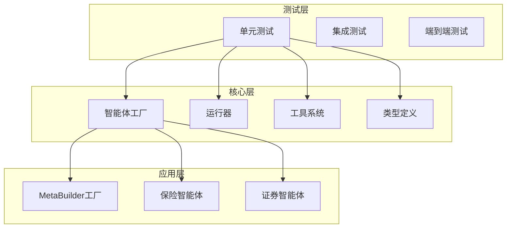
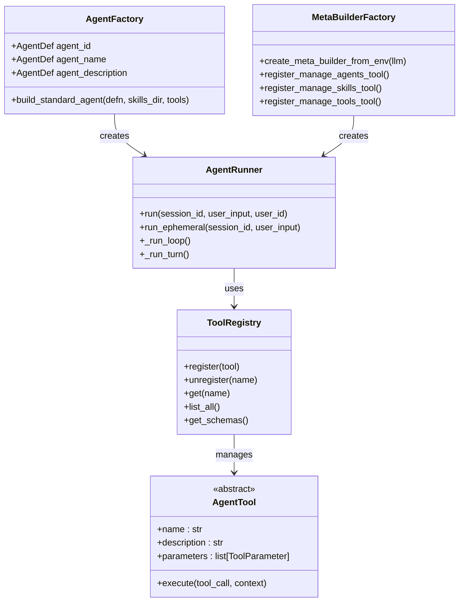
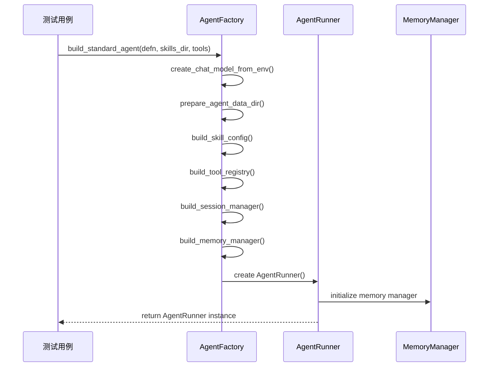
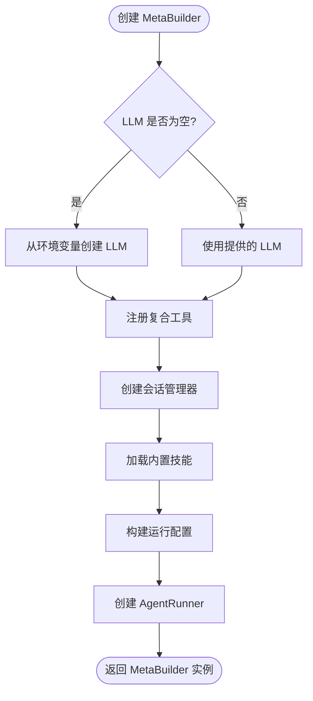
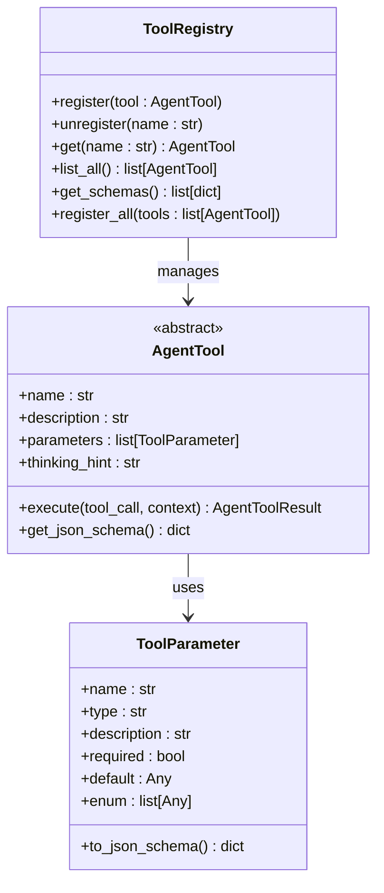
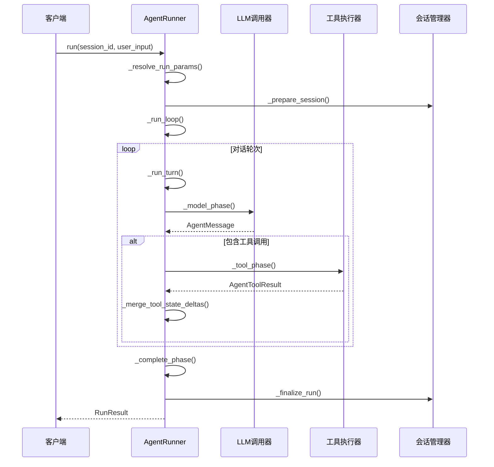
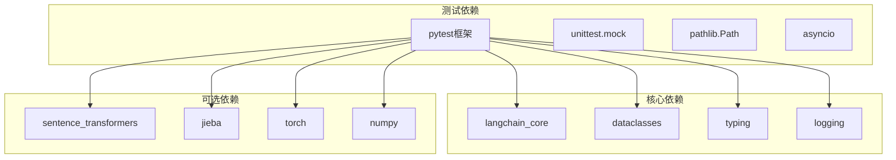

# 智能体工厂单元测试

<cite>
**本文档引用的文件**
- [tests/unit/core/test_agent_factory.py](file://tests/unit/core/test_agent_factory.py)
- [src/ark_agentic/core/agent_factory.py](file://src/ark_agentic/core/agent_factory.py)
- [tests/unit/agents/meta_builder/test_meta_builder_composite_tools.py](file://tests/unit/agents/meta_builder/test_meta_builder_composite_tools.py)
- [src/ark_agentic/agents/meta_builder/factory.py](file://src/ark_agentic/agents/meta_builder/factory.py)
- [tests/conftest.py](file://tests/conftest.py)
- [tests/unit/core/test_types.py](file://tests/unit/core/test_types.py)
- [src/ark_agentic/core/types.py](file://src/ark_agentic/core/types.py)
- [tests/unit/core/test_runner.py](file://tests/unit/core/test_runner.py)
- [src/ark_agentic/core/runner.py](file://src/ark_agentic/core/runner.py)
- [tests/unit/core/test_tools.py](file://tests/unit/core/test_tools.py)
- [src/ark_agentic/core/tools/base.py](file://src/ark_agentic/core/tools/base.py)
</cite>

## 目录
1. [简介](#简介)
2. [项目结构](#项目结构)
3. [核心组件](#核心组件)
4. [架构概览](#架构概览)
5. [详细组件分析](#详细组件分析)
6. [依赖分析](#依赖分析)
7. [性能考虑](#性能考虑)
8. [故障排除指南](#故障排除指南)
9. [结论](#结论)

## 简介

本文档深入分析了 Ark-Agentic 智能体工厂的单元测试代码库，重点关注智能体工厂、MetaBuilder 工厂、工具系统和运行器的核心功能测试。该测试套件涵盖了智能体生命周期管理、工具注册机制、内存管理和会话处理等关键功能。

该项目采用模块化设计，通过工厂模式创建不同类型的智能体，包括标准智能体和 MetaBuilder 智能体。测试覆盖了从基础数据结构到复杂执行流程的各个方面，确保系统的稳定性和可靠性。

## 项目结构

项目采用清晰的分层架构，主要包含以下核心模块：

**图表来源**
- [tests/unit/core/test_agent_factory.py:1-137](file://tests/unit/core/test_agent_factory.py#L1-L137)
- [src/ark_agentic/core/agent_factory.py:1-151](file://src/ark_agentic/core/agent_factory.py#L1-L151)

**章节来源**
- [tests/unit/core/test_agent_factory.py:1-137](file://tests/unit/core/test_agent_factory.py#L1-L137)
- [src/ark_agentic/core/agent_factory.py:1-151](file://src/ark_agentic/core/agent_factory.py#L1-L151)

## 核心组件

### 智能体工厂测试

智能体工厂是系统的核心组件，负责创建和配置不同类型的智能体实例。测试覆盖了以下关键功能：

- **AgentDef 数据类测试**：验证智能体定义的基本属性和默认值
- **构建标准智能体**：测试智能体构建过程中的各种配置选项
- **内存管理集成**：验证内存系统的启用和禁用逻辑
- **工具注册机制**：确保工具正确注册到智能体实例中

### MetaBuilder 工厂测试

MetaBuilder 工厂提供了高级智能体管理功能，测试重点包括：

- **复合工具注册**：验证三个核心管理工具的正确注册
- **JSON Schema 验证**：测试工具参数的枚举值和必需字段
- **错误处理机制**：验证非法操作的错误返回
- **文件系统操作**：测试智能体、技能和工具的创建和管理

### 类型系统测试

类型系统定义了智能体通信的基础数据结构，测试覆盖：

- **工具调用和结果**：验证 ToolCall 和 AgentToolResult 的创建
- **消息传递**：测试 AgentMessage 的不同类型和属性
- **会话管理**：验证 SessionEntry 的状态管理和 token 使用
- **技能元数据**：测试 SkillMetadata 的默认值和配置

**章节来源**
- [tests/unit/core/test_types.py:1-220](file://tests/unit/core/test_types.py#L1-L220)
- [src/ark_agentic/core/types.py:1-423](file://src/ark_agentic/core/types.py#L1-L423)

## 架构概览

系统采用工厂模式和组合模式相结合的设计，通过统一的接口创建不同类型的智能体：

**图表来源**
- [src/ark_agentic/core/agent_factory.py:58-151](file://src/ark_agentic/core/agent_factory.py#L58-L151)
- [src/ark_agentic/agents/meta_builder/factory.py:36-100](file://src/ark_agentic/agents/meta_builder/factory.py#L36-L100)
- [src/ark_agentic/core/runner.py:176-290](file://src/ark_agentic/core/runner.py#L176-L290)

## 详细组件分析

### 智能体工厂组件分析

智能体工厂实现了约定优于配置的原则，通过 AgentDef 数据类提供声明式的智能体定制：

**图表来源**
- [tests/unit/core/test_agent_factory.py:57-137](file://tests/unit/core/test_agent_factory.py#L57-L137)
- [src/ark_agentic/core/agent_factory.py:58-151](file://src/ark_agentic/core/agent_factory.py#L58-L151)

#### AgentDef 数据类测试

AgentDef 数据类提供了智能体的基本配置信息，测试验证了以下功能：

- **必需字段验证**：agent_id、agent_name、agent_description 的必填性
- **默认值设置**：系统协议、自定义指令、子任务启用等默认值
- **可选字段配置**：系统协议和自定义指令的自定义设置
- **类型安全**：确保所有字段具有正确的数据类型

#### 构建标准智能体测试

构建标准智能体的测试覆盖了多个关键场景：

- **返回类型验证**：确保返回的是 AgentRunner 实例
- **配置传播**：验证智能体 ID 正确传播到技能配置
- **提示配置构建**：测试从 AgentDef 构建提示配置
- **内存管理控制**：验证 enable_memory 参数的影响
- **LLM 初始化**：测试 llm 参数为 None 时的自动初始化
- **子任务启用**：验证 enable_subtasks 参数的传播
- **技能目录配置**：测试技能目录的正确添加

**章节来源**
- [tests/unit/core/test_agent_factory.py:12-137](file://tests/unit/core/test_agent_factory.py#L12-L137)

### MetaBuilder 工厂组件分析

MetaBuilder 工厂提供了高级的智能体管理功能，通过三个复合工具实现：

**图表来源**
- [src/ark_agentic/agents/meta_builder/factory.py:36-100](file://src/ark_agentic/agents/meta_builder/factory.py#L36-L100)

#### 复合工具注册测试

MetaBuilder 工厂注册了三个核心复合工具：

- **ManageAgentsTool**：管理智能体的创建、列出和删除
- **ManageSkillsTool**：管理技能的完整生命周期
- **ManageToolsTool**：管理工具的创建、更新和删除

每个工具都经过严格的测试验证：

- **JSON Schema 验证**：确保工具参数符合预期的枚举值
- **错误处理**：测试非法操作时的错误返回
- **文件系统操作**：验证实际的文件系统交互
- **权限控制**：确保敏感操作的安全性

**章节来源**
- [tests/unit/agents/meta_builder/test_meta_builder_composite_tools.py:21-162](file://tests/unit/agents/meta_builder/test_meta_builder_composite_tools.py#L21-L162)

### 工具系统组件分析

工具系统提供了灵活的扩展机制，支持动态注册和执行各种工具：

**图表来源**
- [src/ark_agentic/core/tools/base.py:46-289](file://src/ark_agentic/core/tools/base.py#L46-L289)

#### 工具注册机制测试

工具注册机制的测试验证了以下功能：

- **单个工具注册**：验证工具的正确注册和检索
- **批量注册**：测试多个工具的批量注册功能
- **重复注册防护**：确保重复注册抛出适当的异常
- **Schema 生成**：验证工具 JSON Schema 的正确生成
- **工具列表管理**：测试工具的查询和过滤功能

#### 参数读取辅助函数测试

工具系统提供了丰富的参数读取辅助函数：

- **字符串参数**：支持必需和可选字符串参数
- **数值参数**：支持整数、浮点数和布尔值参数
- **复合参数**：支持列表和字典参数的读取
- **类型转换**：自动进行类型转换和验证

**章节来源**
- [tests/unit/core/test_tools.py:1-344](file://tests/unit/core/test_tools.py#L1-L344)

### 运行器组件分析

运行器是智能体的核心执行引擎，实现了 ReAct 循环和多轮对话管理：

**图表来源**
- [src/ark_agentic/core/runner.py:292-379](file://src/ark_agentic/core/runner.py#L292-L379)

#### 运行器核心功能测试

运行器的测试覆盖了多个关键场景：

- **基本文本响应**：验证简单的文本对话功能
- **工具调用处理**：测试工具调用的完整生命周期
- **流式响应处理**：验证流式输出的正确处理
- **状态管理**：测试会话状态的正确维护
- **A2UI 组件支持**：验证前端组件渲染的特殊处理
- **内存管理集成**：测试与内存系统的集成

#### 回调机制测试

运行器实现了灵活的回调机制，支持业务钩子的注入：

- **业务钩子**：验证回调函数的正确执行顺序
- **观察性集成**：测试与分布式追踪的集成
- **错误处理**：验证回调中的错误处理机制
- **上下文管理**：测试回调中的上下文传递

**章节来源**
- [tests/unit/core/test_runner.py:147-790](file://tests/unit/core/test_runner.py#L147-L790)

## 依赖分析

测试套件展示了清晰的依赖层次结构：

**图表来源**
- [tests/conftest.py:19-36](file://tests/conftest.py#L19-L36)

### 可选依赖处理

测试配置文件实现了智能的可选依赖处理机制：

- **动态模块检测**：自动检测可选模块的可用性
- **模块桩创建**：为缺失的可选依赖创建桩模块
- **导入兼容性**：确保代码在缺少依赖时仍能正常工作
- **测试隔离**：避免可选依赖影响核心测试功能

**章节来源**
- [tests/conftest.py:1-44](file://tests/conftest.py#L1-L44)

## 性能考虑

测试套件体现了多项性能优化策略：

### 异步测试模式
- 使用 `pytest.mark.asyncio` 标记异步测试函数
- 通过 `AsyncMock` 和 `MagicMock` 减少真实外部依赖
- 实现高效的模拟 LLM 和工具执行

### 内存管理优化
- 使用临时目录进行测试隔离
- 及时清理测试产生的中间文件
- 避免内存泄漏的测试设计

### 并行测试执行
- 测试之间保持独立性，支持并行执行
- 使用 fixtures 提高测试复用率
- 减少测试间的耦合依赖

## 故障排除指南

### 常见测试问题

1. **LLM 配置问题**
   - 确保环境变量正确设置
   - 验证 API 密钥的有效性
   - 检查网络连接状态

2. **工具注册失败**
   - 检查工具类的必需属性
   - 验证工具名称的唯一性
   - 确认参数定义的完整性

3. **会话管理异常**
   - 验证会话目录的可写权限
   - 检查磁盘空间充足性
   - 确认文件锁定机制正常

### 调试技巧

- 使用 `pytest --pdb` 启用调试模式
- 通过 `pytest -v` 获取详细输出
- 利用 `pytest --tb=long` 查看完整堆栈跟踪
- 使用 `pytest -k "filter"` 过滤特定测试

**章节来源**
- [tests/unit/core/test_runner.py:772-790](file://tests/unit/core/test_runner.py#L772-L790)

## 结论

智能体工厂单元测试代码库展现了优秀的软件工程实践，通过全面的测试覆盖确保了系统的可靠性和稳定性。测试套件不仅验证了核心功能的正确性，还展示了良好的架构设计和代码组织。

关键优势包括：

- **完整的功能覆盖**：从基础数据结构到复杂执行流程的全面测试
- **清晰的架构分离**：工厂模式和组合模式的合理应用
- **灵活的扩展机制**：工具系统的动态注册和执行
- **健壮的错误处理**：完善的异常处理和恢复机制
- **高效的测试设计**：异步测试和模拟技术的巧妙运用

这些测试为系统的持续开发和维护提供了坚实的基础，确保新功能的添加不会破坏现有功能的稳定性。