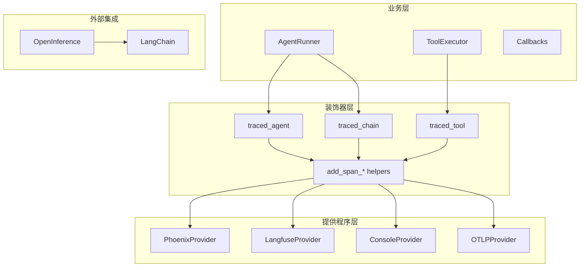
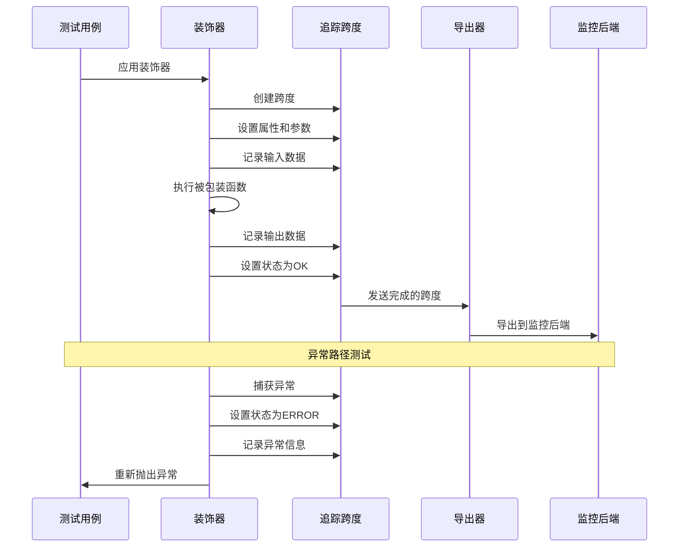
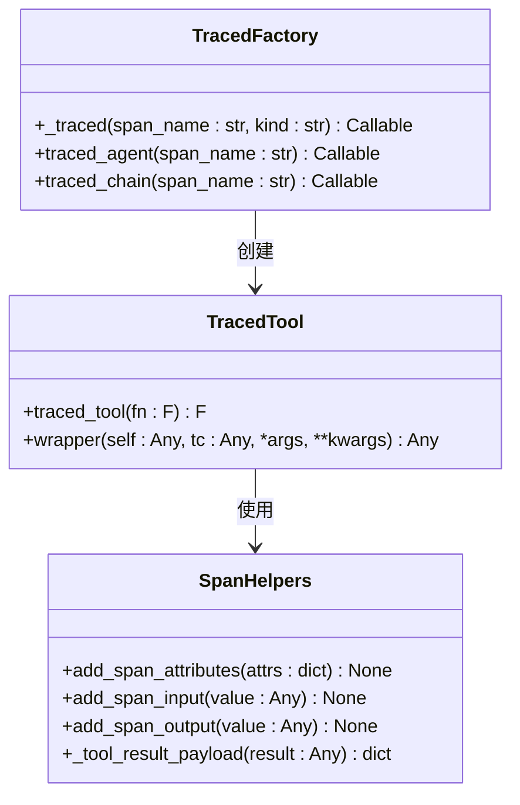
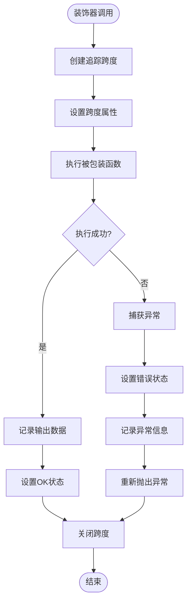
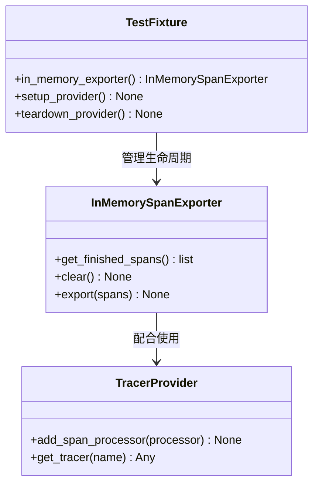
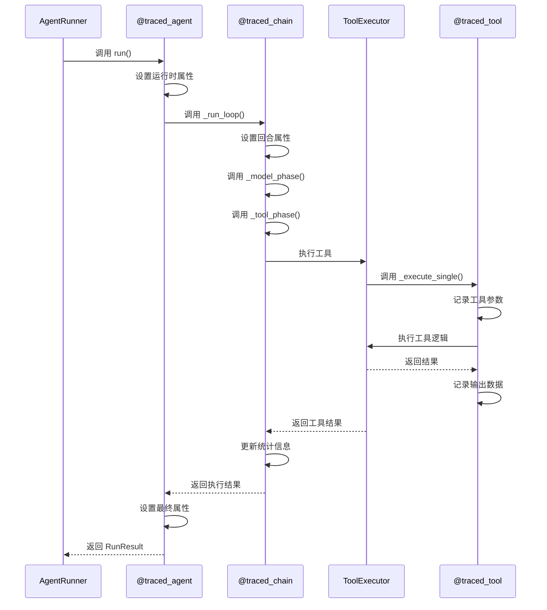
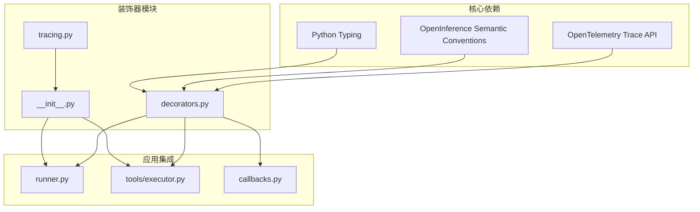

# 装饰器测试

<cite>
**本文档中引用的文件**
- [src/ark_agentic/core/observability/decorators.py](file://src/ark_agentic/core/observability/decorators.py)
- [tests/unit/core/test_tracing.py](file://tests/unit/core/test_tracing.py)
- [src/ark_agentic/core/observability/tracing.py](file://src/ark_agentic/core/observability/tracing.py)
- [src/ark_agentic/core/observability/providers/__init__.py](file://src/ark_agentic/core/observability/providers/__init__.py)
- [src/ark_agentic/core/runner.py](file://src/ark_agentic/core/runner.py)
- [src/ark_agentic/core/tools/executor.py](file://src/ark_agentic/core/tools/executor.py)
- [src/ark_agentic/core/callbacks.py](file://src/ark_agentic/core/callbacks.py)
- [.workspace/superpowers/specs/2026-04-25-runner-telemetry-design.md](file://.workspace/superpowers/specs/2026-04-25-runner-telemetry-design.md)
</cite>

## 目录
1. [简介](#简介)
2. [项目结构](#项目结构)
3. [核心组件](#核心组件)
4. [架构概览](#架构概览)
5. [详细组件分析](#详细组件分析)
6. [依赖关系分析](#依赖关系分析)
7. [性能考虑](#性能考虑)
8. [故障排除指南](#故障排除指南)
9. [结论](#结论)

## 简介

本文档深入分析了 Ark Agentic 项目中的装饰器测试体系，重点关注可观测性装饰器的设计、实现和测试策略。该系统通过三个核心装饰器（`@traced_agent`、`@traced_chain`、`@traced_tool`）和三个辅助函数（`add_span_attributes`、`add_span_input`、`add_span_output`）实现了完整的链路追踪功能。

该项目采用 OpenTelemetry 作为底层追踪框架，并集成了多种监控后端提供商，包括 Phoenix、Langfuse、Console 和 OTLP。装饰器测试确保了追踪功能的正确性和可靠性，为调试复杂的智能体执行流程提供了强大的工具。

## 项目结构

项目采用模块化的架构设计，将可观测性功能分离为独立的层：

**图表来源**
- [src/ark_agentic/core/observability/decorators.py:1-189](file://src/ark_agentic/core/observability/decorators.py#L1-L189)
- [src/ark_agentic/core/observability/providers/__init__.py:1-46](file://src/ark_agentic/core/observability/providers/__init__.py#L1-L46)

**章节来源**
- [src/ark_agentic/core/observability/decorators.py:1-189](file://src/ark_agentic/core/observability/decorators.py#L1-L189)
- [src/ark_agentic/core/observability/providers/__init__.py:1-46](file://src/ark_agentic/core/observability/providers/__init__.py#L1-L46)

## 核心组件

### 装饰器系统

装饰器系统包含三个主要装饰器和三个辅助函数：

#### 主要装饰器
- **`@traced_agent`**: 包装 AgentRunner.run 方法，创建 AGENT 类型的追踪跨度
- **`@traced_chain`**: 包装运行器阶段方法，创建 CHAIN 类型的追踪跨度  
- **`@traced_tool`**: 包装 ToolExecutor._execute_single 方法，创建 TOOL 类型的追踪跨度

#### 辅助函数
- **`add_span_attributes`**: 在当前活动跨度上设置属性
- **`add_span_input`**: 设置输入值（JSON格式）
- **`add_span_output`**: 设置输出值（JSON格式）

**章节来源**
- [src/ark_agentic/core/observability/decorators.py:78-144](file://src/ark_agentic/core/observability/decorators.py#L78-L144)
- [.workspace/superpowers/specs/2026-04-25-runner-telemetry-design.md:70-80](file://.workspace/superpowers/specs/2026-04-25-runner-telemetry-design.md#L70-L80)

### 提供程序注册表

提供程序系统支持多种监控后端：

| 提供程序 | 环境变量 | 功能描述 |
|---------|---------|----------|
| Phoenix | `TRACING=phoenix` | 本地开发和调试 |
| Langfuse | `TRACING=langfuse` | 生产环境监控 |
| Console | `TRACING=console` | 控制台输出 |
| OTLP | `TRACING=otlp` | 标准 OTLP 导出 |

**章节来源**
- [src/ark_agentic/core/observability/providers/__init__.py:30-35](file://src/ark_agentic/core/observability/providers/__init__.py#L30-L35)
- [src/ark_agentic/core/observability/tracing.py:35-53](file://src/ark_agentic/core/observability/tracing.py#L35-L53)

## 架构概览

装饰器测试架构采用分层设计，确保测试的独立性和可靠性：

**图表来源**
- [tests/unit/core/test_tracing.py:56-94](file://tests/unit/core/test_tracing.py#L56-L94)
- [src/ark_agentic/core/observability/decorators.py:80-95](file://src/ark_agentic/core/observability/decorators.py#L80-L95)

## 详细组件分析

### 装饰器实现分析

#### 装饰器工厂模式

装饰器采用工厂模式设计，通过内部工厂函数 `_traced` 创建具体的装饰器：

**图表来源**
- [src/ark_agentic/core/observability/decorators.py:78-144](file://src/ark_agentic/core/observability/decorators.py#L78-L144)

#### 异常处理机制

装饰器实现了完善的异常处理机制，确保即使发生异常也能正确关闭跨度：

**图表来源**
- [src/ark_agentic/core/observability/decorators.py:80-95](file://src/ark_agentic/core/observability/decorators.py#L80-L95)

**章节来源**
- [src/ark_agentic/core/observability/decorators.py:78-144](file://src/ark_agentic/core/observability/decorators.py#L78-L144)

### 测试策略分析

#### 测试覆盖范围

测试套件涵盖了装饰器的所有关键行为：

| 测试类别 | 测试方法 | 验证点 |
|---------|---------|--------|
| 基本功能 | `test_traced_agent_opens_and_closes_span` | 跨度创建、属性设置、输入输出记录 |
| 异常处理 | `test_traced_chain_records_exception` | 异常捕获、错误状态设置 |
| 工具错误 | `test_traced_tool_marks_error_result_as_failed` | 工具错误检测、状态标记 |
| 嵌套装饰器 | `test_nested_decorators_form_parent_child_tree` | 跨度层次结构、父子关系 |
| 提供程序 | `test_provider_resolution` | 提供程序选择、凭据验证 |

**章节来源**
- [tests/unit/core/test_tracing.py:56-241](file://tests/unit/core/test_tracing.py#L56-L241)

#### InMemorySpanExporter 使用

测试使用 InMemorySpanExporter 确保测试的确定性和可靠性：

**图表来源**
- [tests/unit/core/test_tracing.py:34-51](file://tests/unit/core/test_tracing.py#L34-L51)

**章节来源**
- [tests/unit/core/test_tracing.py:34-51](file://tests/unit/core/test_tracing.py#L34-L51)

### 装饰器集成分析

#### AgentRunner 集成

AgentRunner 通过装饰器实现了完整的执行流程追踪：

**图表来源**
- [src/ark_agentic/core/runner.py:665-974](file://src/ark_agentic/core/runner.py#L665-L974)
- [src/ark_agentic/core/tools/executor.py:14](file://src/ark_agentic/core/tools/executor.py#L14)

**章节来源**
- [src/ark_agentic/core/runner.py:665-974](file://src/ark_agentic/core/runner.py#L665-L974)
- [src/ark_agentic/core/tools/executor.py:14](file://src/ark_agentic/core/tools/executor.py#L14)

## 依赖关系分析

装饰器系统的依赖关系清晰且模块化：

**图表来源**
- [src/ark_agentic/core/observability/decorators.py:25-35](file://src/ark_agentic/core/observability/decorators.py#L25-L35)
- [src/ark_agentic/core/observability/tracing.py:26-30](file://src/ark_agentic/core/observability/tracing.py#L26-L30)

**章节来源**
- [src/ark_agentic/core/observability/decorators.py:25-35](file://src/ark_agentic/core/observability/decorators.py#L25-L35)
- [src/ark_agentic/core/observability/tracing.py:26-30](file://src/ark_agentic/core/observability/tracing.py#L26-L30)

## 性能考虑

### 零成本抽象

装饰器设计遵循零成本抽象原则：

- **无提供程序时**: 使用 NoOp Tracer，所有操作都是空操作
- **异步优化**: 使用 async/await 减少协程切换开销
- **内存管理**: 使用 InMemorySpanExporter 避免网络I/O开销

### 资源管理

装饰器确保资源的正确释放：

- **自动关闭**: 使用 `with` 语句确保跨度在异常情况下也能正确关闭
- **异常传播**: 保持异常堆栈完整性，不影响上层错误处理
- **状态清理**: 清理临时状态，避免内存泄漏

## 故障排除指南

### 常见问题诊断

#### 装饰器未生效

**症状**: 跨度未创建或属性未设置

**排查步骤**:
1. 检查是否正确导入装饰器
2. 验证函数签名是否符合要求
3. 确认提供程序已正确初始化

#### 异常处理失败

**症状**: 异常未正确记录或状态未设置

**排查步骤**:
1. 检查装饰器的异常捕获逻辑
2. 验证 `BaseException` 捕获是否正确
3. 确认 `record_exception` 调用

#### 提供程序配置错误

**症状**: 跨度未导出到监控后端

**排查步骤**:
1. 检查 `TRACING` 环境变量设置
2. 验证提供程序凭据配置
3. 确认网络连接正常

**章节来源**
- [tests/unit/core/test_tracing.py:176-241](file://tests/unit/core/test_tracing.py#L176-L241)
- [src/ark_agentic/core/observability/tracing.py:56-99](file://src/ark_agentic/core/observability/tracing.py#L56-L99)

## 结论

Ark Agentic 项目的装饰器测试体系展现了优秀的软件工程实践：

### 设计优势

1. **模块化设计**: 清晰的三层架构分离了关注点
2. **测试驱动**: 完整的测试覆盖确保了功能的可靠性
3. **扩展性**: 插件化的提供程序系统支持多种监控后端
4. **性能优化**: 零成本抽象和异步优化提升了整体性能

### 关键特性

- **完整的生命周期追踪**: 从 Agent 到 Tool 的全链路追踪
- **灵活的配置**: 支持多种环境变量配置选项
- **强大的错误处理**: 完善的异常捕获和状态管理
- **可靠的测试**: 基于 InMemorySpanExporter 的确定性测试

该装饰器测试体系为复杂智能体系统的可观测性提供了坚实的基础，是现代 AI 应用开发的最佳实践范例。