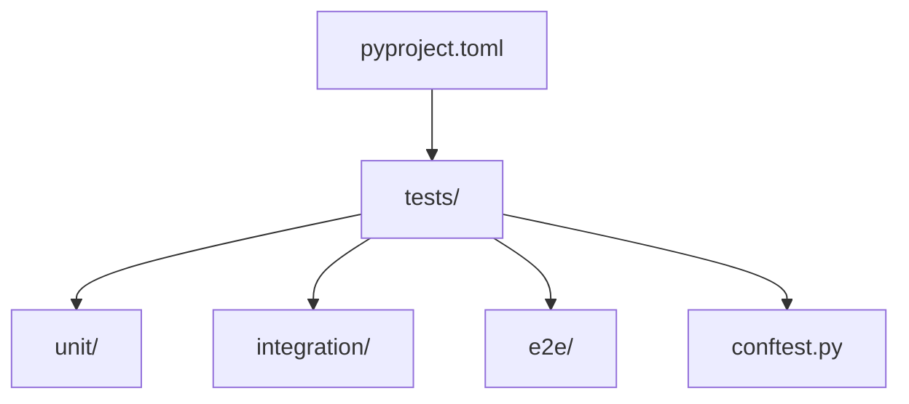
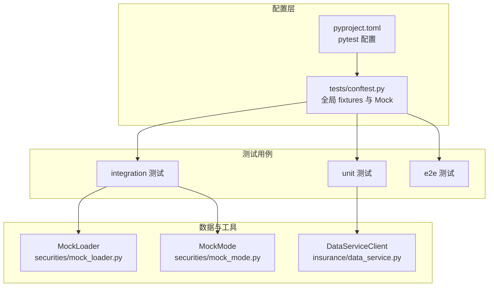
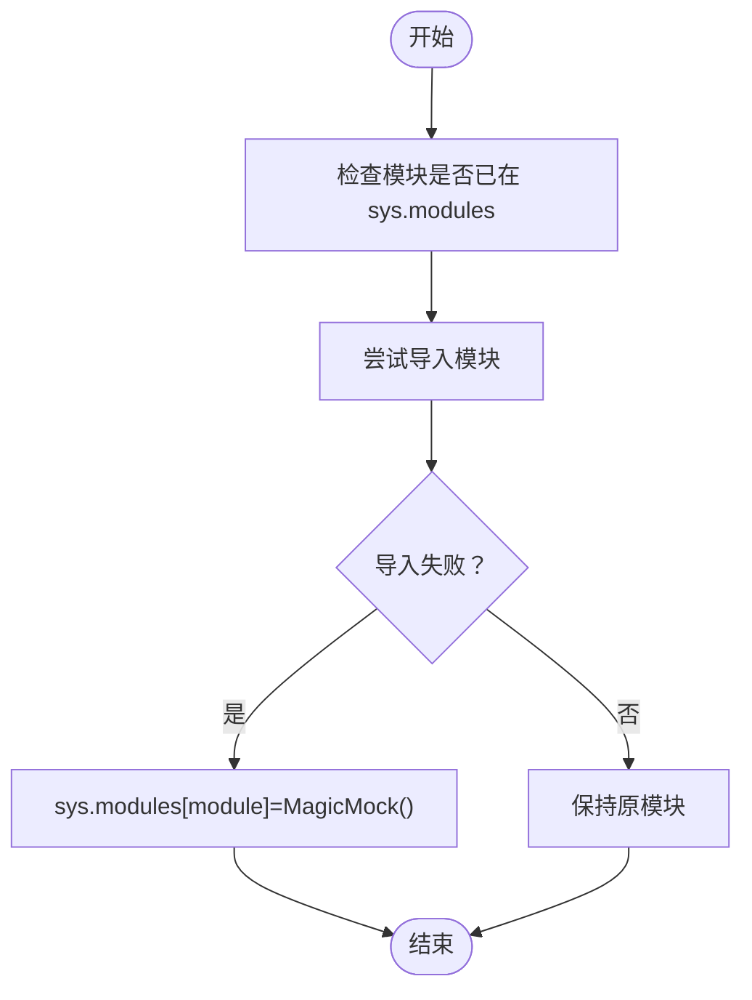
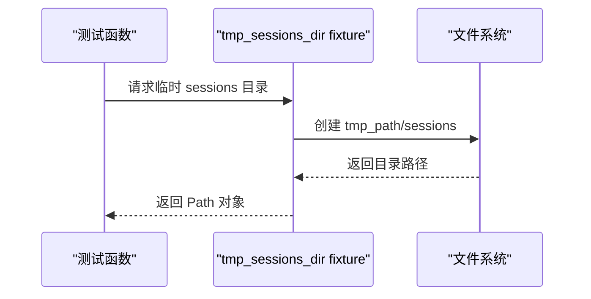
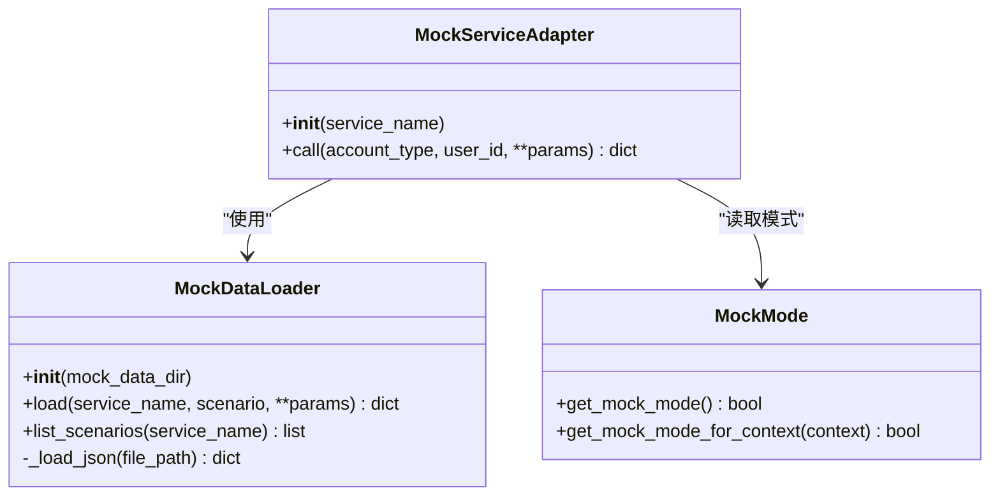
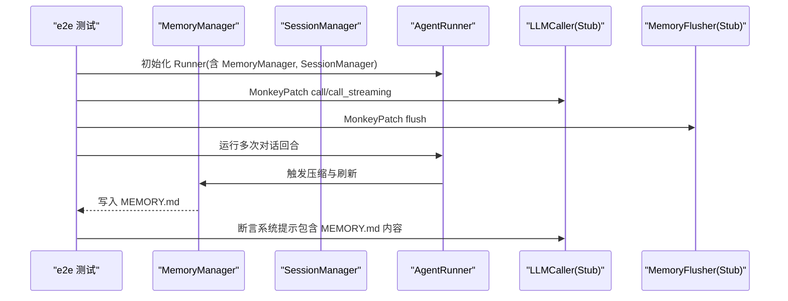
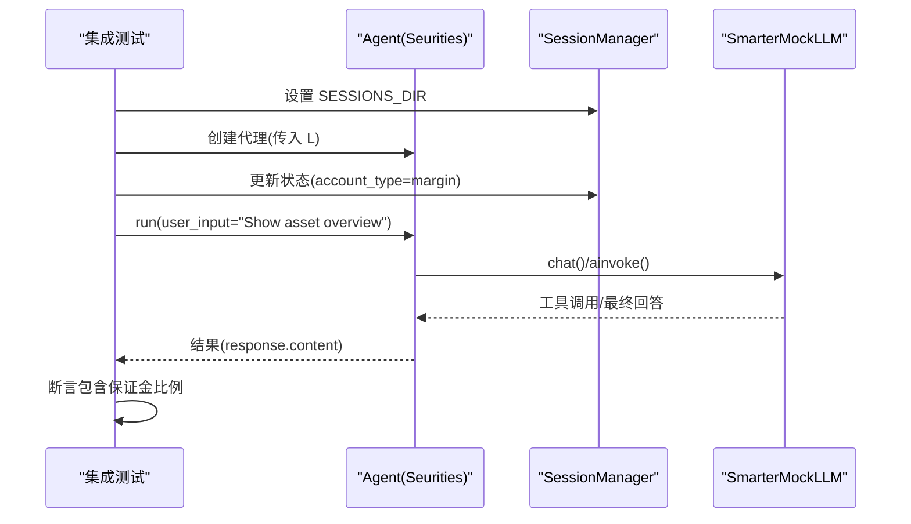
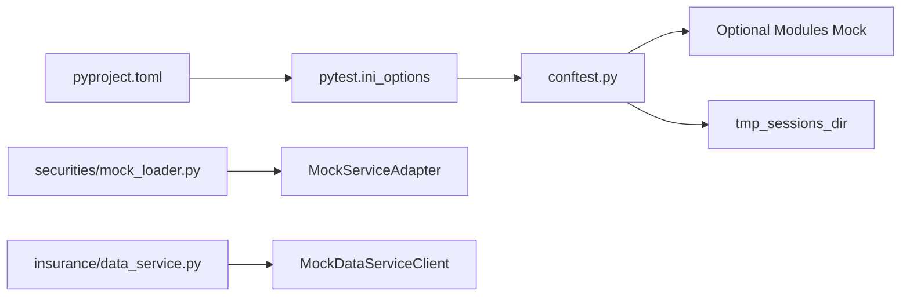

# 测试框架

<cite>
**本文引用的文件**
- [tests/conftest.py](file://tests/conftest.py)
- [pyproject.toml](file://pyproject.toml)
- [tests/unit/core/test_persistence.py](file://tests/unit/core/test_persistence.py)
- [tests/unit/core/test_session.py](file://tests/unit/core/test_session.py)
- [tests/integration/test_agent_integration.py](file://tests/integration/test_agent_integration.py)
- [tests/e2e/test_memory_e2e.py](file://tests/e2e/test_memory_e2e.py)
- [tests/integration/agents/securities/test_mock_loader_and_service_adapter.py](file://tests/integration/agents/securities/test_mock_loader_and_service_adapter.py)
- [src/ark_agentic/agents/securities/tools/service/mock_loader.py](file://src/ark_agentic/agents/securities/tools/service/mock_loader.py)
- [src/ark_agentic/agents/securities/tools/service/mock_mode.py](file://src/ark_agentic/agents/securities/tools/service/mock_mode.py)
- [src/ark_agentic/agents/insurance/tools/data_service.py](file://src/ark_agentic/agents/insurance/tools/data_service.py)
- [tests/unit/core/test_pycryptodome_optional.py](file://tests/unit/core/test_pycryptodome_optional.py)
</cite>

## 目录
1. [简介](#简介)
2. [项目结构](#项目结构)
3. [核心组件](#核心组件)
4. [架构总览](#架构总览)
5. [详细组件分析](#详细组件分析)
6. [依赖分析](#依赖分析)
7. [性能考虑](#性能考虑)
8. [故障排查指南](#故障排查指南)
9. [结论](#结论)
10. [附录](#附录)

## 简介
本文件系统性阐述 Ark-Agentic 的测试框架，覆盖 Pytest 配置、fixtures 设置与测试环境初始化；详解可选依赖的 Mock 处理机制（sentence_transformers、jieba、torch、numpy 等）；说明测试路径配置、临时目录管理与测试数据准备策略；并提供测试框架扩展与自定义 fixtures 的开发指南。

## 项目结构
测试代码位于 tests/ 目录，按层次划分为：
- unit：单元测试，覆盖核心模块与工具类
- integration：集成测试，验证组件协作与外部依赖
- e2e：端到端测试，覆盖会话生命周期与记忆系统
- scripts：辅助脚本（如 E2E 辅助）

关键入口与配置：
- tests/conftest.py：全局 pytest 配置与通用 fixtures
- pyproject.toml：pytest 配置（testpaths、asyncio_mode、timeout、markers 等）

**图示来源**
- [tests/conftest.py:1-39](file://tests/conftest.py#L1-L39)
- [pyproject.toml:70-78](file://pyproject.toml#L70-L78)

**章节来源**
- [tests/conftest.py:1-39](file://tests/conftest.py#L1-L39)
- [pyproject.toml:70-78](file://pyproject.toml#L70-L78)

## 核心组件
- Pytest 配置与标记
  - testpaths 指向 tests/，自动发现测试
  - asyncio_mode = "auto" 支持异步测试
  - timeout = 180 防止阻塞用例拖垮整体
  - markers 定义 "slow" 标记，便于过滤慢测试
- 全局 fixtures
  - tmp_sessions_dir：为需要 SessionManager 的测试提供临时 sessions 目录
  - 可选依赖 Mock：在缺失时以 MagicMock 替代，保证测试可在轻量化环境中运行
- 测试数据与 Mock
  - securities 模块提供 Mock 数据加载器与服务适配器
  - insurance 模块提供基于环境变量的 Mock 切换

**章节来源**
- [pyproject.toml:70-78](file://pyproject.toml#L70-L78)
- [tests/conftest.py:17-38](file://tests/conftest.py#L17-L38)
- [tests/integration/agents/securities/test_mock_loader_and_service_adapter.py:10-45](file://tests/integration/agents/securities/test_mock_loader_and_service_adapter.py#L10-L45)
- [src/ark_agentic/agents/securities/tools/service/mock_loader.py:17-104](file://src/ark_agentic/agents/securities/tools/service/mock_loader.py#L17-L104)
- [src/ark_agentic/agents/insurance/tools/data_service.py:433-445](file://src/ark_agentic/agents/insurance/tools/data_service.py#L433-L445)

## 架构总览
测试框架围绕“可选依赖 Mock + 临时目录 + 环境变量驱动的 Mock 切换”构建，确保在不同依赖环境下稳定运行，并通过 fixtures 统一初始化测试资源。

**图示来源**
- [pyproject.toml:70-78](file://pyproject.toml#L70-L78)
- [tests/conftest.py:17-38](file://tests/conftest.py#L17-L38)
- [src/ark_agentic/agents/securities/tools/service/mock_loader.py:17-104](file://src/ark_agentic/agents/securities/tools/service/mock_loader.py#L17-L104)
- [src/ark_agentic/agents/securities/tools/service/mock_mode.py:7-23](file://src/ark_agentic/agents/securities/tools/service/mock_mode.py#L7-L23)
- [src/ark_agentic/agents/insurance/tools/data_service.py:433-445](file://src/ark_agentic/agents/insurance/tools/data_service.py#L433-L445)

## 详细组件分析

### Pytest 配置与标记
- testpaths = ["tests"]：指定测试根目录
- asyncio_mode = "auto"：自动启用异步测试模式
- timeout = 180：单测超时秒数，避免阻塞
- markers = ["slow: 故意慢的集成测试"]：通过 -m "not slow" 快速跳过慢测试

**章节来源**
- [pyproject.toml:70-78](file://pyproject.toml#L70-L78)

### 可选依赖 Mock 处理机制
- 目标模块：sentence_transformers、jieba、torch、numpy
- 处理策略：若模块未导入成功，则将其加入 sys.modules 并赋值为 MagicMock，从而允许导入但不执行实际逻辑
- 适用场景：在缺少 heavy deps 的 CI 或开发机上仍能运行测试

**图示来源**
- [tests/conftest.py:17-30](file://tests/conftest.py#L17-L30)

**章节来源**
- [tests/conftest.py:17-30](file://tests/conftest.py#L17-L30)

### 临时目录与会话管理
- tmp_sessions_dir：为 SessionManager 提供临时 sessions 目录，自动创建并返回
- 使用场景：需要持久化会话或内存写入的测试（如 e2e 记忆测试）

**图示来源**
- [tests/conftest.py:33-38](file://tests/conftest.py#L33-L38)

**章节来源**
- [tests/conftest.py:33-38](file://tests/conftest.py#L33-L38)

### Mock 数据加载与服务适配器（securities）
- MockLoader：从 JSON 文件加载 Mock 数据，支持按场景与参数选择文件
- MockServiceAdapter：基于 MockLoader 的服务适配器，结合 SECURITIES_SERVICE_MOCK 环境变量控制 mock 模式
- MockMode：解析 per-request 的 mock 模式优先级（context > 环境变量）

**图示来源**
- [src/ark_agentic/agents/securities/tools/service/mock_loader.py:17-104](file://src/ark_agentic/agents/securities/tools/service/mock_loader.py#L17-L104)
- [src/ark_agentic/agents/securities/tools/service/mock_mode.py:7-23](file://src/ark_agentic/agents/securities/tools/service/mock_mode.py#L7-L23)

**章节来源**
- [src/ark_agentic/agents/securities/tools/service/mock_loader.py:17-104](file://src/ark_agentic/agents/securities/tools/service/mock_loader.py#L17-L104)
- [src/ark_agentic/agents/securities/tools/service/mock_mode.py:7-23](file://src/ark_agentic/agents/securities/tools/service/mock_mode.py#L7-L23)
- [tests/integration/agents/securities/test_mock_loader_and_service_adapter.py:10-45](file://tests/integration/agents/securities/test_mock_loader_and_service_adapter.py#L10-L45)

### 环境变量驱动的 Mock（insurance）
- get_data_service_client：当 DATA_SERVICE_MOCK=true 时返回 MockDataServiceClient，否则返回真实客户端
- 适用于保险代理的工具链，便于在不同环境间切换

**章节来源**
- [src/ark_agentic/agents/insurance/tools/data_service.py:433-445](file://src/ark_agentic/agents/insurance/tools/data_service.py#L433-L445)

### 端到端记忆测试（e2e）
- 使用临时目录管理 MEMORY.md 写入与读取
- 通过 MonkeyPatch 注入 stub LLM 与 MemoryFlusher 行为，验证压缩与注入逻辑
- 关键断言：MEMORY.md 存在且内容被注入系统提示词

**图示来源**
- [tests/e2e/test_memory_e2e.py:65-96](file://tests/e2e/test_memory_e2e.py#L65-L96)
- [tests/e2e/test_memory_e2e.py:100-162](file://tests/e2e/test_memory_e2e.py#L100-L162)
- [tests/e2e/test_memory_e2e.py:164-210](file://tests/e2e/test_memory_e2e.py#L164-L210)
- [tests/e2e/test_memory_e2e.py:211-260](file://tests/e2e/test_memory_e2e.py#L211-L260)

**章节来源**
- [tests/e2e/test_memory_e2e.py:65-96](file://tests/e2e/test_memory_e2e.py#L65-L96)
- [tests/e2e/test_memory_e2e.py:100-162](file://tests/e2e/test_memory_e2e.py#L100-L162)
- [tests/e2e/test_memory_e2e.py:164-210](file://tests/e2e/test_memory_e2e.py#L164-L210)
- [tests/e2e/test_memory_e2e.py:211-260](file://tests/e2e/test_memory_e2e.py#L211-L260)

### 集成测试：代理与会话上下文
- 通过 SmarterMockLLM 模拟流式与非流式响应，验证工具调用与最终回答
- 使用 monkeypatch 设置 SECURITIES_SERVICE_MOCK 与 SESSIONS_DIR
- 注入“保证金账户”上下文，断言返回中包含保证金比例

**图示来源**
- [tests/integration/test_agent_integration.py:136-199](file://tests/integration/test_agent_integration.py#L136-L199)
- [tests/integration/test_agent_integration.py:258-291](file://tests/integration/test_agent_integration.py#L258-L291)

**章节来源**
- [tests/integration/test_agent_integration.py:136-199](file://tests/integration/test_agent_integration.py#L136-L199)
- [tests/integration/test_agent_integration.py:258-291](file://tests/integration/test_agent_integration.py#L258-L291)

### 可选依赖 pycryptodome 的错误处理
- 验证非 PA-JT 模型在无 pycryptodome 时正常工作
- 验证 PA-JT 模型在缺少 pycryptodome 时抛出 ImportError，并给出友好提示
- 验证 RSA 签名在缺失 pycryptodome 时的错误消息

**章节来源**
- [tests/unit/core/test_pycryptodome_optional.py:9-69](file://tests/unit/core/test_pycryptodome_optional.py#L9-L69)

## 依赖分析
- 测试对可选依赖的处理：通过 conftest.py 的 Mock 机制，避免因缺失 heavy deps 导致测试失败
- 测试对环境变量的依赖：securities 与 insurance 模块均通过环境变量控制 mock 模式
- 测试对临时目录的依赖：通过 tmp_path 与 tmp_sessions_dir 提供隔离的文件系统空间

**图示来源**
- [tests/conftest.py:17-38](file://tests/conftest.py#L17-L38)
- [pyproject.toml:70-78](file://pyproject.toml#L70-L78)
- [src/ark_agentic/agents/securities/tools/service/mock_loader.py:110-123](file://src/ark_agentic/agents/securities/tools/service/mock_loader.py#L110-L123)
- [src/ark_agentic/agents/insurance/tools/data_service.py:433-445](file://src/ark_agentic/agents/insurance/tools/data_service.py#L433-L445)

**章节来源**
- [tests/conftest.py:17-38](file://tests/conftest.py#L17-L38)
- [pyproject.toml:70-78](file://pyproject.toml#L70-L78)
- [src/ark_agentic/agents/securities/tools/service/mock_loader.py:110-123](file://src/ark_agentic/agents/securities/tools/service/mock_loader.py#L110-L123)
- [src/ark_agentic/agents/insurance/tools/data_service.py:433-445](file://src/ark_agentic/agents/insurance/tools/data_service.py#L433-L445)

## 性能考虑
- 使用 timeout 防止阻塞用例影响整体测试时间
- 通过 markers "slow" 将耗时测试标记为可跳过，加速本地迭代
- 在集成与 E2E 测试中尽量使用 MonkeyPatch 与临时目录，减少真实外部依赖的开销

## 故障排查指南
- 可选依赖缺失导致导入失败
  - 现象：模块导入报错
  - 处理：确认 conftest.py 的 Mock 逻辑已生效；必要时手动安装对应依赖
- Mock 数据未命中
  - 现象：返回 error 或空数据
  - 处理：检查 MockLoader 的文件命名与目录结构；确认 scenario 与参数匹配
- 会话目录权限或路径问题
  - 现象：会话文件无法创建或读取
  - 处理：确认 tmp_sessions_dir 的路径存在且可写；检查权限
- 环境变量未生效
  - 现象：Mock 切换未按预期
  - 处理：确认 SECURITIES_SERVICE_MOCK 或 DATA_SERVICE_MOCK 设置正确；注意大小写与空字符串

**章节来源**
- [tests/conftest.py:17-30](file://tests/conftest.py#L17-L30)
- [src/ark_agentic/agents/securities/tools/service/mock_loader.py:31-71](file://src/ark_agentic/agents/securities/tools/service/mock_loader.py#L31-L71)
- [tests/unit/core/test_session.py:243-265](file://tests/unit/core/test_session.py#L243-L265)
- [src/ark_agentic/agents/insurance/tools/data_service.py:433-445](file://src/ark_agentic/agents/insurance/tools/data_service.py#L433-L445)

## 结论
Ark-Agentic 的测试框架通过 Pytest 配置、可选依赖 Mock 与统一的 fixtures，实现了在多样化环境下的稳定测试。结合环境变量驱动的 Mock 切换与临时目录管理，既能覆盖单元、集成与端到端场景，又能有效降低对外部依赖的耦合度。

## 附录

### 测试路径与发现
- testpaths = ["tests"]：pytest 自动扫描 tests/ 下的测试文件
- 建议新增测试文件遵循 tests/ 下的分层结构（unit/integration/e2e）

**章节来源**
- [pyproject.toml:72-72](file://pyproject.toml#L72-L72)

### 临时目录与数据准备
- 使用 tmp_path 提供临时工作目录，配合 tmp_sessions_dir 为会话管理准备独立目录
- e2e 测试中通过 monkeypatch 注入 stub 实现，避免真实 LLM 与外部服务

**章节来源**
- [tests/conftest.py:33-38](file://tests/conftest.py#L33-L38)
- [tests/e2e/test_memory_e2e.py:49-62](file://tests/e2e/test_memory_e2e.py#L49-L62)

### 扩展指南与自定义 fixtures
- 新增通用 fixtures：在 tests/conftest.py 中添加，作用域可选 function/module/session/session-wide
- Mock 可选依赖：在 conftest.py 中扩展 OPTIONAL_MODULES 列表，确保缺失时以 MagicMock 替代
- 环境变量驱动：在被测模块中读取环境变量，测试中通过 monkeypatch.setenv 控制
- 会话与持久化：为涉及 SessionManager 的测试提供 tmp_sessions_dir，确保隔离与清理

**章节来源**
- [tests/conftest.py:17-38](file://tests/conftest.py#L17-L38)
- [tests/unit/core/test_session.py:14-80](file://tests/unit/core/test_session.py#L14-L80)