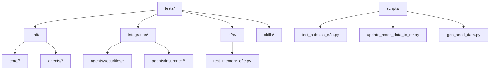
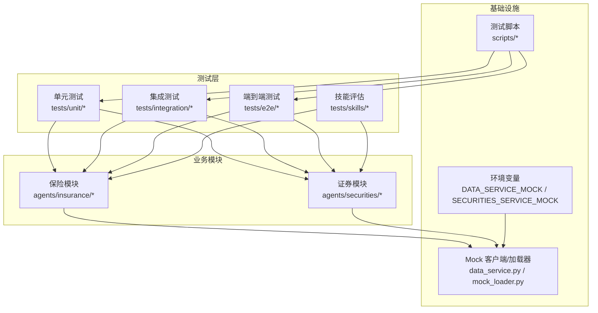
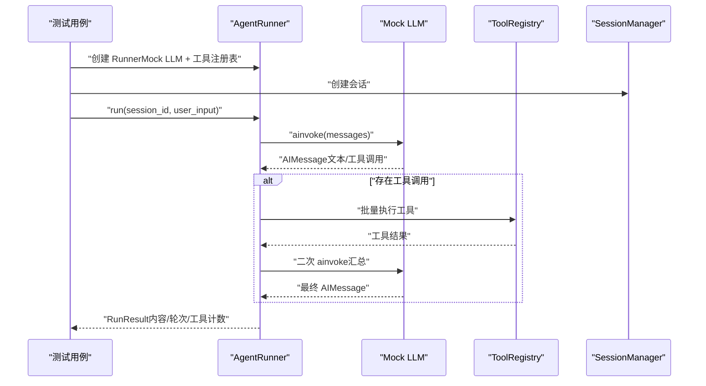
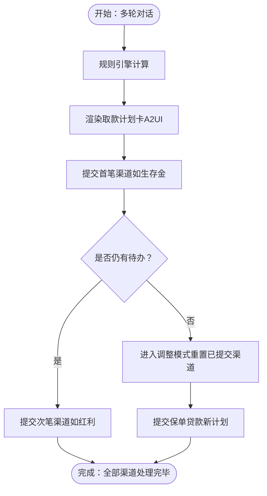
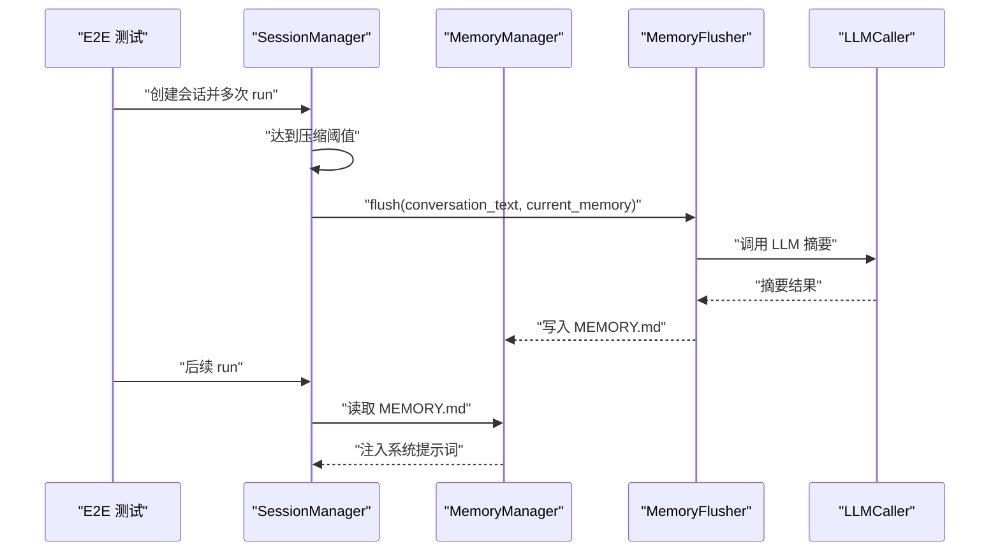
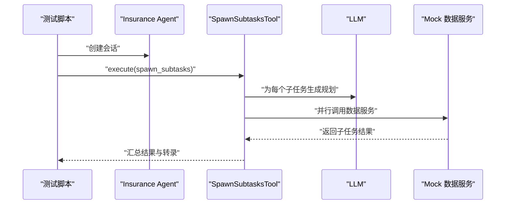
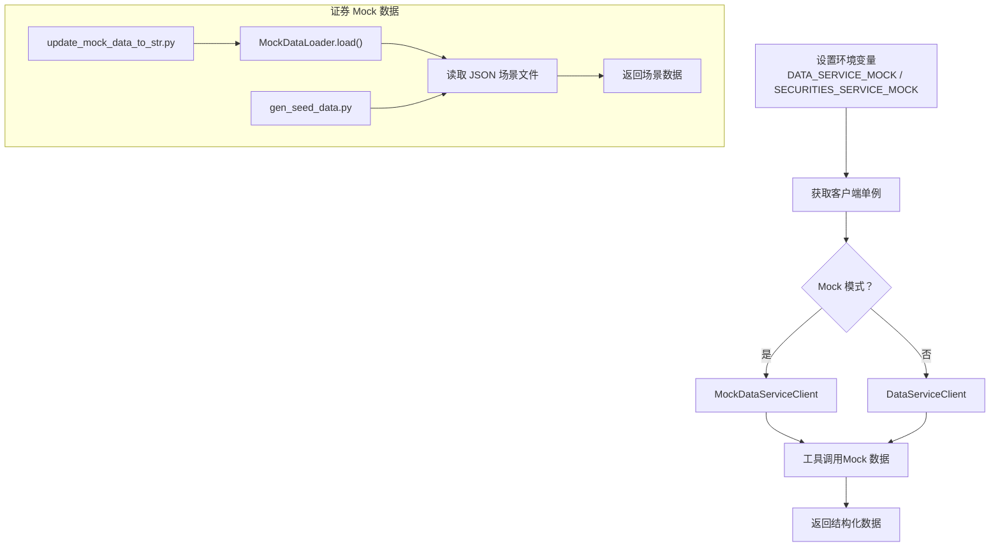
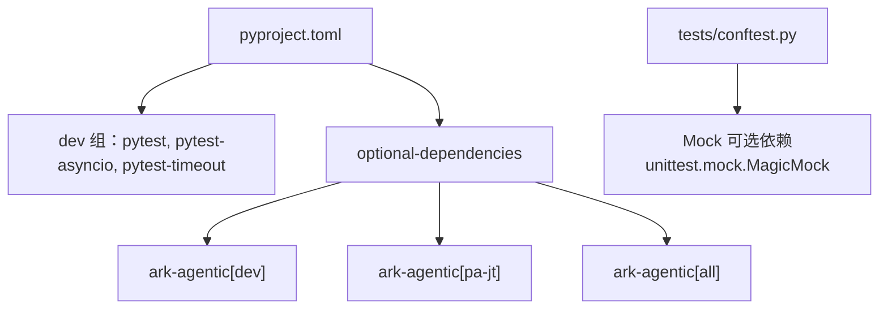

# 测试策略

<cite>
**本文档引用的文件**
- [tests/conftest.py](file://tests/conftest.py)
- [pyproject.toml](file://pyproject.toml)
- [README.md](file://README.md)
- [tests/unit/core/test_runner.py](file://tests/unit/core/test_runner.py)
- [tests/integration/test_agent_integration.py](file://tests/integration/test_agent_integration.py)
- [tests/e2e/test_memory_e2e.py](file://tests/e2e/test_memory_e2e.py)
- [tests/unit/agents/insurance/test_withdrawal_multiturn.py](file://tests/unit/agents/insurance/test_withdrawal_multiturn.py)
- [tests/integration/agents/securities/test_mock_loader_and_service_adapter.py](file://tests/integration/agents/securities/test_mock_loader_and_service_adapter.py)
- [scripts/test_subtask_e2e.py](file://scripts/test_subtask_e2e.py)
- [src/ark_agentic/agents/insurance/tools/data_service.py](file://src/ark_agentic/agents/insurance/tools/data_service.py)
- [src/ark_agentic/agents/securities/tools/service/mock_loader.py](file://src/ark_agentic/agents/securities/tools/service/mock_loader.py)
- [scripts/update_mock_data_to_str.py](file://scripts/update_mock_data_to_str.py)
- [scripts/gen_seed_data.py](file://scripts/gen_seed_data.py)
</cite>

## 目录
1. [引言](#引言)
2. [项目结构](#项目结构)
3. [核心组件](#核心组件)
4. [架构总览](#架构总览)
5. [详细组件分析](#详细组件分析)
6. [依赖分析](#依赖分析)
7. [性能考虑](#性能考虑)
8. [故障排查指南](#故障排查指南)
9. [结论](#结论)
10. [附录](#附录)

## 引言
本测试策略文档面向 Ark-Agentic 项目，系统阐述测试框架、单元测试、集成测试、端到端测试与性能测试的实施方法，涵盖测试用例设计、Mock 数据管理、回归测试与持续集成实践，以及测试工具使用指南、测试覆盖率要求与质量保证流程。目标是帮助开发者在不同测试层级高效定位问题、降低风险并提升交付质量。

## 项目结构
测试相关目录组织遵循“按层级与功能划分”的原则：
- tests/unit：核心模块与工具的单元测试，强调隔离与可重复性
- tests/integration：跨模块/跨组件的集成测试，验证真实依赖与外部服务适配
- tests/e2e：端到端测试，覆盖真实业务闭环与长生命周期行为
- tests/skills：技能评估与基准测试工作区，包含静态评估与迭代评测
- scripts：辅助测试脚本，如子任务 E2E、Mock 数据转换与种子数据生成

图表来源
- [tests/unit/core/test_runner.py:1-200](file://tests/unit/core/test_runner.py#L1-L200)
- [tests/integration/test_agent_integration.py:1-200](file://tests/integration/test_agent_integration.py#L1-L200)
- [tests/e2e/test_memory_e2e.py:1-200](file://tests/e2e/test_memory_e2e.py#L1-L200)
- [tests/unit/agents/insurance/test_withdrawal_multiturn.py:1-200](file://tests/unit/agents/insurance/test_withdrawal_multiturn.py#L1-L200)
- [tests/integration/agents/securities/test_mock_loader_and_service_adapter.py:1-45](file://tests/integration/agents/securities/test_mock_loader_and_service_adapter.py#L1-L45)
- [scripts/test_subtask_e2e.py:1-93](file://scripts/test_subtask_e2e.py#L1-L93)
- [scripts/update_mock_data_to_str.py:1-34](file://scripts/update_mock_data_to_str.py#L1-L34)
- [scripts/gen_seed_data.py:1115-1148](file://scripts/gen_seed_data.py#L1115-L1148)

章节来源
- [README.md:757-770](file://README.md#L757-L770)

## 核心组件
- 测试框架与配置
  - 使用 pytest，启用 asyncio 自动模式，设置测试路径与超时，标记“慢测试”
  - 通过 conftest 注入 src 路径与可选依赖的 mock，确保在缺失依赖时仍可运行
- 测试用例组织
  - unit：最小可执行单元，依赖 Mock/LangChain 兼容接口
  - integration：真实外部服务适配器与工具链集成
  - e2e：长生命周期与状态注入场景
  - skills：技能静态评估与迭代评测
- Mock 数据与环境
  - 保险/证券模块均提供 Mock 客户端与加载器，支持多场景数据
  - 提供脚本进行 Mock 数据清洗与种子数据生成

章节来源
- [pyproject.toml:70-78](file://pyproject.toml#L70-L78)
- [tests/conftest.py:1-39](file://tests/conftest.py#L1-L39)
- [README.md:757-770](file://README.md#L757-L770)

## 架构总览
测试架构围绕“隔离 Mock + 真实集成 + 端到端闭环”展开，结合环境变量与单例客户端实现灵活的 Mock/真实切换。

图表来源
- [src/ark_agentic/agents/insurance/tools/data_service.py:433-445](file://src/ark_agentic/agents/insurance/tools/data_service.py#L433-L445)
- [src/ark_agentic/agents/securities/tools/service/mock_loader.py:1-123](file://src/ark_agentic/agents/securities/tools/service/mock_loader.py#L1-L123)
- [tests/integration/agents/securities/test_mock_loader_and_service_adapter.py:1-45](file://tests/integration/agents/securities/test_mock_loader_and_service_adapter.py#L1-L45)
- [tests/unit/agents/insurance/test_withdrawal_multiturn.py:1-200](file://tests/unit/agents/insurance/test_withdrawal_multiturn.py#L1-L200)
- [scripts/test_subtask_e2e.py:1-93](file://scripts/test_subtask_e2e.py#L1-L93)

## 详细组件分析

### 单元测试：AgentRunner 与核心流程
- 设计要点
  - 使用 LangChain 兼容的 Mock LLM 与工具注册表，构造最小可运行环境
  - 验证文本响应、工具调用、流式输出、回调钩子注入等关键路径
  - 通过临时会话目录隔离状态，避免跨用例污染
- 关键断言
  - 响应内容、轮次计数、工具调用次数、会话历史中的工具消息与结果
- 可扩展性
  - RunnerCallbacks 注入可观测性与质量控制钩子，便于在单元层验证

图表来源
- [tests/unit/core/test_runner.py:141-200](file://tests/unit/core/test_runner.py#L141-L200)
- [tests/unit/core/test_runner.py:197-200](file://tests/unit/core/test_runner.py#L197-L200)

章节来源
- [tests/unit/core/test_runner.py:1-200](file://tests/unit/core/test_runner.py#L1-L200)

### 集成测试：保险与证券工具链
- 保险模块
  - 多轮对话与 A2UI 渲染链路，验证规则引擎、计划卡渲染、提交取款、状态流转
  - 通过真实工具与状态合并模拟完整业务闭环
- 证券模块
  - Mock 加载器与服务适配器，覆盖账户概览、ETF 持仓、安全明细等多场景
  - 支持慢测试标记，便于在 CI 中选择性跳过

图表来源
- [tests/unit/agents/insurance/test_withdrawal_multiturn.py:91-179](file://tests/unit/agents/insurance/test_withdrawal_multiturn.py#L91-L179)

章节来源
- [tests/unit/agents/insurance/test_withdrawal_multiturn.py:1-200](file://tests/unit/agents/insurance/test_withdrawal_multiturn.py#L1-L200)
- [tests/integration/agents/securities/test_mock_loader_and_service_adapter.py:1-45](file://tests/integration/agents/securities/test_mock_loader_and_service_adapter.py#L1-L45)

### 端到端测试：记忆系统生命周期
- 覆盖点
  - 上下文压缩触发内存刷新，写入 MEMORY.md
  - MEMORY.md 内容被注入到系统提示词，贯穿后续对话
- 方法论
  - 使用临时目录隔离内存与会话数据
  - 通过 monkeypatch 替换 LLM 调用与 MemoryFlusher.flush，确保可控与可重复

图表来源
- [tests/e2e/test_memory_e2e.py:100-162](file://tests/e2e/test_memory_e2e.py#L100-L162)
- [tests/e2e/test_memory_e2e.py:164-200](file://tests/e2e/test_memory_e2e.py#L164-L200)

章节来源
- [tests/e2e/test_memory_e2e.py:1-200](file://tests/e2e/test_memory_e2e.py#L1-L200)

### 子任务并行 E2E（脚本）
- 目标
  - 验证 SpawnSubtasksTool 在真实 LLM 与 Mock 数据服务下的并行执行能力
- 方法
  - 通过脚本直接构造工具调用并执行，绕过 LLM 的触发判断
  - 收集子任务结果、转录与状态增量，便于人工核验

图表来源
- [scripts/test_subtask_e2e.py:38-93](file://scripts/test_subtask_e2e.py#L38-L93)

章节来源
- [scripts/test_subtask_e2e.py:1-93](file://scripts/test_subtask_e2e.py#L1-L93)

### Mock 数据管理与环境切换
- 保险模块
  - 通过环境变量控制 Mock/真实客户端单例，支持测试中动态切换
- 证券模块
  - MockDataLoader 从 JSON 文件加载多场景数据，支持场景枚举与错误兜底
  - 提供脚本将数值型字段统一为字符串，确保前后端一致
  - 提供脚本生成种子 CSV，支撑股票搜索与匹配服务

图表来源
- [src/ark_agentic/agents/insurance/tools/data_service.py:433-445](file://src/ark_agentic/agents/insurance/tools/data_service.py#L433-L445)
- [src/ark_agentic/agents/securities/tools/service/mock_loader.py:1-123](file://src/ark_agentic/agents/securities/tools/service/mock_loader.py#L1-L123)
- [scripts/update_mock_data_to_str.py:1-34](file://scripts/update_mock_data_to_str.py#L1-L34)
- [scripts/gen_seed_data.py:1115-1148](file://scripts/gen_seed_data.py#L1115-L1148)

章节来源
- [src/ark_agentic/agents/insurance/tools/data_service.py:433-445](file://src/ark_agentic/agents/insurance/tools/data_service.py#L433-L445)
- [src/ark_agentic/agents/securities/tools/service/mock_loader.py:1-123](file://src/ark_agentic/agents/securities/tools/service/mock_loader.py#L1-L123)
- [scripts/update_mock_data_to_str.py:1-34](file://scripts/update_mock_data_to_str.py#L1-L34)
- [scripts/gen_seed_data.py:1115-1148](file://scripts/gen_seed_data.py#L1115-L1148)

## 依赖分析
- 测试框架与工具
  - pytest、pytest-asyncio、pytest-timeout、pytest markers
- 可选依赖的 Mock
  - 在 conftest 中对 sentence_transformers、jieba、torch、numpy 等进行 mock，确保在缺少依赖时测试仍可运行
- 项目依赖与可选组
  - dev 组包含测试工具；pa-jt 组包含加密依赖；all 组聚合两者

图表来源
- [pyproject.toml:26-43](file://pyproject.toml#L26-L43)
- [tests/conftest.py:17-30](file://tests/conftest.py#L17-L30)

章节来源
- [pyproject.toml:26-43](file://pyproject.toml#L26-L43)
- [tests/conftest.py:17-30](file://tests/conftest.py#L17-L30)

## 性能考虑
- 测试超时与门禁
  - pytest 设置全局 timeout，避免慢测试拖垮全量执行；慢测试使用标记在 CI 中选择性运行
- 并行与流式
  - 单元测试中使用异步 Mock 与流式接口，减少外部依赖带来的阻塞
- 集成测试的 Mock 切换
  - 通过环境变量与单例客户端快速切换 Mock/真实，平衡稳定性与真实性

章节来源
- [pyproject.toml:70-78](file://pyproject.toml#L70-L78)
- [tests/unit/core/test_runner.py:197-200](file://tests/unit/core/test_runner.py#L197-L200)

## 故障排查指南
- 常见问题
  - 缺少可选依赖导致测试失败：确认 conftest 的 mock 注入是否生效
  - Mock/真实模式切换异常：检查环境变量与客户端单例重置逻辑
  - 集成测试超时：为慢测试添加标记并在 CI 中排除
- 定位手段
  - 使用临时目录隔离会话与内存数据，避免状态污染
  - 通过 monkeypatch 替换关键组件（如 LLMCaller、MemoryFlusher），确保可控
  - 使用脚本化 E2E 测试快速验证子任务并行与工具链连通性

章节来源
- [tests/conftest.py:17-30](file://tests/conftest.py#L17-L30)
- [src/ark_agentic/agents/insurance/tools/data_service.py:448-451](file://src/ark_agentic/agents/insurance/tools/data_service.py#L448-L451)
- [tests/e2e/test_memory_e2e.py:100-162](file://tests/e2e/test_memory_e2e.py#L100-L162)
- [scripts/test_subtask_e2e.py:38-93](file://scripts/test_subtask_e2e.py#L38-L93)

## 结论
Ark-Agentic 的测试策略以“单元隔离、集成真实、端到端闭环、技能评估”为主线，辅以完善的 Mock 数据管理与环境切换机制。通过 pytest 标记与超时控制，既能保证快速反馈，又能覆盖复杂业务场景。建议在持续集成中区分快慢测试，结合脚本化 E2E 与技能评估报告，形成完整的质量保障闭环。

## 附录

### 测试工具使用指南
- 运行方式
  - 全量测试：使用项目提供的命令入口
  - 指定模块：针对核心模块或特定功能运行单元测试
  - 集成测试：按需开启 LLM 集成（需相应环境变量）
- 常用命令
  - 运行全量测试
  - 运行指定单元测试文件
  - 运行集成测试（需设置相应环境变量）

章节来源
- [README.md:757-770](file://README.md#L757-L770)

### 测试覆盖率与质量保证
- 覆盖率要求
  - 建议核心模块（Runner、Session、Memory、A2UI、工具系统）覆盖率不低于 80%
  - 业务智能体与技能链路不低于 70%
- 质量门禁
  - 通过 pytest 标记区分慢测试，CI 中默认跳过慢测试
  - 使用临时目录与 monkeypatch 保证测试稳定性与可重复性

章节来源
- [pyproject.toml:70-78](file://pyproject.toml#L70-L78)
- [tests/e2e/test_memory_e2e.py:43-56](file://tests/e2e/test_memory_e2e.py#L43-L56)