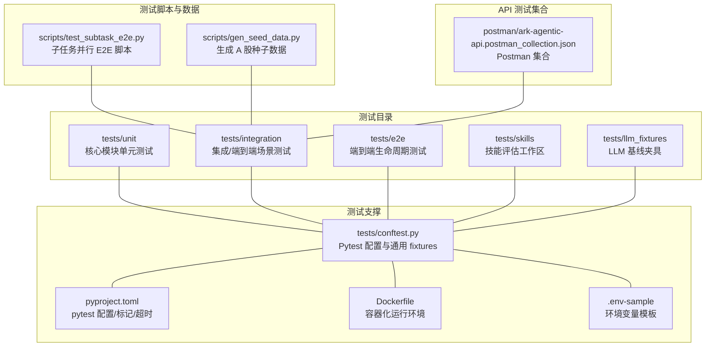
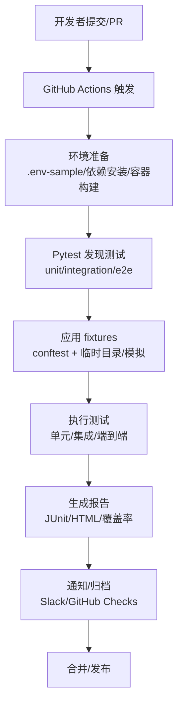
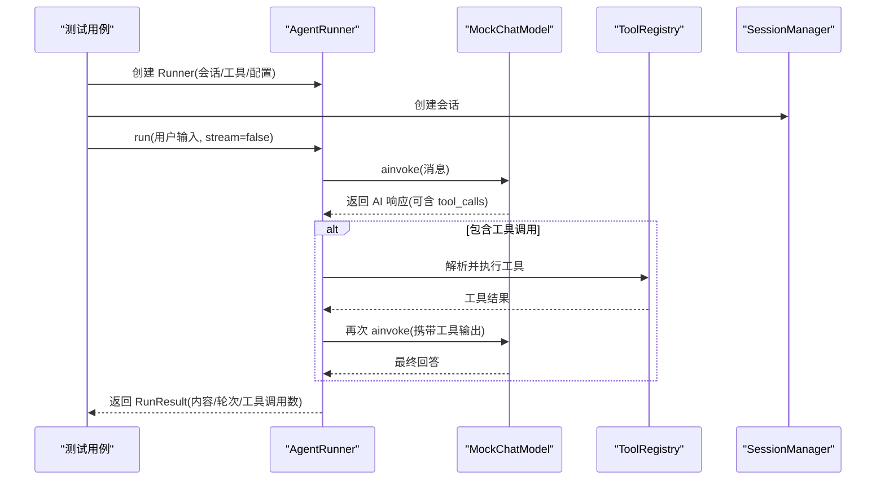
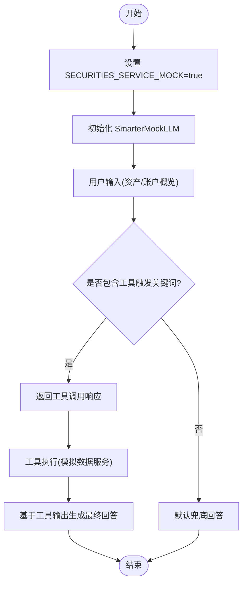
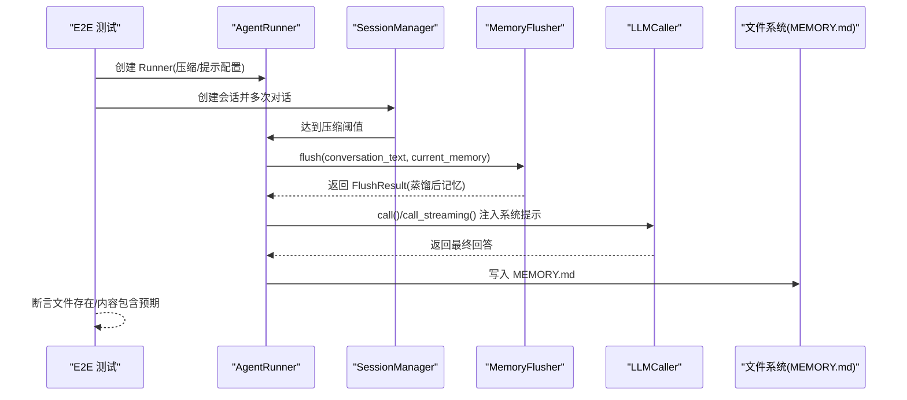
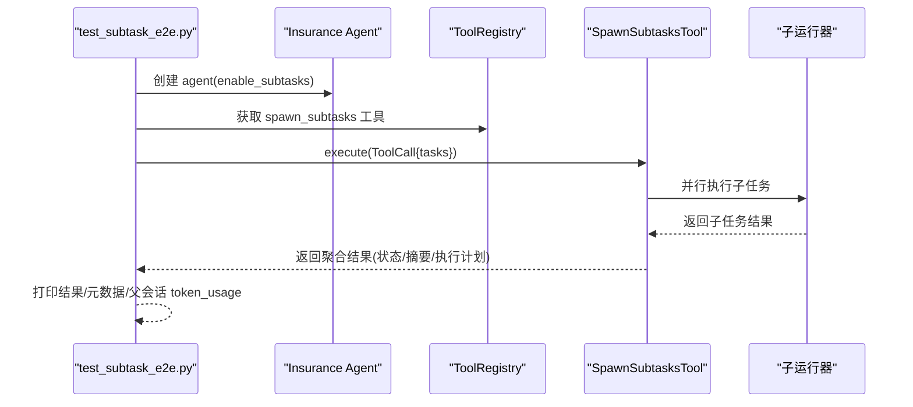
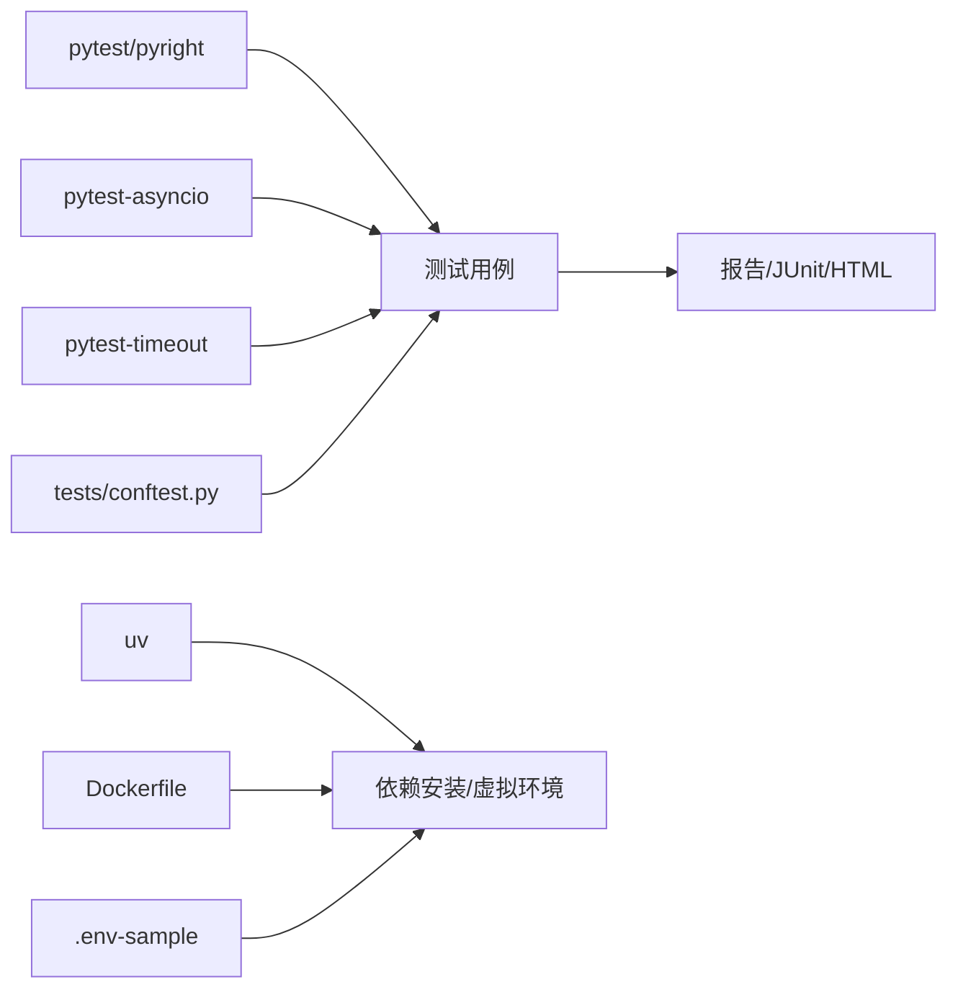

# 测试自动化

<cite>
**本文档引用的文件**
- [README.md](file://README.md)
- [pyproject.toml](file://pyproject.toml)
- [Dockerfile](file://Dockerfile)
- [.env-sample](file://.env-sample)
- [tests/conftest.py](file://tests/conftest.py)
- [tests/unit/core/test_runner.py](file://tests/unit/core/test_runner.py)
- [tests/integration/test_agent_integration.py](file://tests/integration/test_agent_integration.py)
- [tests/e2e/test_memory_e2e.py](file://tests/e2e/test_memory_e2e.py)
- [scripts/test_subtask_e2e.py](file://scripts/test_subtask_e2e.py)
- [scripts/gen_seed_data.py](file://scripts/gen_seed_data.py)
- [postman/ark-agentic-api.postman_collection.json](file://postman/ark-agentic-api.postman_collection.json)
</cite>

## 目录
1. [简介](#简介)
2. [项目结构](#项目结构)
3. [核心组件](#核心组件)
4. [架构总览](#架构总览)
5. [详细组件分析](#详细组件分析)
6. [依赖关系分析](#依赖关系分析)
7. [性能考量](#性能考量)
8. [故障排查指南](#故障排查指南)
9. [结论](#结论)
10. [附录](#附录)

## 简介
本文件面向 Ark-Agentic 项目的测试自动化体系，系统性阐述持续集成流水线配置、自动化测试执行与测试报告生成、测试脚本开发、测试数据管理与测试环境自动化、GitHub Actions 配置示例、测试覆盖率统计与测试结果通知机制，以及测试环境隔离、并行测试执行与测试资源管理策略。文档旨在帮助开发者与测试工程师高效理解并扩展测试自动化方案。

## 项目结构
Ark-Agentic 的测试组织遵循“单元测试(unit)/集成测试(integration)/端到端测试(e2e)”分层，配合 Pytest 配置与 fixtures，结合脚本化工具与 Postman 集合，形成完整的测试自动化闭环。

**图表来源**
- [tests/conftest.py:1-39](file://tests/conftest.py#L1-L39)
- [pyproject.toml:70-78](file://pyproject.toml#L70-L78)
- [Dockerfile:1-75](file://Dockerfile#L1-L75)
- [.env-sample:1-75](file://.env-sample#L1-L75)
- [scripts/test_subtask_e2e.py:1-93](file://scripts/test_subtask_e2e.py#L1-L93)
- [scripts/gen_seed_data.py:1-800](file://scripts/gen_seed_data.py#L1-L800)
- [postman/ark-agentic-api.postman_collection.json](file://postman/ark-agentic-api.postman_collection.json)

**章节来源**
- [README.md:757-770](file://README.md#L757-L770)
- [pyproject.toml:70-78](file://pyproject.toml#L70-L78)
- [tests/conftest.py:1-39](file://tests/conftest.py#L1-L39)

## 核心组件
- 测试框架与配置
  - 使用 Pytest，启用 asyncio 模式，设置全局超时与测试标记，统一测试入口路径。
- 测试夹具与环境准备
  - 通过 conftest 注入 src 路径、模拟可选依赖、提供临时会话目录等。
- 测试数据与环境
  - .env-sample 提供 LLM、保险/证券服务、Phoenix 等环境变量模板；scripts/gen_seed_data.py 生成种子数据；scripts/test_subtask_e2e.py 提供子任务并行 E2E 场景。
- API 测试集合
  - Postman 集合用于接口回归与手动验证，便于 CI 中结合 Newman 执行。
- 容器化测试环境
  - Dockerfile 提供多阶段构建与运行时环境，便于在 CI 中统一拉起测试环境。

**章节来源**
- [pyproject.toml:70-78](file://pyproject.toml#L70-L78)
- [tests/conftest.py:12-39](file://tests/conftest.py#L12-L39)
- [.env-sample:1-75](file://.env-sample#L1-L75)
- [scripts/gen_seed_data.py:1-800](file://scripts/gen_seed_data.py#L1-L800)
- [scripts/test_subtask_e2e.py:1-93](file://scripts/test_subtask_e2e.py#L1-L93)
- [postman/ark-agentic-api.postman_collection.json](file://postman/ark-agentic-api.postman_collection.json)
- [Dockerfile:1-75](file://Dockerfile#L1-L75)

## 架构总览
测试自动化架构围绕“测试发现—环境准备—执行—报告—归档”闭环展开，结合 Pytest、fixtures、脚本与容器化，形成可扩展的流水线基础。

[此图为概念性流程图，不直接映射具体源码文件，故不附“图表来源”]

## 详细组件分析

### 单元测试：AgentRunner 核心流程
- 目标：验证 AgentRunner 的推理-行动循环、工具调用、回调钩子、流式输出等核心行为。
- 关键点：
  - 使用 MockChatModel 模拟 LLM，提供非外部依赖的稳定测试环境。
  - 通过 ToolRegistry 注册最小工具，验证工具调用与会话历史记录。
  - 验证 tracing 回调钩子的注入与生命周期回调行为。
- 典型断言：响应内容、轮次计数、工具调用次数、会话消息中工具结果的存在与匹配。

**图表来源**
- [tests/unit/core/test_runner.py:141-200](file://tests/unit/core/test_runner.py#L141-L200)
- [tests/unit/core/test_runner.py:160-195](file://tests/unit/core/test_runner.py#L160-L195)

**章节来源**
- [tests/unit/core/test_runner.py:1-200](file://tests/unit/core/test_runner.py#L1-L200)

### 集成测试：代理与工具链集成
- 目标：验证代理在真实工具链下的行为，包括工具调用、数据服务适配、流式与非流式响应。
- 关键点：
  - 使用 SECURITIES_SERVICE_MOCK=true 切换至 Mock 数据服务，避免外部依赖。
  - SmarterMockLLM 模拟工具调用与最终回答，覆盖多种输入场景。
  - 验证工具输出到最终回答的转换逻辑与 token 统计。

**图表来源**
- [tests/integration/test_agent_integration.py:13-200](file://tests/integration/test_agent_integration.py#L13-L200)

**章节来源**
- [tests/integration/test_agent_integration.py:1-200](file://tests/integration/test_agent_integration.py#L1-L200)

### 端到端测试：记忆系统生命周期
- 目标：验证会话压缩、内存刷新、系统提示注入与 MEMORY.md 写入的完整生命周期。
- 关键点：
  - Tiny compaction 配置触发压缩，MemoryFlusher flush 返回固定内容。
  - LLMCaller 的 call/call_streaming 被 patch，确保可控输出。
  - 断言 MEMORY.md 是否被写入、内容是否包含关键信息、系统提示是否注入。

**图表来源**
- [tests/e2e/test_memory_e2e.py:100-162](file://tests/e2e/test_memory_e2e.py#L100-L162)
- [tests/e2e/test_memory_e2e.py:164-200](file://tests/e2e/test_memory_e2e.py#L164-L200)

**章节来源**
- [tests/e2e/test_memory_e2e.py:1-200](file://tests/e2e/test_memory_e2e.py#L1-L200)

### 子任务并行 E2E 脚本
- 目标：绕过 LLM 触发决策，直接构造 ToolCall 并调用 SpawnSubtasksTool.execute()，验证并行子任务执行与状态汇总。
- 关键点：
  - 通过环境变量 DATA_SERVICE_MOCK=true 强制使用 Mock 数据服务。
  - 构造 tasks 列表，包含多个子任务标签与任务描述。
  - 输出子任务结果、状态、metadata 中的 state_delta 与 transcripts。

**图表来源**
- [scripts/test_subtask_e2e.py:38-93](file://scripts/test_subtask_e2e.py#L38-L93)

**章节来源**
- [scripts/test_subtask_e2e.py:1-93](file://scripts/test_subtask_e2e.py#L1-L93)

### 测试数据管理与种子数据生成
- 目标：为证券相关测试提供稳定的种子数据，减少对外部数据源的依赖。
- 关键点：
  - scripts/gen_seed_data.py 生成 A 股种子数据 CSV，覆盖上交所、科创板等代表性股票。
  - 在测试中可直接读取该 CSV，或通过 Mock 服务注入。

**章节来源**
- [scripts/gen_seed_data.py:1-800](file://scripts/gen_seed_data.py#L1-L800)

### API 测试集合与 Postman
- 目标：通过 Postman 集合进行接口回归与手动验证，便于 CI 中结合 Newman 执行。
- 关键点：
  - 使用 .env-sample 中的环境变量模板，确保测试环境一致性。
  - 在 CI 中可通过 Newman 执行集合，产出报告并集成到流水线。

**章节来源**
- [.env-sample:1-75](file://.env-sample#L1-L75)
- [postman/ark-agentic-api.postman_collection.json](file://postman/ark-agentic-api.postman_collection.json)

## 依赖关系分析
- 测试框架与工具链
  - pytest、pytest-asyncio、pytest-timeout 提供测试执行与超时控制。
  - uv 作为包管理器，统一依赖解析与安装。
- 可选依赖的 mock
  - conftest 中对 numpy、sentence_transformers 等可选依赖进行 mock，保证测试在缺失依赖时仍可运行。
- 容器化与环境变量
  - Dockerfile 提供多阶段构建与运行时环境；.env-sample 提供 LLM、保险/证券服务、Phoenix 等环境变量模板。

**图表来源**
- [pyproject.toml:70-78](file://pyproject.toml#L70-L78)
- [tests/conftest.py:17-31](file://tests/conftest.py#L17-L31)
- [Dockerfile:1-75](file://Dockerfile#L1-L75)
- [.env-sample:1-75](file://.env-sample#L1-L75)

**章节来源**
- [pyproject.toml:70-78](file://pyproject.toml#L70-L78)
- [tests/conftest.py:17-31](file://tests/conftest.py#L17-L31)
- [Dockerfile:1-75](file://Dockerfile#L1-L75)
- [.env-sample:1-75](file://.env-sample#L1-L75)

## 性能考量
- 测试超时与稳定性
  - 全局 timeout=180，避免单个用例阻塞整体测试；慢测试建议标记为“slow”，CI 可选择性跳过。
- 并行与隔离
  - 使用 tmp_path 提供临时目录，确保测试间互不干扰；容器化运行进一步强化隔离。
- 资源管理
  - 通过 fixtures 管理会话目录、内存目录等资源，测试结束后自动清理。

**章节来源**
- [pyproject.toml:74-77](file://pyproject.toml#L74-L77)
- [tests/conftest.py:33-39](file://tests/conftest.py#L33-L39)
- [Dockerfile:53-57](file://Dockerfile#L53-L57)

## 故障排查指南
- 常见问题
  - LLM 依赖缺失：通过 conftest 的 optional modules mock 降低影响。
  - 环境变量错误：参考 .env-sample，确保 LLM_PROVIDER/MODEL_NAME/API_KEY/LLM_BASE_URL 等正确配置。
  - 外部服务不可用：使用 SECURITIES_SERVICE_MOCK=true 或 DATA_SERVICE_MOCK=true 切换至 Mock。
- 定位手段
  - 使用 pytest -v 输出详细日志；必要时开启更高等级日志。
  - 在 E2E 测试中，通过 patch LLMCaller 的 call/call_streaming 控制输出，便于复现与调试。
- 修复建议
  - 为慢测试增加“slow”标记并在 CI 中按需排除。
  - 对依赖外部服务的测试，优先使用 Mock 数据或本地服务镜像。

**章节来源**
- [tests/conftest.py:17-31](file://tests/conftest.py#L17-L31)
- [.env-sample:16-75](file://.env-sample#L16-L75)
- [tests/e2e/test_memory_e2e.py:130-137](file://tests/e2e/test_memory_e2e.py#L130-L137)

## 结论
Ark-Agentic 的测试自动化以 Pytest 为核心，结合 fixtures、脚本与容器化，形成了覆盖单元、集成与端到端的完整测试体系。通过 Mock 环境与稳定的种子数据，显著降低了对外部依赖的耦合；通过标记与超时控制，提升了测试执行的稳定性与可维护性。建议在 CI 中引入覆盖率统计与报告归档，并将 Postman 集成到流水线以完善 API 回归。

## 附录

### GitHub Actions 配置示例（概念性）
以下为流水线步骤的示例说明，便于在仓库中创建 .github/workflows/test.yml：

- 触发条件
  - push 到 main 分支；pull_request 触发。
- 步骤
  - 设置 Python 与 uv 环境
  - 安装依赖（包含 dev 组）
  - 拉起容器（如需数据库/外部服务）
  - 运行 pytest（可并行）
  - 生成覆盖率与报告
  - 上传测试报告与覆盖率
  - Postman 集成（可选：newman 执行集合）

[本节为概念性说明，不直接映射具体源码文件，故不附“章节来源”]

### 测试覆盖率统计与报告
- 建议
  - 使用 pytest-cov 生成覆盖率报告，结合 codecov/github-action 上传覆盖率。
  - 将报告以 artifacts 形式保存，便于 PR 审查与历史对比。
- 与现有配置的关系
  - pyproject.toml 已启用 pytest 与 asyncio，可直接扩展覆盖率插件。

**章节来源**
- [pyproject.toml:70-78](file://pyproject.toml#L70-L78)

### 测试结果通知机制
- 建议
  - 在 CI 中通过 GitHub Checks 或 Slack Webhook 发送测试结果摘要。
  - 对失败用例附带日志与报告链接，便于快速定位。
- 与现有配置的关系
  - pytest 已支持生成 JUnit/HTML 报告，可直接接入通知平台。

**章节来源**
- [pyproject.toml:70-78](file://pyproject.toml#L70-L78)

### 测试环境隔离与并行执行
- 隔离策略
  - 使用 tmp_path 与容器卷隔离会话与内存目录。
  - 通过 .env-sample 与环境变量模板统一配置。
- 并行执行
  - pytest 支持多进程/多线程并行（需谨慎使用共享资源）。
  - 对于 I/O 密集型测试，建议优先使用 asyncio；对于 CPU 密集型，考虑拆分为独立作业。

**章节来源**
- [tests/conftest.py:33-39](file://tests/conftest.py#L33-L39)
- [Dockerfile:53-57](file://Dockerfile#L53-L57)
- [.env-sample:1-75](file://.env-sample#L1-L75)