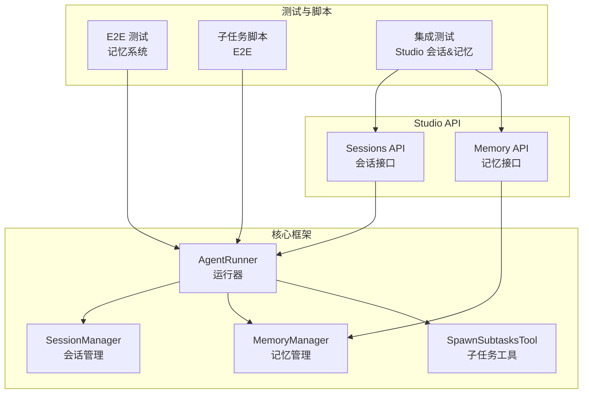
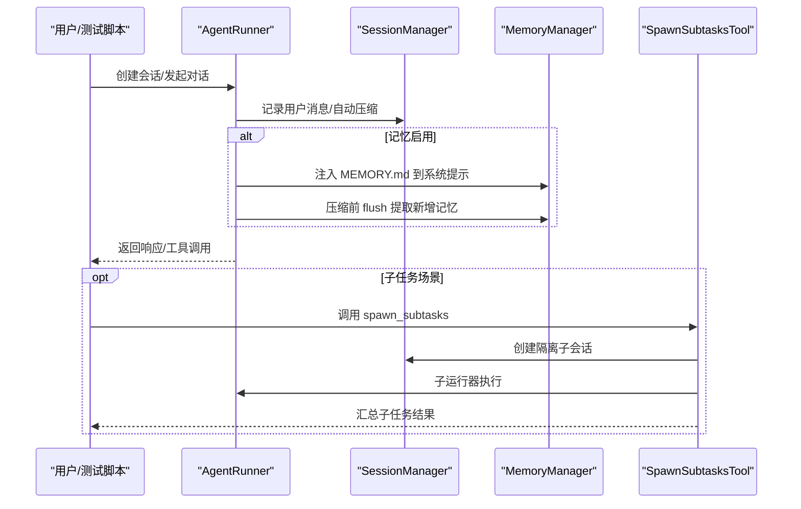
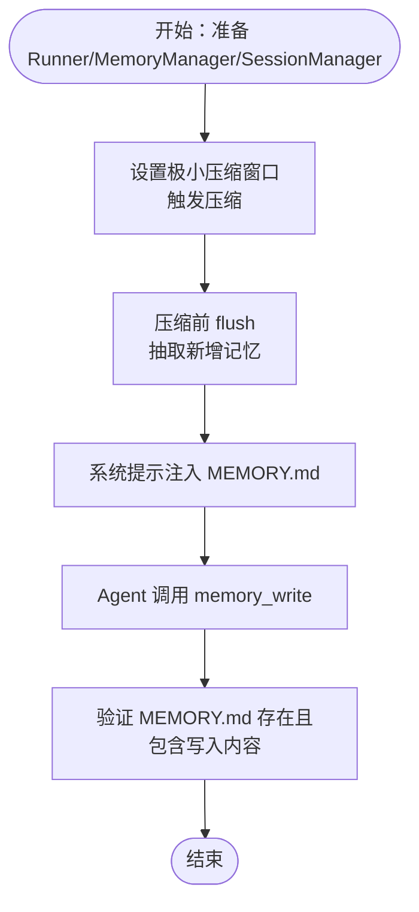
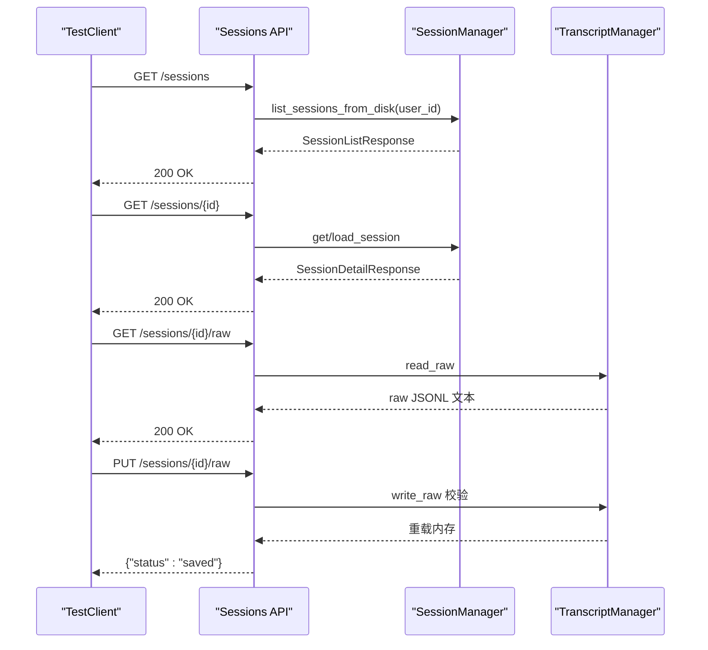
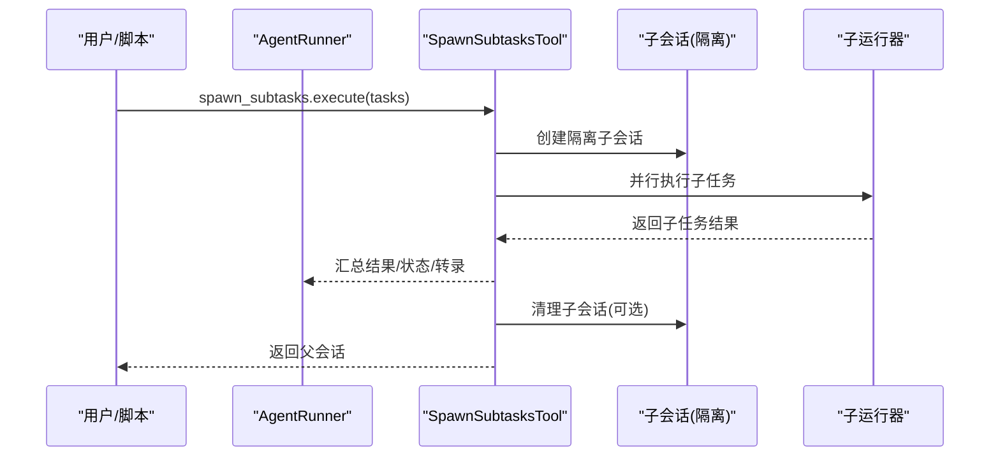
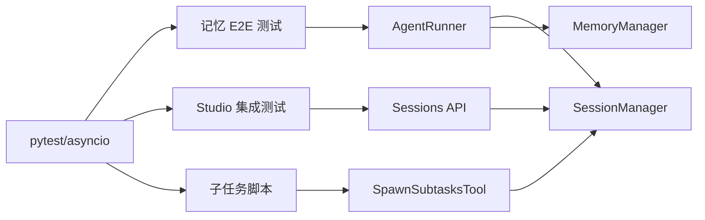

# 端到端测试

<cite>
**本文档引用的文件**
- [README.md](file://README.md)
- [pyproject.toml](file://pyproject.toml)
- [tests/conftest.py](file://tests/conftest.py)
- [tests/e2e/test_memory_e2e.py](file://tests/e2e/test_memory_e2e.py)
- [tests/integration/test_studio_sessions_memory.py](file://tests/integration/test_studio_sessions_memory.py)
- [scripts/test_subtask_e2e.py](file://scripts/test_subtask_e2e.py)
- [src/ark_agentic/core/memory/manager.py](file://src/ark_agentic/core/memory/manager.py)
- [src/ark_agentic/core/session.py](file://src/ark_agentic/core/session.py)
- [src/ark_agentic/core/subtask/tool.py](file://src/ark_agentic/core/subtask/tool.py)
- [src/ark_agentic/core/runner.py](file://src/ark_agentic/core/runner.py)
- [src/ark_agentic/studio/api/sessions.py](file://src/ark_agentic/studio/api/sessions.py)
</cite>

## 目录
1. [简介](#简介)
2. [项目结构](#项目结构)
3. [核心组件](#核心组件)
4. [架构总览](#架构总览)
5. [详细组件分析](#详细组件分析)
6. [依赖分析](#依赖分析)
7. [性能考虑](#性能考虑)
8. [故障排查指南](#故障排查指南)
9. [结论](#结论)
10. [附录](#附录)

## 简介
本文件面向 Ark-Agentic 的端到端测试实践，聚焦三大业务主线：
- 记忆系统端到端验证：从会话 JSONL 到 MEMORY.md 的蒸馏与系统提示注入闭环
- Studio 会话管理测试：基于 FastAPI 的会话列表、详情与原始 JSONL 读写
- 子任务执行测试：并行子任务工具的场景构造、隔离会话与结果聚合

文档提供测试场景设计、用户行为模拟、系统状态验证方法，以及测试环境搭建、数据清理与测试结果分析的实操指引，并补充性能测试与压力测试的实施建议。

## 项目结构
Ark-Agentic 采用“核心框架 + 业务智能体 + Studio 控制台”的分层组织方式。与端到端测试直接相关的核心模块包括：
- 核心运行与会话：AgentRunner、SessionManager、MemoryManager
- 记忆系统：MemoryManager、MemoryFlusher、MemoryDreamer
- 子任务系统：SpawnSubtasksTool
- Studio API：会话与记忆的 REST 接口
- 测试与脚本：pytest 配置、E2E 测试、子任务 E2E 脚本

图示来源
- [src/ark_agentic/core/runner.py](file://src/ark_agentic/core/runner.py)
- [src/ark_agentic/core/session.py](file://src/ark_agentic/core/session.py)
- [src/ark_agentic/core/memory/manager.py](file://src/ark_agentic/core/memory/manager.py)
- [src/ark_agentic/core/subtask/tool.py](file://src/ark_agentic/core/subtask/tool.py)
- [src/ark_agentic/studio/api/sessions.py](file://src/ark_agentic/studio/api/sessions.py)
- [tests/e2e/test_memory_e2e.py](file://tests/e2e/test_memory_e2e.py)
- [scripts/test_subtask_e2e.py](file://scripts/test_subtask_e2e.py)
- [tests/integration/test_studio_sessions_memory.py](file://tests/integration/test_studio_sessions_memory.py)

章节来源
- [README.md](file://README.md)
- [pyproject.toml](file://pyproject.toml)

## 核心组件
- AgentRunner：ReAct 执行循环、工具调用、钩子回调、会话状态与令牌统计、自动压缩与记忆蒸馏触发
- SessionManager：会话生命周期、消息持久化(JSONL)、上下文压缩、状态与令牌统计
- MemoryManager：MEMORY.md 读写、heading 级 upsert、工作区路径管理
- SpawnSubtasksTool：并行子任务执行、隔离会话、状态合并、转录回传
- Studio Sessions API：会话列表/详情、原始 JSONL 读写、错误校验
- 测试基础设施：pytest 配置、临时目录、mock 依赖注入

章节来源
- [src/ark_agentic/core/runner.py](file://src/ark_agentic/core/runner.py)
- [src/ark_agentic/core/session.py](file://src/ark_agentic/core/session.py)
- [src/ark_agentic/core/memory/manager.py](file://src/ark_agentic/core/memory/manager.py)
- [src/ark_agentic/core/subtask/tool.py](file://src/ark_agentic/core/subtask/tool.py)
- [src/ark_agentic/studio/api/sessions.py](file://src/ark_agentic/studio/api/sessions.py)
- [tests/conftest.py](file://tests/conftest.py)

## 架构总览
端到端测试围绕以下三条主线展开：

图示来源
- [src/ark_agentic/core/runner.py](file://src/ark_agentic/core/runner.py)
- [src/ark_agentic/core/session.py](file://src/ark_agentic/core/session.py)
- [src/ark_agentic/core/memory/manager.py](file://src/ark_agentic/core/memory/manager.py)
- [src/ark_agentic/core/subtask/tool.py](file://src/ark_agentic/core/subtask/tool.py)

## 详细组件分析

### 记忆系统端到端验证
目标：验证“Session JSONL(raw) → MEMORY.md(distilled) → 系统提示注入(system prompt consumption)”的完整生命周期。

- 场景设计要点
  - 触发压缩：通过极小上下文窗口配置，使会话在多轮后触发压缩
  - 内容注入：验证系统提示是否包含 MEMORY.md 的关键信息
  - 写入工具：Agent 主动调用 memory_write，确认 MEMORY.md 更新与工具调用记录
  - Flush 回写：压缩前的 flush 将抽取的记忆写入 MEMORY.md

- 用户行为模拟
  - 多轮对话逐步引入敏感话题/偏好，观察压缩与注入
  - 显式触发记忆写入（如“请以后都这样回复”）

- 系统状态验证
  - MEMORY.md 文件存在性与内容片段命中
  - 系统提示首条消息包含 MEMORY.md 关键字段
  - 工具调用记录中包含 memory_write

- 测试脚本参考
  - [tests/e2e/test_memory_e2e.py](file://tests/e2e/test_memory_e2e.py)

图示来源
- [tests/e2e/test_memory_e2e.py](file://tests/e2e/test_memory_e2e.py)
- [src/ark_agentic/core/memory/manager.py](file://src/ark_agentic/core/memory/manager.py)
- [src/ark_agentic/core/runner.py](file://src/ark_agentic/core/runner.py)

章节来源
- [tests/e2e/test_memory_e2e.py](file://tests/e2e/test_memory_e2e.py)
- [src/ark_agentic/core/memory/manager.py](file://src/ark_agentic/core/memory/manager.py)
- [src/ark_agentic/core/runner.py](file://src/ark_agentic/core/runner.py)

### Studio 会话管理测试
目标：验证 Studio 的会话 API 在“只读/编辑”模式下的正确性，确保磁盘 JSONL 与内存状态一致。

- 场景设计要点
  - 会话列表：按 user_id 过滤、消息计数、首次用户消息截断
  - 会话详情：消息序列、tool_calls/tool_results、thinking/metadata
  - 原始 JSONL：GET/PUT 校验（首行 type、id 一致性、空行校验）
  - 记忆 API：文件枚举、内容读写、路径遍历防护

- 用户行为模拟
  - 通过 TestClient 发起 GET/PUT 请求，构造合法/非法 JSONL
  - 模拟不同 user_id 的会话列表查询

- 系统状态验证
  - GET 返回与 PUT 内容一致
  - 非法 JSONL 返回 400，包含 line_number 或 message
  - 路径穿越被拒绝（403）

- 测试脚本参考
  - [tests/integration/test_studio_sessions_memory.py](file://tests/integration/test_studio_sessions_memory.py)

图示来源
- [tests/integration/test_studio_sessions_memory.py](file://tests/integration/test_studio_sessions_memory.py)
- [src/ark_agentic/studio/api/sessions.py](file://src/ark_agentic/studio/api/sessions.py)
- [src/ark_agentic/core/session.py](file://src/ark_agentic/core/session.py)

章节来源
- [tests/integration/test_studio_sessions_memory.py](file://tests/integration/test_studio_sessions_memory.py)
- [src/ark_agentic/studio/api/sessions.py](file://src/ark_agentic/studio/api/sessions.py)
- [src/ark_agentic/core/session.py](file://src/ark_agentic/core/session.py)

### 子任务执行测试
目标：验证并行子任务工具在单次对话中拆解与执行多个独立意图的能力。

- 场景设计要点
  - 任务拆分：用户输入包含多个独立意图，工具自动拆分为子任务
  - 隔离会话：子任务使用独立 session_id（含 :sub: 标记），避免嵌套
  - 并行执行：使用 asyncio.gather 并发执行，受 max_concurrent 限制
  - 结果聚合：汇总子任务结果、state_delta、转录与令牌用量

- 用户行为模拟
  - 输入复合意图（如“我要理赔，同时查查能领多少钱”）
  - 通过脚本直接构造 ToolCall 并调用 spawn_subtasks.execute()

- 系统状态验证
  - 子任务执行摘要（turns、tools_called、token_usage、duration_ms）
  - metadata 中 state_delta 与 transcripts
  - 超时/错误处理与清理

- 测试脚本参考
  - [scripts/test_subtask_e2e.py](file://scripts/test_subtask_e2e.py)
  - [src/ark_agentic/core/subtask/tool.py](file://src/ark_agentic/core/subtask/tool.py)

图示来源
- [scripts/test_subtask_e2e.py](file://scripts/test_subtask_e2e.py)
- [src/ark_agentic/core/subtask/tool.py](file://src/ark_agentic/core/subtask/tool.py)

章节来源
- [scripts/test_subtask_e2e.py](file://scripts/test_subtask_e2e.py)
- [src/ark_agentic/core/subtask/tool.py](file://src/ark_agentic/core/subtask/tool.py)

## 依赖分析
- 测试运行时依赖
  - pytest、pytest-asyncio、pytest-timeout：测试框架与异步支持
  - fastapi、httpx：Studio API 与 HTTP 客户端
  - langchain-*：LLM 客户端与链路可观测性
  - optional：PA-JT 签名、开发工具链

- 组件耦合
  - AgentRunner 依赖 SessionManager、MemoryManager、ToolRegistry、LLMCaller
  - SpawnSubtasksTool 依赖 SessionManager、ToolRegistry、AgentRunner（子运行器）
  - Studio API 依赖 Registry 获取 Runner，间接依赖 SessionManager 与 MemoryManager

图示来源
- [pyproject.toml](file://pyproject.toml)
- [tests/conftest.py](file://tests/conftest.py)
- [tests/e2e/test_memory_e2e.py](file://tests/e2e/test_memory_e2e.py)
- [tests/integration/test_studio_sessions_memory.py](file://tests/integration/test_studio_sessions_memory.py)
- [scripts/test_subtask_e2e.py](file://scripts/test_subtask_e2e.py)

章节来源
- [pyproject.toml](file://pyproject.toml)
- [tests/conftest.py](file://tests/conftest.py)

## 性能考虑
- 并发与吞吐
  - 子任务并发：通过 SubtaskConfig.max_concurrent 控制，避免过度并发导致资源争用
  - 工具并行：LLM 返回多工具调用时使用 asyncio.gather 并行执行
- 上下文压缩
  - 合理设置 CompactionConfig.context_window 与 preserve_recent，平衡上下文长度与压缩成本
- I/O 与锁
  - JSONL 写入使用文件锁，避免竞态；批量写入建议合并请求
- 可观测性
  - Phoenix 链路追踪与事件流式输出，便于定位瓶颈

[本节为通用指导，无需特定文件引用]

## 故障排查指南
- 记忆系统
  - MEMORY.md 未更新：检查 auto_compact 与 flush 回调是否触发；确认 memory_write 工具注册
  - 系统提示未注入：核对 PromptConfig 与 flusher 的 pre_compact 回调
- Studio API
  - PUT 返回 400：检查首行 JSON 结构、type 与 id 一致性；关注 line_number
  - 路径穿越：确认 _resolve_memory_path 的安全校验
- 子任务
  - 嵌套子任务：子会话 id 含 :sub:，检测到则拒绝再次 spawn
  - 超时/错误：检查 timeout_seconds 与 keep_session 配置，确保异常分支清理

章节来源
- [tests/e2e/test_memory_e2e.py](file://tests/e2e/test_memory_e2e.py)
- [tests/integration/test_studio_sessions_memory.py](file://tests/integration/test_studio_sessions_memory.py)
- [src/ark_agentic/core/subtask/tool.py](file://src/ark_agentic/core/subtask/tool.py)

## 结论
Ark-Agentic 的端到端测试以“记忆蒸馏-会话持久化-子任务并行”为核心闭环，结合 Studio API 的只读/编辑能力，形成完整的业务验证体系。通过 pytest 配置、mock 依赖与脚本化子任务执行，既能覆盖关键路径，又能灵活扩展测试场景。建议在 CI 中分层执行：单元/快速集成优先，E2E 与压力测试按需触发。

[本节为总结性内容，无需特定文件引用]

## 附录

### 测试环境搭建与数据清理
- 环境变量
  - LLM_PROVIDER、API_KEY、MODEL_NAME、SESSIONS_DIR、MEMORY_DIR 等
  - DATA_SERVICE_MOCK=true（子任务脚本默认设置）
- 依赖安装
  - 使用 uv 安装 dev 依赖组，确保 pytest、pytest-asyncio、pytest-timeout
- 临时目录
  - 使用 tmp_path 提供 sessions 与 memory 工作区，自动清理
- 可选依赖 mock
  - 未安装的可选模块将被 mock，保证测试可在最小依赖下运行

章节来源
- [README.md](file://README.md)
- [pyproject.toml](file://pyproject.toml)
- [tests/conftest.py](file://tests/conftest.py)
- [scripts/test_subtask_e2e.py](file://scripts/test_subtask_e2e.py)

### 测试结果分析
- 记忆系统
  - 断言 MEMORY.md 存在与内容片段命中；验证工具调用记录中 memory_write 出现
- Studio API
  - GET/PUT 成功往返；非法 JSONL 的 400 错误与错误细节
  - 路径穿越防护触发（403）
- 子任务
  - 子任务摘要、state_delta、转录与令牌用量；超时/错误分支清理

章节来源
- [tests/e2e/test_memory_e2e.py](file://tests/e2e/test_memory_e2e.py)
- [tests/integration/test_studio_sessions_memory.py](file://tests/integration/test_studio_sessions_memory.py)
- [scripts/test_subtask_e2e.py](file://scripts/test_subtask_e2e.py)