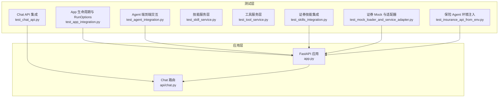
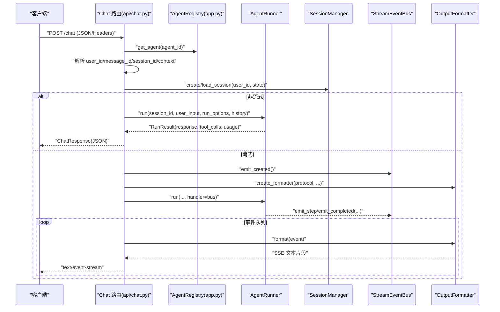
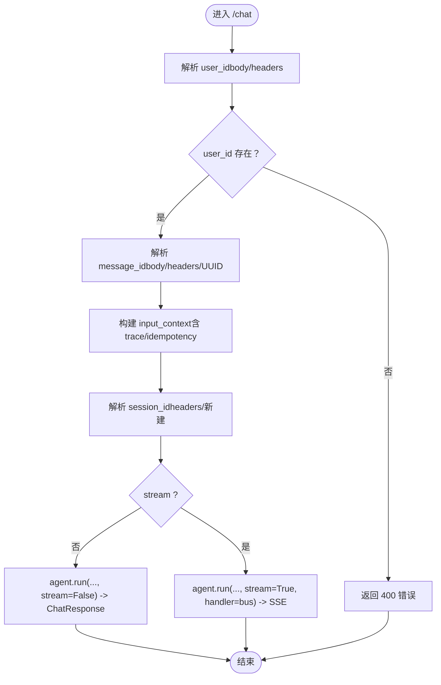
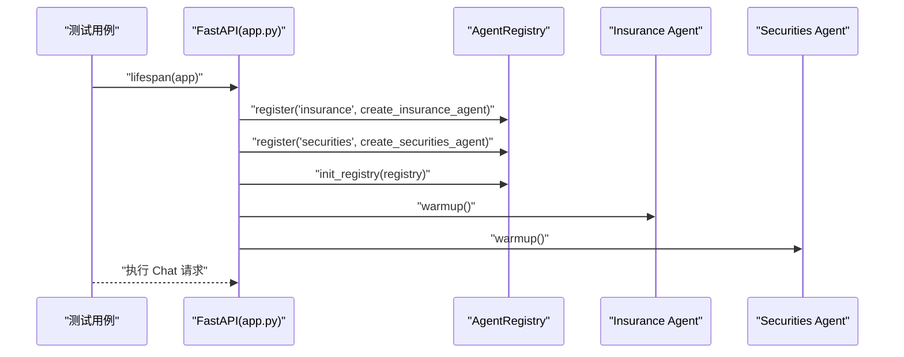
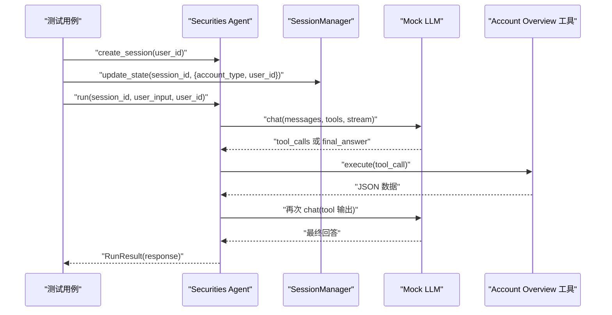
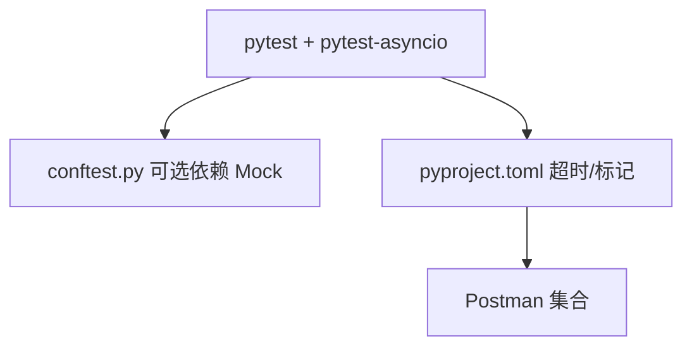

# 集成测试

<cite>
**本文引用的文件**
- [tests/integration/test_chat_api.py](file://tests/integration/test_chat_api.py)
- [tests/integration/test_app_integration.py](file://tests/integration/test_app_integration.py)
- [tests/integration/test_agent_integration.py](file://tests/integration/test_agent_integration.py)
- [tests/integration/test_skills_integration.py](file://tests/integration/test_skills_integration.py)
- [tests/integration/test_skill_service.py](file://tests/integration/test_skill_service.py)
- [tests/integration/test_tool_service.py](file://tests/integration/test_tool_service.py)
- [tests/integration/agents/securities/test_mock_loader_and_service_adapter.py](file://tests/integration/agents/securities/test_mock_loader_and_service_adapter.py)
- [tests/integration/agents/insurance/test_insurance_api_from_env.py](file://tests/integration/agents/insurance/test_insurance_api_from_env.py)
- [tests/conftest.py](file://tests/conftest.py)
- [src/ark_agentic/api/chat.py](file://src/ark_agentic/api/chat.py)
- [src/ark_agentic/app.py](file://src/ark_agentic/app.py)
- [postman/ark-agentic-api.postman_collection.json](file://postman/ark-agentic-api.postman_collection.json)
- [.env-sample](file://.env-sample)
- [pyproject.toml](file://pyproject.toml)
</cite>

## 目录
1. [引言](#引言)
2. [项目结构](#项目结构)
3. [核心组件](#核心组件)
4. [架构总览](#架构总览)
5. [详细组件分析](#详细组件分析)
6. [依赖分析](#依赖分析)
7. [性能考虑](#性能考虑)
8. [故障排查指南](#故障排查指南)
9. [结论](#结论)
10. [附录](#附录)

## 引言
本文件面向 Ark-Agentic 的集成测试实践，系统化说明智能体集成测试、API 接口测试与服务集成测试的实施方法，覆盖 Chat API 测试、智能体交互测试、技能服务测试等关键领域。文档提供测试策略、环境配置、数据库/会话连接测试、外部服务模拟方法、测试数据准备、测试场景设计与结果验证标准，并辅以可视化流程图帮助理解端到端调用链路。

## 项目结构
- 集成测试集中于 tests/integration，按功能域划分为：
  - Chat API 与运行选项集成：tests/integration/test_chat_api.py、tests/integration/test_app_integration.py
  - 智能体交互与端到端：tests/integration/test_agent_integration.py
  - 技能与工具服务层：tests/integration/test_skill_service.py、tests/integration/test_tool_service.py
  - 证券与保险子域集成：tests/integration/test_skills_integration.py、tests/integration/agents/securities/test_mock_loader_and_service_adapter.py、tests/integration/agents/insurance/test_insurance_api_from_env.py
- 运行时入口与路由：
  - FastAPI 应用入口与生命周期：src/ark_agentic/app.py
  - Chat 路由实现：src/ark_agentic/api/chat.py
- Postman 集合：postman/ark-agentic-api.postman_collection.json
- 环境变量参考：.env-sample
- 测试框架与超时配置：pyproject.toml

图表来源
- [tests/integration/test_chat_api.py:1-178](file://tests/integration/test_chat_api.py#L1-L178)
- [tests/integration/test_app_integration.py:1-162](file://tests/integration/test_app_integration.py#L1-L162)
- [tests/integration/test_agent_integration.py:1-294](file://tests/integration/test_agent_integration.py#L1-L294)
- [tests/integration/test_skills_integration.py:1-184](file://tests/integration/test_skills_integration.py#L1-L184)
- [tests/integration/test_skill_service.py:1-142](file://tests/integration/test_skill_service.py#L1-L142)
- [tests/integration/test_tool_service.py:1-168](file://tests/integration/test_tool_service.py#L1-L168)
- [tests/integration/agents/securities/test_mock_loader_and_service_adapter.py:1-45](file://tests/integration/agents/securities/test_mock_loader_and_service_adapter.py#L1-L45)
- [tests/integration/agents/insurance/test_insurance_api_from_env.py:1-24](file://tests/integration/agents/insurance/test_insurance_api_from_env.py#L1-L24)
- [src/ark_agentic/app.py:1-249](file://src/ark_agentic/app.py#L1-L249)
- [src/ark_agentic/api/chat.py:1-177](file://src/ark_agentic/api/chat.py#L1-L177)

章节来源
- [tests/integration/test_chat_api.py:1-178](file://tests/integration/test_chat_api.py#L1-L178)
- [tests/integration/test_app_integration.py:1-162](file://tests/integration/test_app_integration.py#L1-L162)
- [tests/integration/test_agent_integration.py:1-294](file://tests/integration/test_agent_integration.py#L1-L294)
- [tests/integration/test_skills_integration.py:1-184](file://tests/integration/test_skills_integration.py#L1-L184)
- [tests/integration/test_skill_service.py:1-142](file://tests/integration/test_skill_service.py#L1-L142)
- [tests/integration/test_tool_service.py:1-168](file://tests/integration/test_tool_service.py#L1-L168)
- [tests/integration/agents/securities/test_mock_loader_and_service_adapter.py:1-45](file://tests/integration/agents/securities/test_mock_loader_and_service_adapter.py#L1-L45)
- [tests/integration/agents/insurance/test_insurance_api_from_env.py:1-24](file://tests/integration/agents/insurance/test_insurance_api_from_env.py#L1-L24)
- [src/ark_agentic/app.py:1-249](file://src/ark_agentic/app.py#L1-L249)
- [src/ark_agentic/api/chat.py:1-177](file://src/ark_agentic/api/chat.py#L1-L177)

## 核心组件
- Chat API 集成测试：覆盖用户标识解析、消息与会话 ID 规则、SSE 协议与头部注入、RunOptions 传递与校验。
- 应用生命周期与 Registry 注册：验证 AgentWarmup、Registry 初始化、跨进程/线程稳定性。
- Agent 端到端交互：基于 Mock LLM 的智能体运行，注入上下文（如保证金账户），断言关键指标。
- 技能服务层：对 Studio 技能目录进行 CRUD、元数据生成与解析、slug 化与 Markdown 生成。
- 工具服务层：对 Studio 工具目录进行脚手架生成、解析与发现、模板渲染与 AST 校验。
- 证券技能集成：工具链返回原始数据后，通过 A2UI 渲染器生成 UI 卡片，断言模板类型与字段。
- Mock Loader 与服务适配器：验证多场景数据加载、适配器调用与关闭、账户类型差异。
- 保险 Agent 环境注入：通过环境变量注入 LLM Provider 与模型，断言 Runner 与 LLM 实例。

章节来源
- [tests/integration/test_chat_api.py:69-177](file://tests/integration/test_chat_api.py#L69-L177)
- [tests/integration/test_app_integration.py:60-162](file://tests/integration/test_app_integration.py#L60-L162)
- [tests/integration/test_agent_integration.py:13-294](file://tests/integration/test_agent_integration.py#L13-L294)
- [tests/integration/test_skill_service.py:40-142](file://tests/integration/test_skill_service.py#L40-L142)
- [tests/integration/test_tool_service.py:58-168](file://tests/integration/test_tool_service.py#L58-L168)
- [tests/integration/test_skills_integration.py:27-184](file://tests/integration/test_skills_integration.py#L27-L184)
- [tests/integration/agents/securities/test_mock_loader_and_service_adapter.py:10-45](file://tests/integration/agents/securities/test_mock_loader_and_service_adapter.py#L10-L45)
- [tests/integration/agents/insurance/test_insurance_api_from_env.py:10-24](file://tests/integration/agents/insurance/test_insurance_api_from_env.py#L10-L24)

## 架构总览
下图展示从客户端到 Agent 的端到端调用链，包括会话管理、上下文注入、流式与非流式响应、以及 SSE 输出协议选择。

图表来源
- [src/ark_agentic/api/chat.py:27-177](file://src/ark_agentic/api/chat.py#L27-L177)
- [src/ark_agentic/app.py:95-120](file://src/ark_agentic/app.py#L95-L120)

章节来源
- [src/ark_agentic/api/chat.py:27-177](file://src/ark_agentic/api/chat.py#L27-L177)
- [src/ark_agentic/app.py:95-120](file://src/ark_agentic/app.py#L95-L120)

## 详细组件分析

### Chat API 测试策略
- 用户标识解析与优先级：要求 user_id 必填，支持从 body 或 x-ark-user-id 头部注入；当两者同时存在时以 body 为准。
- 消息与会话 ID：message_id 支持从 body/header 注入或自动生成 UUID；x-ark-session-id 头部用于指定会话。
- 上下文注入：支持在请求中注入 context，内部会规范化键前缀与临时字段。
- 非流式与流式响应：非流式返回 ChatResponse；流式通过 SSE 输出，支持 internal/agui/enterprise 三种协议格式。
- RunOptions 校验：对温度等参数进行校验，非法值返回 422；额外字段默认忽略。

图表来源
- [src/ark_agentic/api/chat.py:27-177](file://src/ark_agentic/api/chat.py#L27-L177)
- [tests/integration/test_chat_api.py:69-177](file://tests/integration/test_chat_api.py#L69-L177)

章节来源
- [tests/integration/test_chat_api.py:69-177](file://tests/integration/test_chat_api.py#L69-L177)
- [src/ark_agentic/api/chat.py:27-177](file://src/ark_agentic/api/chat.py#L27-L177)

### 应用生命周期与 RunOptions 集成
- Registry 初始化：在测试中注入临时 AgentRegistry 并注册保险/证券 Agent，随后 warmup。
- RunOptions 传递：验证部分字段覆盖、非法字段校验、额外字段忽略行为。
- 生命周期钩子：lifespan 中完成 Agent 注册与 warmup，确保后续调用可用。

图表来源
- [tests/integration/test_app_integration.py:142-162](file://tests/integration/test_app_integration.py#L142-L162)
- [src/ark_agentic/app.py:95-120](file://src/ark_agentic/app.py#L95-L120)

章节来源
- [tests/integration/test_app_integration.py:60-162](file://tests/integration/test_app_integration.py#L60-L162)
- [src/ark_agentic/app.py:95-120](file://src/ark_agentic/app.py#L95-L120)

### 智能体交互测试（端到端）
- Mock LLM：提供同步/异步响应与流式分片，支持工具调用与最终回答。
- 场景注入：通过 SessionManager 更新状态（如保证金账户），驱动 Agent 行为。
- 断言：根据工具输出解析关键指标（如保证金比例），断言最终回复内容包含预期数值。

图表来源
- [tests/integration/test_agent_integration.py:13-294](file://tests/integration/test_agent_integration.py#L13-L294)

章节来源
- [tests/integration/test_agent_integration.py:13-294](file://tests/integration/test_agent_integration.py#L13-L294)

### 技能服务测试
- Slug 化：中文保留、危险路径清理、空值校验。
- Markdown 生成：标题、描述、正文三段式元数据与内容。
- CRUD 行为：创建/更新/删除/列出，文件系统一致性校验与异常断言。
- 目录发现：支持子目录工具文件发现与相对路径修正。

章节来源
- [tests/integration/test_skill_service.py:40-142](file://tests/integration/test_skill_service.py#L40-L142)

### 工具服务测试
- 类名转换：下划线命名转为类名规范。
- 脚手架生成：模板渲染、AST 解析、文件落盘。
- 文件解析：识别 AgentTool 子类、提取元信息、排除非工具文件。
- 列表与发现：递归扫描子目录，修正文件路径。

章节来源
- [tests/integration/test_tool_service.py:58-168](file://tests/integration/test_tool_service.py#L58-L168)

### 证券技能集成测试
- 数据工具：AccountOverview/CashAssets/ETF/HKSC/Fund/SecurityDetail。
- 渲染工具：RenderA2UITool，按 preset 渲染为 A2UI 卡片。
- 断言：JSON 结果包含关键字段；A2UI 模板类型与资产类别匹配。

章节来源
- [tests/integration/test_skills_integration.py:27-184](file://tests/integration/test_skills_integration.py#L27-L184)

### Mock Loader 与服务适配器测试
- 多场景数据加载：账户视图、ETF 持仓、安全详情等不同场景与账户类型。
- 适配器调用：在 mock 模式下调用并断言返回结构；调用后正确关闭资源。
- 列举场景：验证场景清单包含预期项。

章节来源
- [tests/integration/agents/securities/test_mock_loader_and_service_adapter.py:10-45](file://tests/integration/agents/securities/test_mock_loader_and_service_adapter.py#L10-L45)

### 保险 Agent 环境注入测试
- 通过环境变量注入 LLM Provider、API Key、模型名称。
- 断言：创建的 Runner 持有 LLM 实例且模型名匹配。

章节来源
- [tests/integration/agents/insurance/test_insurance_api_from_env.py:10-24](file://tests/integration/agents/insurance/test_insurance_api_from_env.py#L10-L24)

## 依赖分析
- 测试框架与并发模式：pytest + pytest-asyncio；默认异步模式；超时限制防止阻塞。
- 可选依赖 Mock：conftest 中对缺失模块进行 Mock，保证测试在轻量化环境下运行。
- Postman 集合：提供健康检查、非流式与多种 SSE 协议的流式示例，便于手工联调与回归。

图表来源
- [tests/conftest.py:17-31](file://tests/conftest.py#L17-L31)
- [pyproject.toml:70-77](file://pyproject.toml#L70-L77)
- [postman/ark-agentic-api.postman_collection.json:1-200](file://postman/ark-agentic-api.postman_collection.json#L1-L200)

章节来源
- [tests/conftest.py:17-31](file://tests/conftest.py#L17-L31)
- [pyproject.toml:70-77](file://pyproject.toml#L70-L77)
- [postman/ark-agentic-api.postman_collection.json:1-200](file://postman/ark-agentic-api.postman_collection.json#L1-L200)

## 性能考虑
- 流式输出：SSE 分片传输降低首包延迟，适合长对话与工具调用链路。
- RunOptions 参数：温度等参数直接影响推理耗时与稳定性，建议在测试中覆盖边界值。
- Mock 模式：在集成测试中优先使用 SECURITIES_SERVICE_MOCK 等开关，减少真实外部服务抖动。
- 会话持久化：通过 SESSIONS_DIR 指定会话存储位置，避免频繁磁盘 IO 影响测试吞吐。

## 故障排查指南
- Chat API 常见错误
  - user_id 缺失：返回 400，检查请求体或 x-ark-user-id 头部。
  - message_id 为空：确认是否从 body/header 注入或期望自动生成。
  - session_id 不存在：Agent 会自动创建新会话，检查 agent_id 与用户绑定。
- RunOptions 校验
  - 温度过高导致不稳定：测试中使用较小温度值，避免极端输出。
  - 额外字段：默认忽略，若业务需要可调整 Pydantic 配置。
- SSE 协议
  - 协议不匹配：确认请求头 Accept 与 protocol 字段一致。
  - 事件丢失：检查事件队列与格式化器，确保 emit_completed 在任务完成后触发。
- Mock 与外部服务
  - 证券服务：通过 SECURITIES_SERVICE_MOCK 控制，确保场景数据完整。
  - 保险 LLM：通过环境变量注入 Provider 与 Key，断言 LLM 实例存在。

章节来源
- [tests/integration/test_chat_api.py:69-177](file://tests/integration/test_chat_api.py#L69-L177)
- [tests/integration/test_app_integration.py:60-140](file://tests/integration/test_app_integration.py#L60-L140)
- [tests/integration/agents/securities/test_mock_loader_and_service_adapter.py:26-45](file://tests/integration/agents/securities/test_mock_loader_and_service_adapter.py#L26-L45)
- [tests/integration/agents/insurance/test_insurance_api_from_env.py:10-24](file://tests/integration/agents/insurance/test_insurance_api_from_env.py#L10-L24)

## 结论
本集成测试体系覆盖 Chat API、Agent 生命周期、技能与工具服务、以及证券/保险子域的端到端场景。通过 Mock 模式与可配置的环境变量，测试能够在可控环境中稳定复现复杂交互；借助 Postman 集合与流式协议，便于人工联调与自动化回归。建议在持续集成中区分“快速门禁”与“慢集成”两类用例，结合 RunOptions 与上下文注入策略，进一步提升测试效率与覆盖率。

## 附录
- 环境变量参考：.env-sample
- Postman 集合：postman/ark-agentic-api.postman_collection.json
- 测试超时与标记：pyproject.toml