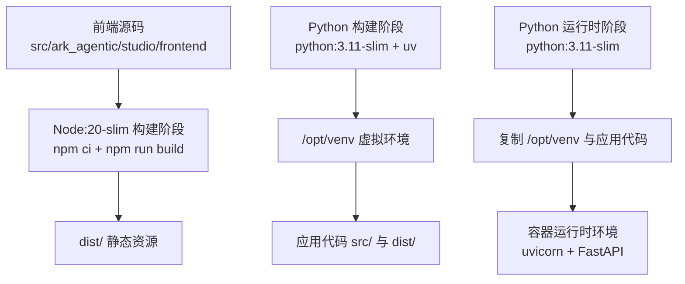
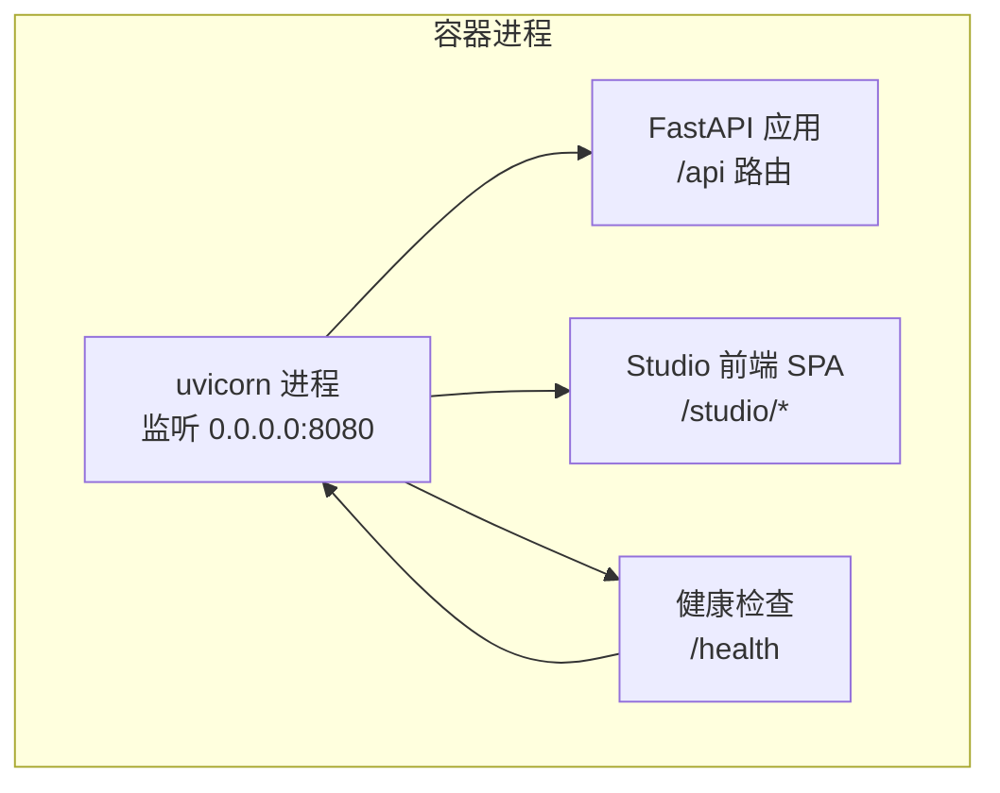
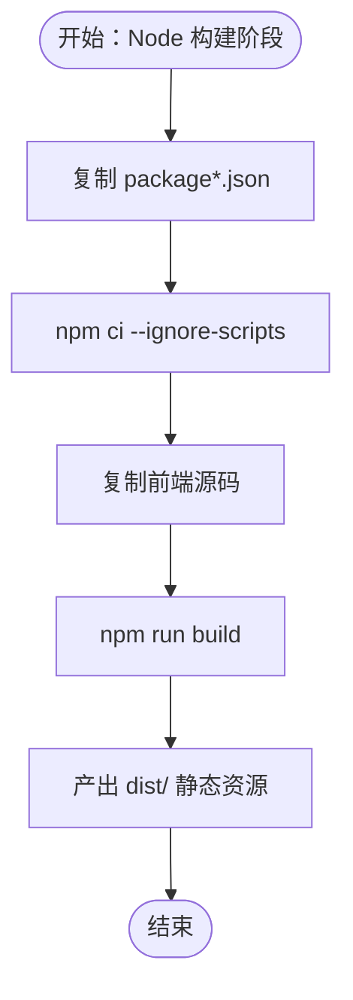
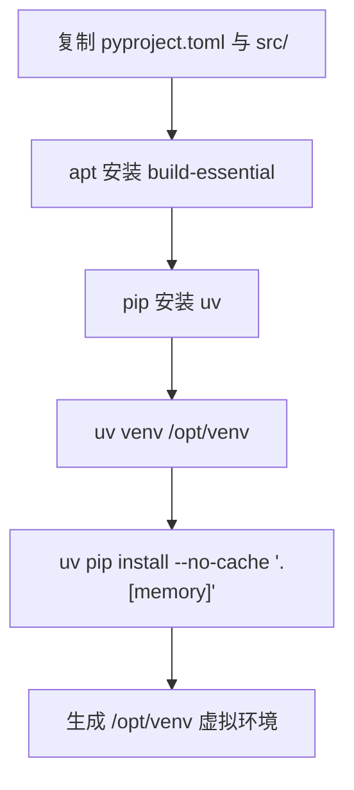
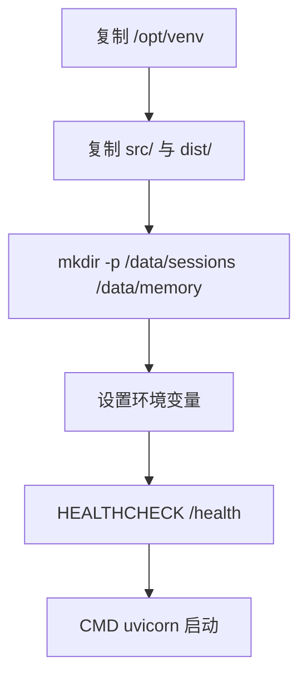
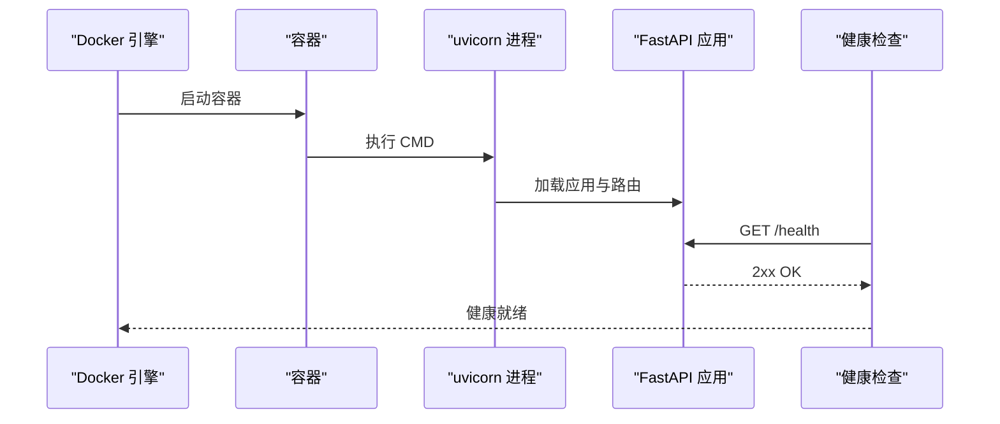
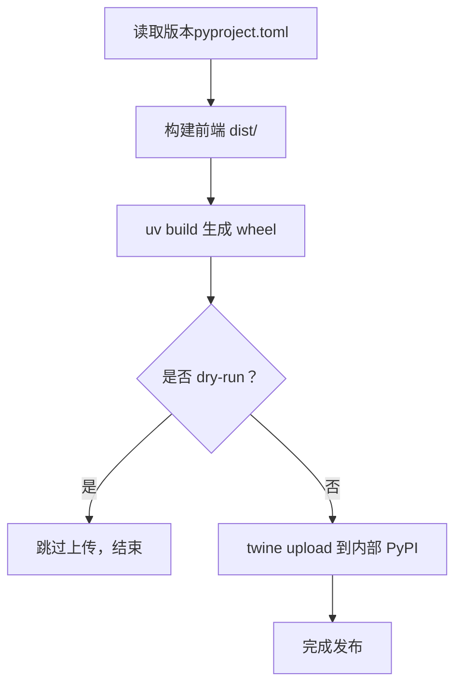
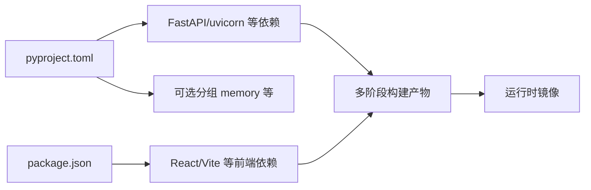

# Docker 部署

<cite>
**本文引用的文件**
- [Dockerfile](file://Dockerfile)
- [pyproject.toml](file://pyproject.toml)
- [.env-sample](file://.env-sample)
- [src/ark_agentic/app.py](file://src/ark_agentic/app.py)
- [src/ark_agentic/studio/__init__.py](file://src/ark_agentic/studio/__init__.py)
- [src/ark_agentic/studio/frontend/package.json](file://src/ark_agentic/studio/frontend/package.json)
- [src/ark_agentic/studio/frontend/vite.config.ts](file://src/ark_agentic/studio/frontend/vite.config.ts)
- [src/ark_agentic/studio/frontend/tsconfig.json](file://src/ark_agentic/studio/frontend/tsconfig.json)
- [src/ark_agentic/studio/frontend/src/main.tsx](file://src/ark_agentic/studio/frontend/src/main.tsx)
- [scripts/publish.sh](file://scripts/publish.sh)
- [scripts/publish.ps1](file://scripts/publish.ps1)
- [scripts/publish.cmd](file://scripts/publish.cmd)
</cite>

## 目录
1. [简介](#简介)
2. [项目结构](#项目结构)
3. [核心组件](#核心组件)
4. [架构总览](#架构总览)
5. [详细组件分析](#详细组件分析)
6. [依赖关系分析](#依赖关系分析)
7. [性能考量](#性能考量)
8. [故障排查指南](#故障排查指南)
9. [结论](#结论)
10. [附录](#附录)

## 简介
本指南面向在生产环境中使用 Docker 部署 Ark-Agentic 的工程团队，系统讲解多阶段构建流程（前端构建阶段与 Python 运行时阶段）、构建依赖与虚拟环境创建、镜像构建与运行参数、卷挂载策略、健康检查与启动流程，并提供发布脚本的使用方法与最佳实践。目标是帮助读者在不同平台（Linux/macOS/Windows）上稳定、可重复地完成镜像构建与容器运行。

## 项目结构
Ark-Agentic 的 Docker 部署采用多阶段构建：
- 阶段一：Node 基础镜像用于前端构建，产出静态资源 dist/
- 阶段二：Python 构建阶段，安装构建依赖与 uv，创建虚拟环境并安装 Python 依赖
- 阶段三：Python 运行时阶段，仅携带运行所需的虚拟环境与静态资源，最小化镜像体积

**图表来源**
- [Dockerfile:4-10](file://Dockerfile#L4-L10)
- [Dockerfile:12-34](file://Dockerfile#L12-L34)
- [Dockerfile:35-75](file://Dockerfile#L35-L75)

**章节来源**
- [Dockerfile:1-75](file://Dockerfile#L1-L75)

## 核心组件
- 多阶段构建
  - 前端阶段：基于 node:20-slim，执行 npm ci 与构建，产出 dist/ 静态资源
  - 构建阶段：基于 python:3.11-slim，安装 build-essential，使用 uv 安装 Python 依赖至 /opt/venv
  - 运行阶段：基于 python:3.11-slim，复制 /opt/venv 与应用代码，准备运行时目录
- 运行时目录与持久化
  - /data/sessions 与 /data/memory 为持久化目录，建议使用 Docker 命名卷而非 bind mount，避免跨文件系统导致的 WAL 问题
- 健康检查
  - 使用 HTTP GET /health，要求 2xx 状态码
- 环境变量
  - API_HOST、API_PORT、SESSIONS_DIR、MEMORY_DIR 等通过 Dockerfile ENV 注入，可在运行时覆盖
- 前端基路径
  - Vite 在生产模式下 base=/studio/，FastAPI 挂载 /studio 作为 SPA，确保前端路由正确

**章节来源**
- [Dockerfile:35-75](file://Dockerfile#L35-L75)
- [src/ark_agentic/studio/frontend/vite.config.ts:4-10](file://src/ark_agentic/studio/frontend/vite.config.ts#L4-L10)
- [src/ark_agentic/studio/__init__.py:53-83](file://src/ark_agentic/studio/__init__.py#L53-L83)

## 架构总览
下图展示容器启动后，FastAPI 应用、Studio 前端与健康检查的关系：

**图表来源**
- [src/ark_agentic/app.py:213-215](file://src/ark_agentic/app.py#L213-L215)
- [src/ark_agentic/studio/__init__.py:53-83](file://src/ark_agentic/studio/__init__.py#L53-L83)

## 详细组件分析

### 前端构建阶段（Node）
- 基础镜像：node:20-slim
- 关键步骤
  - 复制 package*.json 并执行 npm ci（忽略 pre/post scripts）
  - 复制前端源码并执行构建，输出 dist/
- 生产基路径
  - vite.config.ts 中 base: isProd ? '/studio/' : '/'，确保与 FastAPI 挂载路径一致

**图表来源**
- [Dockerfile:4-10](file://Dockerfile#L4-L10)
- [src/ark_agentic/studio/frontend/vite.config.ts:4-10](file://src/ark_agentic/studio/frontend/vite.config.ts#L4-L10)

**章节来源**
- [Dockerfile:4-10](file://Dockerfile#L4-L10)
- [src/ark_agentic/studio/frontend/package.json:6-10](file://src/ark_agentic/studio/frontend/package.json#L6-L10)
- [src/ark_agentic/studio/frontend/vite.config.ts:4-27](file://src/ark_agentic/studio/frontend/vite.config.ts#L4-L27)

### Python 构建与虚拟环境（uv）
- 基础镜像：python:3.11-slim
- 构建依赖：build-essential
- 包管理：uv（安装于 /opt/venv）
- 依赖安装：通过 pyproject.toml 的 optional-dependencies 与 extras 安装，例如 [memory] 分组
- 复制产物：将 dist/ 与 src/ 复制到最终镜像

**图表来源**
- [Dockerfile:12-34](file://Dockerfile#L12-L34)
- [pyproject.toml:26-43](file://pyproject.toml#L26-L43)

**章节来源**
- [Dockerfile:12-34](file://Dockerfile#L12-L34)
- [pyproject.toml:26-43](file://pyproject.toml#L26-L43)

### 运行时阶段与持久化
- 运行时镜像：python:3.11-slim
- 复制内容：/opt/venv、应用代码与 dist/
- 持久化目录：/data/sessions、/data/memory（建议使用命名卷）
- 环境变量：API_HOST、API_PORT、SESSIONS_DIR、MEMORY_DIR 等
- 健康检查：HTTP GET /health

**图表来源**
- [Dockerfile:35-75](file://Dockerfile#L35-L75)

**章节来源**
- [Dockerfile:35-75](file://Dockerfile#L35-L75)

### 健康检查与启动流程
- 健康检查：间隔 30s，超时 10s，启动期 5s，重试 3 次，调用 /health
- 启动流程：容器启动后，uvicorn 监听 API_HOST:API_PORT，FastAPI 应用注册路由与 Studio（条件挂载）

**图表来源**
- [Dockerfile:69-74](file://Dockerfile#L69-L74)
- [src/ark_agentic/app.py:213-215](file://src/ark_agentic/app.py#L213-L215)

**章节来源**
- [Dockerfile:69-74](file://Dockerfile#L69-L74)
- [src/ark_agentic/app.py:213-215](file://src/ark_agentic/app.py#L213-L215)

### 发布脚本与最佳实践
- 脚本位置
  - Linux/macOS: scripts/publish.sh
  - Windows: scripts/publish.ps1、scripts/publish.cmd
- 功能概述
  - 清理历史构建产物
  - 读取版本（从 pyproject.toml）
  - 构建前端 dist/（通过 npm ci + npm run build）
  - 使用 uv build 生成 wheel
  - 可选上传至内部 PyPI（twine upload）
- 最佳实践
  - 使用 --dry-run 验证流程
  - 在 CI 环境中设置 PYPI_REPO_URL、TWINE_USERNAME、TWINE_PASSWORD
  - 确保前端构建产物被强制包含在 wheel 中（pyproject.toml 已配置）

**图表来源**
- [scripts/publish.sh:35-74](file://scripts/publish.sh#L35-L74)
- [scripts/publish.ps1:23-61](file://scripts/publish.ps1#L23-L61)
- [scripts/publish.cmd:28-66](file://scripts/publish.cmd#L28-L66)

**章节来源**
- [scripts/publish.sh:1-75](file://scripts/publish.sh#L1-L75)
- [scripts/publish.ps1:1-62](file://scripts/publish.ps1#L1-L62)
- [scripts/publish.cmd:1-73](file://scripts/publish.cmd#L1-L73)
- [pyproject.toml:62-68](file://pyproject.toml#L62-L68)

## 依赖关系分析
- Python 依赖来源：pyproject.toml 的 project.dependencies 与 optional-dependencies
- 前端依赖来源：src/ark_agentic/studio/frontend/package.json
- 构建工具：uv（替代 pip，提升解析与安装速度）
- 运行时：uvicorn（ASGI 服务器），FastAPI（Web 框架）

**图表来源**
- [pyproject.toml:1-99](file://pyproject.toml#L1-L99)
- [src/ark_agentic/studio/frontend/package.json:12-30](file://src/ark_agentic/studio/frontend/package.json#L12-L30)

**章节来源**
- [pyproject.toml:1-99](file://pyproject.toml#L1-L99)
- [src/ark_agentic/studio/frontend/package.json:12-30](file://src/ark_agentic/studio/frontend/package.json#L12-L30)

## 性能考量
- 多阶段构建显著减小最终镜像体积，仅保留运行所需文件
- 使用 uv 替代 pip，提升依赖解析与安装效率
- 前端静态资源 dist/ 在构建阶段生成，运行阶段直接复用，减少启动时间
- 建议在 CI 中缓存 npm 与 uv 的依赖缓存目录，进一步缩短构建时间

## 故障排查指南
- 健康检查失败
  - 确认容器内 /health 可达且返回 2xx
  - 检查 API_HOST/API_PORT 是否正确映射
- 前端页面空白或 404
  - 确认 Vite 生产基路径为 /studio/，FastAPI 已挂载 /studio/*
  - 确认 dist/ 已正确复制到运行时镜像
- 持久化异常
  - 使用 Docker 命名卷挂载 /data/sessions 与 /data/memory，避免跨文件系统导致的 WAL 问题
- 环境变量未生效
  - Dockerfile 中 ENV 已设置默认值，可通过 docker run -e 覆盖

**章节来源**
- [Dockerfile:69-74](file://Dockerfile#L69-L74)
- [src/ark_agentic/studio/frontend/vite.config.ts:4-10](file://src/ark_agentic/studio/frontend/vite.config.ts#L4-L10)
- [src/ark_agentic/studio/__init__.py:53-83](file://src/ark_agentic/studio/__init__.py#L53-L83)
- [Dockerfile:53-64](file://Dockerfile#L53-L64)

## 结论
通过多阶段构建与 uv 的配合，Ark-Agentic 的 Docker 镜像实现了“构建高效、运行轻量”的目标。结合明确的健康检查、稳定的前端基路径与持久化策略，能够在生产环境中可靠运行。配合发布脚本，可实现从本地到内部 PyPI 的自动化交付。

## 附录

### Docker 镜像构建命令
- Linux/macOS
  - docker build -t ark-agentic .
- Windows（PowerShell）
  - docker build -t ark-agentic .

**章节来源**
- [Dockerfile:1-75](file://Dockerfile#L1-L75)

### 容器运行参数与卷挂载
- 端口映射
  - 将容器 8080 映射到宿主机端口（如 8080）
- 环境变量（示例）
  - API_HOST、API_PORT、ENABLE_STUDIO、SESSIONS_DIR、MEMORY_DIR、LLM_PROVIDER、MODEL_NAME、API_KEY 等
- 卷挂载（建议）
  - /data/sessions 与 /data/memory 使用 Docker 命名卷，避免跨文件系统 WAL 问题
- 示例命令（示意）
  - docker run -d --name ark -p 8080:8080 -v sessions:/data/sessions -v memory:/data/memory -e ENABLE_STUDIO=true ark-agentic

**章节来源**
- [Dockerfile:53-67](file://Dockerfile#L53-L67)
- [.env-sample:5-75](file://.env-sample#L5-L75)

### 健康检查配置
- 周期：每 30s
- 超时：10s
- 启动期：5s
- 重试：3 次
- 检查路径：/health

**章节来源**
- [Dockerfile:69-71](file://Dockerfile#L69-L71)
- [src/ark_agentic/app.py:213-215](file://src/ark_agentic/app.py#L213-L215)

### 前端 SPA 与 FastAPI 挂载
- Vite 生产基路径：/studio/
- FastAPI 挂载：/studio/* 作为 SPA，index.html 交由前端路由处理
- SPA 支持：未命中静态资源时回退到 index.html

**章节来源**
- [src/ark_agentic/studio/frontend/vite.config.ts:4-27](file://src/ark_agentic/studio/frontend/vite.config.ts#L4-L27)
- [src/ark_agentic/studio/__init__.py:53-83](file://src/ark_agentic/studio/__init__.py#L53-L83)