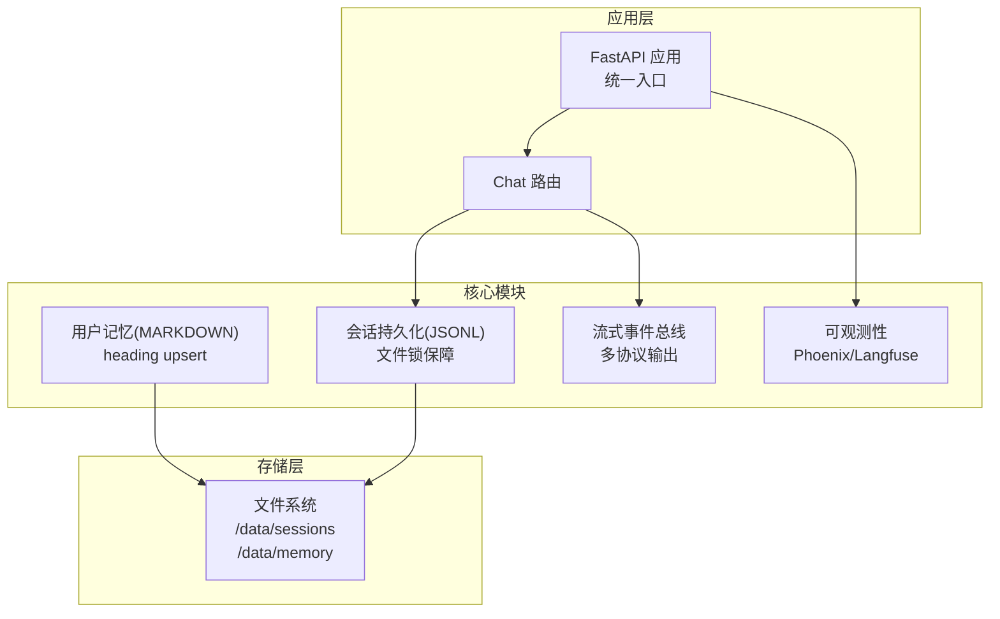
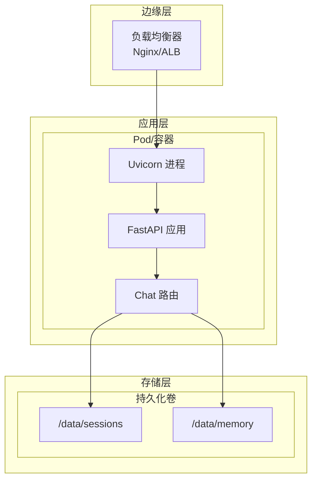
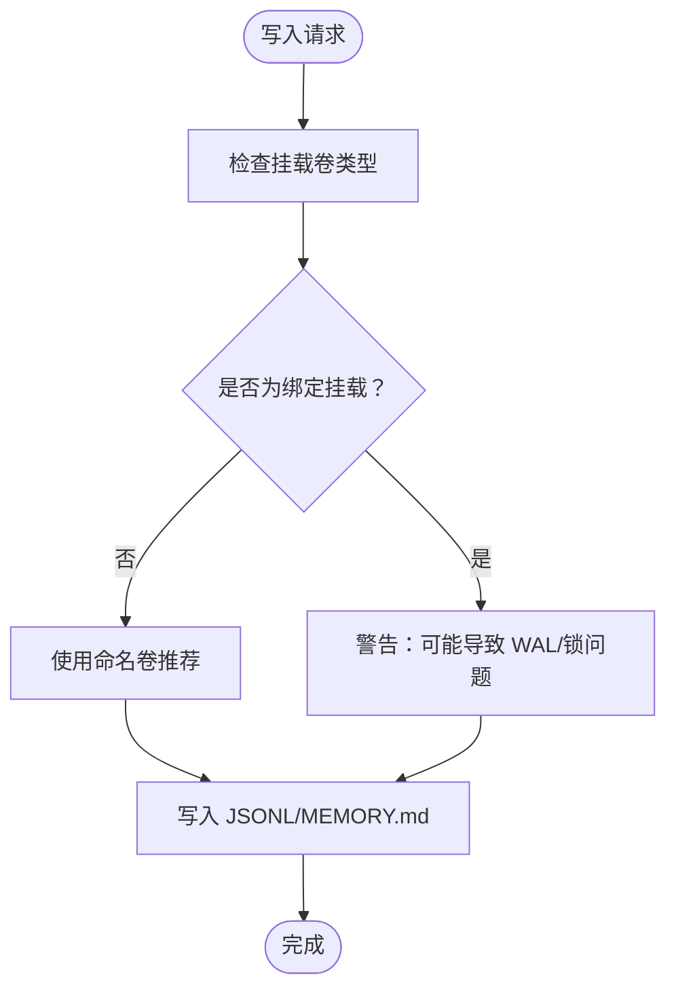
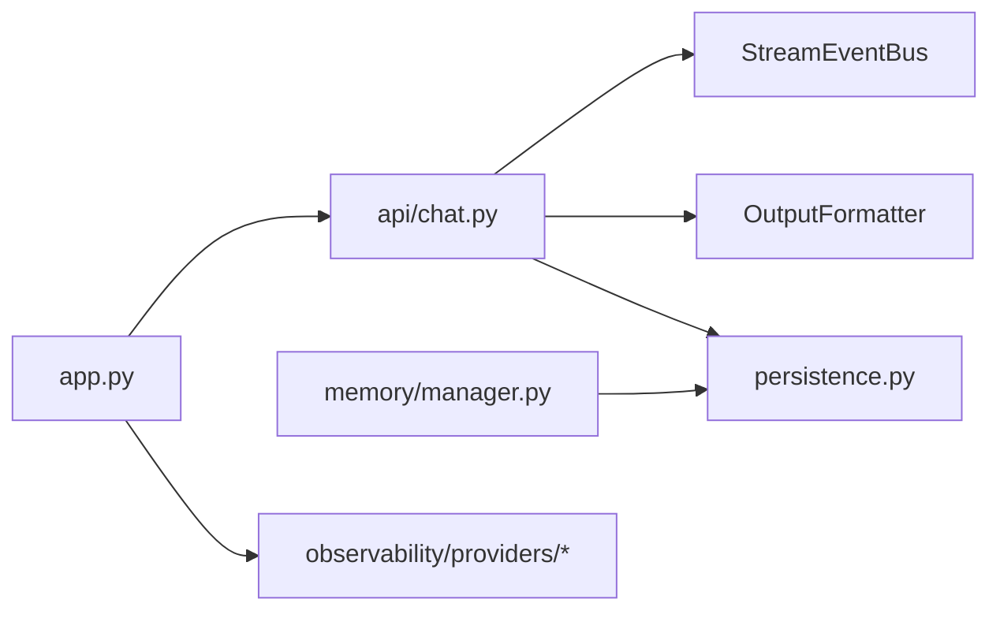

# 生产环境部署

<cite>
**本文档引用的文件**
- [README.md](file://README.md)
- [Dockerfile](file://Dockerfile)
- [pyproject.toml](file://pyproject.toml)
- [src/ark_agentic/app.py](file://src/ark_agentic/app.py)
- [src/ark_agentic/api/chat.py](file://src/ark_agentic/api/chat.py)
- [src/ark_agentic/cli/main.py](file://src/ark_agentic/cli/main.py)
- [.env-sample](file://.env-sample)
- [src/ark_agentic/core/persistence.py](file://src/ark_agentic/core/persistence.py)
- [src/ark_agentic/core/memory/manager.py](file://src/ark_agentic/core/memory/manager.py)
- [src/ark_agentic/core/memory/dream.py](file://src/ark_agentic/core/memory/dream.py)
- [src/ark_agentic/core/observability/providers/phoenix.py](file://src/ark_agentic/core/observability/providers/phoenix.py)
- [src/ark_agentic/core/observability/providers/langfuse.py](file://src/ark_agentic/core/observability/providers/langfuse.py)
- [scripts/publish.sh](file://scripts/publish.sh)
</cite>

## 目录
1. [简介](#简介)
2. [项目结构](#项目结构)
3. [核心组件](#核心组件)
4. [架构总览](#架构总览)
5. [详细组件分析](#详细组件分析)
6. [依赖关系分析](#依赖关系分析)
7. [性能考虑](#性能考虑)
8. [故障排查指南](#故障排查指南)
9. [结论](#结论)
10. [附录](#附录)

## 简介
本指南面向 Ark-Agentic 在生产环境的部署与运维，涵盖部署架构、负载均衡与高可用、持久化存储最佳实践（含 SQLite WAL 模式与跨文件系统访问问题）、Nginx 反向代理与 SSL 证书管理、安全加固、性能调优、资源限制与容量规划等。文档基于仓库中的应用入口、API 路由、持久化与内存管理、可观测性等核心模块进行分析与提炼，确保读者能够安全、稳定、高性能地交付系统。

## 项目结构
- 应用入口与服务
  - FastAPI 应用入口位于统一服务入口文件，负责注册中间件、路由与静态资源，并在 lifespan 中完成 Agent 注册与 warmup。
  - Chat API 路由提供流式与非流式响应，支持多协议输出格式。
- 核心模块
  - 会话持久化采用 JSONL 转录与会话元数据存储，配合文件锁保障并发安全。
  - 内存系统采用纯文件 MEMORY.md，无 SQLite/向量库依赖，简化部署与运维。
  - 可观测性支持 Phoenix 与 Langfuse，便于生产链路追踪与分析。
- 部署与打包
  - Dockerfile 提供多阶段构建，包含前端构建与运行时镜像，内置健康检查。
  - 发布脚本支持构建与上传至内部 PyPI，wheel 中包含前端产物。

**图表来源**
- [src/ark_agentic/app.py:137-249](file://src/ark_agentic/app.py#L137-L249)
- [src/ark_agentic/api/chat.py:27-177](file://src/ark_agentic/api/chat.py#L27-L177)
- [src/ark_agentic/core/persistence.py:392-787](file://src/ark_agentic/core/persistence.py#L392-L787)
- [src/ark_agentic/core/memory/manager.py:24-92](file://src/ark_agentic/core/memory/manager.py#L24-L92)
- [src/ark_agentic/core/observability/providers/phoenix.py:36-77](file://src/ark_agentic/core/observability/providers/phoenix.py#L36-L77)

**章节来源**
- [src/ark_agentic/app.py:137-249](file://src/ark_agentic/app.py#L137-L249)
- [src/ark_agentic/api/chat.py:27-177](file://src/ark_agentic/api/chat.py#L27-L177)
- [Dockerfile:1-75](file://Dockerfile#L1-L75)

## 核心组件
- 应用入口与生命周期
  - 应用在 lifespan 中注册 Agent、执行 warmup，并在关闭时清理资源与关闭可观测性提供者。
  - 支持 CORS 中间件，挂载 Chat 路由与可选 Studio。
- Chat API
  - 支持流式与非流式响应，多协议输出格式（agui/internal/enterprise/alone）。
  - 支持自定义头部传递用户、会话、追踪等上下文。
- 会话持久化
  - JSONL 转录与会话元数据存储，文件锁保障并发写入安全。
  - 提供原始 JSONL 读写与校验，支持追加消息与批量写入。
- 用户记忆
  - MEMORY.md 采用 heading-based upsert，支持并发写入的乐观合并。
  - 提供记忆蒸馏（Dream）周期性整理，保守策略避免误删。
- 可观测性
  - Phoenix 与 Langfuse 可选集成，支持 OTLP 导出与批量上报。
- 部署与打包
  - 多阶段 Docker 构建，运行时镜像包含前端产物，内置健康检查。
  - 发布脚本支持构建 wheel 并上传至内部 PyPI。

**章节来源**
- [src/ark_agentic/app.py:63-135](file://src/ark_agentic/app.py#L63-L135)
- [src/ark_agentic/api/chat.py:27-177](file://src/ark_agentic/api/chat.py#L27-L177)
- [src/ark_agentic/core/persistence.py:392-787](file://src/ark_agentic/core/persistence.py#L392-L787)
- [src/ark_agentic/core/memory/manager.py:24-92](file://src/ark_agentic/core/memory/manager.py#L24-L92)
- [src/ark_agentic/core/memory/dream.py:190-323](file://src/ark_agentic/core/memory/dream.py#L190-L323)
- [src/ark_agentic/core/observability/providers/phoenix.py:36-77](file://src/ark_agentic/core/observability/providers/phoenix.py#L36-L77)
- [src/ark_agentic/core/observability/providers/langfuse.py:21-63](file://src/ark_agentic/core/observability/providers/langfuse.py#L21-L63)
- [Dockerfile:1-75](file://Dockerfile#L1-L75)
- [scripts/publish.sh:1-75](file://scripts/publish.sh#L1-L75)

## 架构总览
生产部署推荐采用“反向代理 + 多实例 + 持久化卷”的架构，结合健康检查与自动扩缩容，实现高可用与弹性伸缩。

**图表来源**
- [src/ark_agentic/app.py:234-244](file://src/ark_agentic/app.py#L234-L244)
- [Dockerfile:53-71](file://Dockerfile#L53-L71)
- [src/ark_agentic/api/chat.py:27-177](file://src/ark_agentic/api/chat.py#L27-L177)

## 详细组件分析

### 部署架构与高可用
- 多实例部署
  - 建议至少部署 2 个以上实例，结合健康检查与自动重启策略，实现高可用。
  - 使用 Docker Compose 或 Kubernetes Deployment 管理，设置副本数与滚动更新。
- 负载均衡
  - Nginx 作为反向代理，支持 HTTP/HTTPS、健康检查与会话亲和（可选）。
  - 将上游指向多个应用实例，启用连接池与超时配置。
- 健康检查
  - 使用应用内置 /health 接口进行存活探针，结合就绪探针确保流量只在实例准备就绪后进入。
- 自动扩缩容
  - 基于 CPU/内存与 QPS 指标设置 HPA，结合 PodDisruptionBudget 保证服务连续性。

**章节来源**
- [src/ark_agentic/app.py:213-215](file://src/ark_agentic/app.py#L213-L215)
- [Dockerfile:69-74](file://Dockerfile#L69-L74)

### 持久化存储最佳实践
- 会话存储（JSONL）
  - 使用独立持久化卷挂载 /data/sessions，避免跨文件系统导致的锁与 WAL 问题。
  - 文件锁保障并发写入安全，建议在容器内使用本地卷而非跨主机共享存储。
- 用户记忆（MEMORY.md）
  - 使用独立持久化卷挂载 /data/memory，确保 heading-based upsert 与蒸馏（Dream）正常工作。
  - 避免跨文件系统访问，防止锁失效与数据竞争。
- SQLite 与跨文件系统
  - 仓库中明确指出：/data/memory 包含 SQLite .db 文件，应使用 Docker 命名卷而非绑定挂载，避免 WAL 模式与跨文件系统访问问题。
  - 若必须使用外部存储，确保其支持 POSIX 文件锁与原子写入。

**图表来源**
- [Dockerfile:53-56](file://Dockerfile#L53-L56)

**章节来源**
- [Dockerfile:53-56](file://Dockerfile#L53-L56)
- [src/ark_agentic/core/persistence.py:264-387](file://src/ark_agentic/core/persistence.py#L264-L387)
- [src/ark_agentic/core/memory/manager.py:45-69](file://src/ark_agentic/core/memory/manager.py#L45-L69)

### Nginx 反向代理与 SSL 证书管理
- 反向代理配置要点
  - 将 /chat 路由转发至后端实例，启用长连接与超时配置。
  - 为 /health 提供直连，避免被代理层干扰。
  - 启用 gzip/HTTP/2，优化传输效率。
- SSL 证书
  - 使用 Let’s Encrypt 或企业 CA，结合自动续期策略。
  - 强制 HTTPS，配置 HSTS 与安全响应头。
- 会话亲和与粘性会话
  - 如需 SSE/会话状态一致性，可启用基于 Cookie 的会话亲和（谨慎使用，避免热点倾斜）。

[本节为通用实践说明，不直接分析具体文件，故无“章节来源”]

### 安全加固措施
- 网络与访问控制
  - 仅暴露必要端口，使用防火墙与安全组限制来源 IP。
  - 在反向代理层启用速率限制与 WAF 规则。
- 身份与认证
  - 在反向代理层实施 API Key/Token 校验，或使用 OAuth/JWT。
  - 对敏感环境变量与密钥进行加密存储与轮换。
- 日志与审计
  - 关闭调试日志，仅保留必要级别。
  - 将访问日志与错误日志集中采集，定期归档与清理。
- 依赖与漏洞管理
  - 定期扫描镜像与依赖，修复高危漏洞。
  - 使用只读根文件系统与最小权限运行容器。

[本节为通用实践说明，不直接分析具体文件，故无“章节来源”]

### 性能调优
- 并发与线程
  - 合理设置 Uvicorn workers 与 threads，结合业务特性压测确定最优配置。
  - 对长耗时工具调用采用异步执行，避免阻塞事件循环。
- 流式输出
  - 使用 SSE 时，合理设置缓冲区与刷新策略，减少延迟。
- LLM 调用
  - 启用合适的温度与上下文长度，避免过度消耗 Token。
  - 对频繁调用的工具进行缓存与去重。
- 存储优化
  - JSONL 追加写入时确保换行结尾，避免解析异常。
  - 定期清理过期会话与内存文件，控制磁盘占用。

**章节来源**
- [src/ark_agentic/api/chat.py:115-177](file://src/ark_agentic/api/chat.py#L115-L177)
- [src/ark_agentic/core/persistence.py:419-427](file://src/ark_agentic/core/persistence.py#L419-L427)

### 资源限制与容量规划
- 资源限制
  - 为容器设置 CPU/内存限制与预留，结合 HPA 实现弹性伸缩。
  - 为会话与内存目录设置磁盘配额，防止磁盘打满。
- 容量规划
  - 评估峰值 QPS、平均响应时间与并发会话数，计算所需实例数量。
  - 估算 JSONL 与 MEMORY.md 的增长速率，预留存储空间与备份策略。
- 监控指标
  - 关键指标：CPU/内存使用率、P95/P99 延迟、错误率、Token 消耗、磁盘使用率。
  - 建立告警阈值与自动化处置流程。

[本节为通用实践说明，不直接分析具体文件，故无“章节来源”]

## 依赖关系分析
- 应用入口依赖
  - FastAPI 应用依赖路由模块、Agent 注册中心与可观测性提供者。
  - Chat 路由依赖事件总线与输出格式化器。
- 存储依赖
  - 会话持久化依赖文件锁与 JSONL 序列化。
  - 内存管理依赖 heading 解析与格式化。
- 可观测性依赖
  - Phoenix/Langfuse 依赖 OTel SDK 与导出器。

**图表来源**
- [src/ark_agentic/app.py:161-164](file://src/ark_agentic/app.py#L161-L164)
- [src/ark_agentic/api/chat.py:15-20](file://src/ark_agentic/api/chat.py#L15-L20)
- [src/ark_agentic/core/persistence.py:392-417](file://src/ark_agentic/core/persistence.py#L392-L417)
- [src/ark_agentic/core/memory/manager.py:37-39](file://src/ark_agentic/core/memory/manager.py#L37-L39)
- [src/ark_agentic/core/observability/providers/phoenix.py:36-77](file://src/ark_agentic/core/observability/providers/phoenix.py#L36-L77)

**章节来源**
- [src/ark_agentic/app.py:161-164](file://src/ark_agentic/app.py#L161-L164)
- [src/ark_agentic/api/chat.py:15-20](file://src/ark_agentic/api/chat.py#L15-L20)
- [src/ark_agentic/core/persistence.py:392-417](file://src/ark_agentic/core/persistence.py#L392-L417)
- [src/ark_agentic/core/memory/manager.py:37-39](file://src/ark_agentic/core/memory/manager.py#L37-L39)
- [src/ark_agentic/core/observability/providers/phoenix.py:36-77](file://src/ark_agentic/core/observability/providers/phoenix.py#L36-L77)

## 性能考虑
- I/O 与锁
  - JSONL 写入采用文件锁，避免并发冲突；建议将会话与内存目录置于同一卷，减少跨文件系统开销。
- 流式协议
  - SSE 输出通过事件总线与格式化器实现，建议在反向代理层启用压缩与长连接。
- LLM 调用
  - 通过 run_options 控制模型参数，结合上下文压缩与记忆蒸馏降低 Token 消耗。
- 可观测性
  - Phoenix/Langfuse 批量上报与自动仪器化可降低对主业务的影响。

[本节为通用指导，不直接分析具体文件，故无“章节来源”]

## 故障排查指南
- 健康检查失败
  - 检查 /health 端点是否可达，确认应用进程与端口监听状态。
- JSONL 写入异常
  - 检查文件锁是否超时，确认挂载卷权限与磁盘空间。
- 内存写入冲突
  - 检查 heading upsert 是否正确，确认并发写入是否导致覆盖。
- 可观测性未生效
  - 检查环境变量配置与依赖安装，确认导出器端点可达。
- Docker 部署问题
  - 确认镜像构建与运行时环境，检查健康检查与端口映射。

**章节来源**
- [src/ark_agentic/app.py:213-215](file://src/ark_agentic/app.py#L213-L215)
- [src/ark_agentic/core/persistence.py:287-357](file://src/ark_agentic/core/persistence.py#L287-L357)
- [src/ark_agentic/core/memory/manager.py:45-69](file://src/ark_agentic/core/memory/manager.py#L45-L69)
- [src/ark_agentic/core/observability/providers/phoenix.py:36-77](file://src/ark_agentic/core/observability/providers/phoenix.py#L36-L77)

## 结论
通过合理的部署架构、严格的持久化与存储策略、完善的反向代理与安全加固、以及持续的性能调优与容量规划，Ark-Agentic 可在生产环境中实现高可用、可扩展与可维护的服务交付。建议结合本文档的实践建议与仓库中的配置与实现，制定符合自身业务场景的部署方案。

## 附录
- 环境变量清单与用途
  - 应用与网络：LOG_LEVEL、API_HOST、API_PORT、ENABLE_STUDIO、AGENTS_ROOT
  - 会话与记忆：SESSIONS_DIR、MEMORY_DIR
  - LLM：LLM_PROVIDER、MODEL_NAME、API_KEY、LLM_BASE_URL、DEFAULT_TEMPERATURE
  - 可观测性：ENABLE_PHOENIX、PHOENIX_COLLECTOR_ENDPOINT、PHOENIX_PROJECT_NAME、PHOENIX_PROTOCOL、PHOENIX_AUTO_INSTRUMENT、PHOENIX_BATCH
  - 保险与证券服务：DATA_SERVICE_*、SECURITIES_SERVICE_* 等
- 发布与打包
  - 发布脚本支持前端构建与 wheel 打包，上传至内部 PyPI。

**章节来源**
- [.env-sample:1-75](file://.env-sample#L1-L75)
- [scripts/publish.sh:1-75](file://scripts/publish.sh#L1-L75)