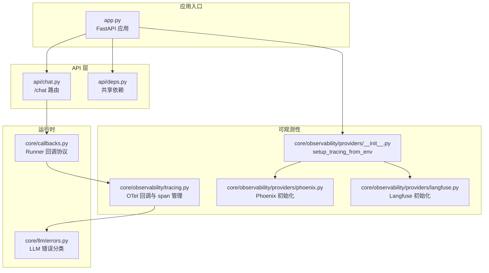
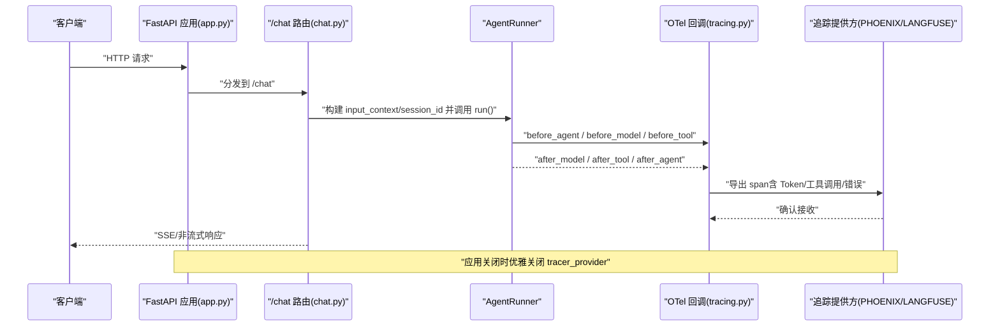
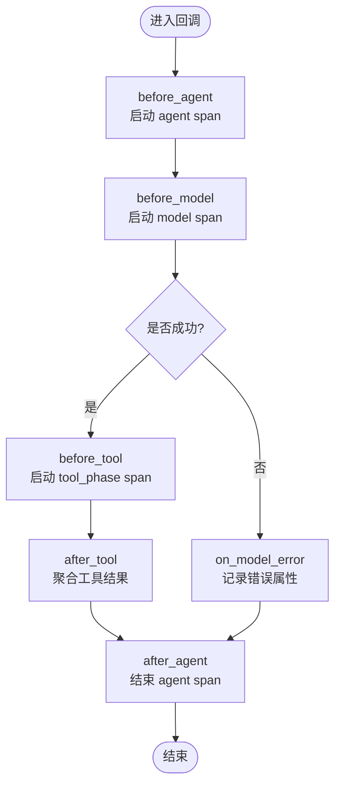
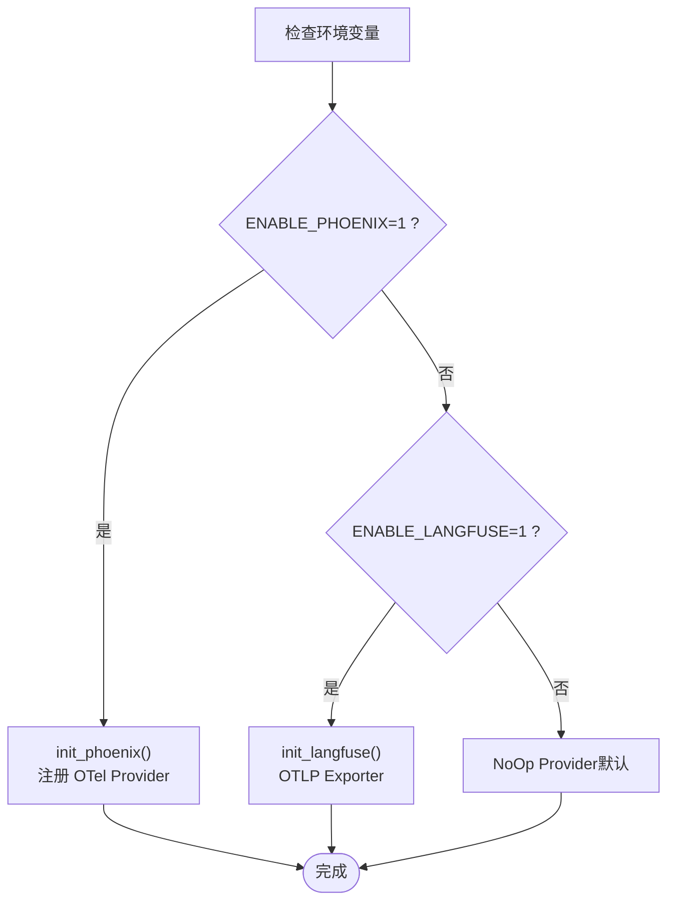
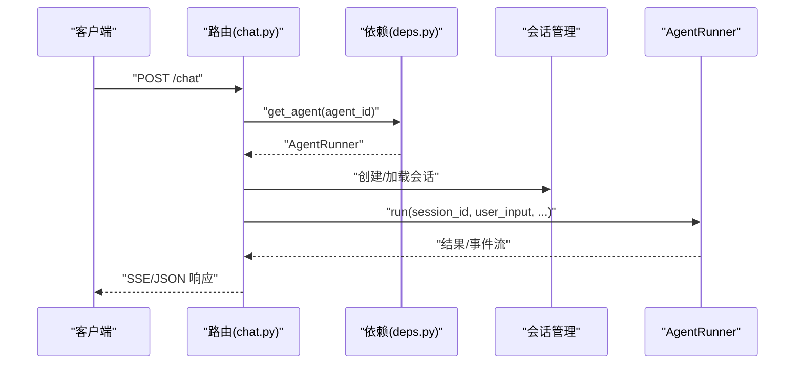
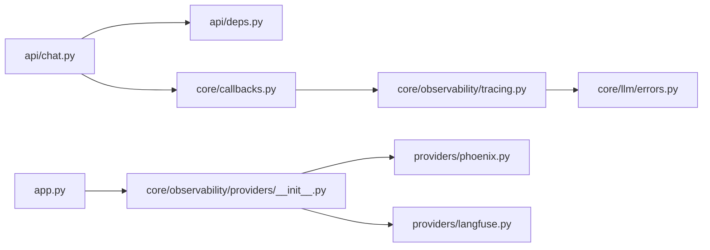

# 监控运维

<cite>
**本文引用的文件**
- [app.py](file://src/ark_agentic/app.py)
- [chat.py](file://src/ark_agentic/api/chat.py)
- [deps.py](file://src/ark_agentic/api/deps.py)
- [tracing.py](file://src/ark_agentic/core/observability/tracing.py)
- [providers/__init__.py](file://src/ark_agentic/core/observability/providers/__init__.py)
- [providers/langfuse.py](file://src/ark_agentic/core/observability/providers/langfuse.py)
- [providers/phoenix.py](file://src/ark_agentic/core/observability/providers/phoenix.py)
- [callbacks.py](file://src/ark_agentic/core/callbacks.py)
- [errors.py](file://src/ark_agentic/core/llm/errors.py)
- [.env-sample](file://.env-sample)
- [Dockerfile](file://Dockerfile)
- [pyproject.toml](file://pyproject.toml)
- [docs/securities/api.md](file://docs/securities/api.md)
</cite>

## 目录
1. [简介](#简介)
2. [项目结构](#项目结构)
3. [核心组件](#核心组件)
4. [架构总览](#架构总览)
5. [组件详解](#组件详解)
6. [依赖关系分析](#依赖关系分析)
7. [性能考量](#性能考量)
8. [故障排查指南](#故障排查指南)
9. [结论](#结论)
10. [附录](#附录)

## 简介
本指南面向 Ark-Agentic 的监控运维实践，聚焦可观测性体系的配置与使用，覆盖以下主题：
- 可观测性系统配置：Langfuse 与 Phoenix 的集成与选择策略
- 日志管理：日志级别、格式与第三方库噪声控制
- 性能监控：Token 使用、响应时间与吞吐指标
- 错误追踪：LLM 错误分类、链路状态与异常记录
- 健康检查端点：/health 的使用与容器健康检查
- 告警配置：基于指标与错误事件的告警建议
- 日志分析与性能优化：结合运行时回调与流式事件
- 容器监控与资源使用：Dockerfile 中的健康检查与运行参数

## 项目结构
Ark-Agentic 将可观测性能力集中在 core/observability 下，通过环境变量驱动选择不同的追踪提供方，并在应用生命周期内注入 OpenTelemetry 回调，以捕获 Agent 执行的关键阶段与工具调用。



**图表来源**
- [app.py:63-135](file://src/ark_agentic/app.py#L63-L135)
- [chat.py:27-177](file://src/ark_agentic/api/chat.py#L27-L177)
- [tracing.py:227-481](file://src/ark_agentic/core/observability/tracing.py#L227-L481)
- [providers/__init__.py:19-36](file://src/ark_agentic/core/observability/providers/__init__.py#L19-L36)
- [providers/phoenix.py:36-92](file://src/ark_agentic/core/observability/providers/phoenix.py#L36-L92)
- [providers/langfuse.py:21-78](file://src/ark_agentic/core/observability/providers/langfuse.py#L21-L78)
- [callbacks.py:98-198](file://src/ark_agentic/core/callbacks.py#L98-L198)
- [errors.py:17-159](file://src/ark_agentic/core/llm/errors.py#L17-L159)

**章节来源**
- [app.py:16-36](file://src/ark_agentic/app.py#L16-L36)
- [app.py:93-135](file://src/ark_agentic/app.py#L93-L135)
- [chat.py:27-177](file://src/ark_agentic/api/chat.py#L27-L177)
- [tracing.py:227-481](file://src/ark_agentic/core/observability/tracing.py#L227-L481)
- [providers/__init__.py:19-36](file://src/ark_agentic/core/observability/providers/__init__.py#L19-L36)
- [providers/phoenix.py:36-92](file://src/ark_agentic/core/observability/providers/phoenix.py#L36-L92)
- [providers/langfuse.py:21-78](file://src/ark_agentic/core/observability/providers/langfuse.py#L21-L78)
- [callbacks.py:98-198](file://src/ark_agentic/core/callbacks.py#L98-L198)
- [errors.py:17-159](file://src/ark_agentic/core/llm/errors.py#L17-L159)

## 核心组件
- 运行时回调与链路追踪
  - 通过 create_tracing_callbacks 生成覆盖 Agent 生命周期的回调集合，自动注入 OTel span，记录输入输出、Token 使用、工具调用与错误属性。
- 追踪提供方选择
  - setup_tracing_from_env 根据环境变量选择 Phoenix 或 Langfuse；未配置时使用 OTel NoOp，保证零成本降级。
- Phoenix/Langfuse 初始化
  - Phoenix 通过 arize-phoenix-otel 与 openinference-instrumentation-langchain 自动注入；Langfuse 通过 OTLP 导出器连接云端。
- 错误分类与链路状态
  - LLMErrorReason 对错误进行分类，追踪回调在模型阶段记录错误标志与原因，便于定位与告警。
- 健康检查与容器化
  - /health 端点用于就绪/存活探针；Dockerfile 中 HEALTHCHECK 通过 /health 验证服务可用性。

**章节来源**
- [tracing.py:227-481](file://src/ark_agentic/core/observability/tracing.py#L227-L481)
- [providers/__init__.py:19-36](file://src/ark_agentic/core/observability/providers/__init__.py#L19-L36)
- [providers/phoenix.py:36-92](file://src/ark_agentic/core/observability/providers/phoenix.py#L36-L92)
- [providers/langfuse.py:21-78](file://src/ark_agentic/core/observability/providers/langfuse.py#L21-L78)
- [errors.py:17-159](file://src/ark_agentic/core/llm/errors.py#L17-L159)
- [app.py:213-216](file://src/ark_agentic/app.py#L213-L216)
- [Dockerfile:69-71](file://Dockerfile#L69-L71)

## 架构总览
下图展示从 API 请求到可观测性数据采集的整体流程，以及容器健康检查与外部平台对接。



**图表来源**
- [app.py:93-135](file://src/ark_agentic/app.py#L93-L135)
- [chat.py:87-152](file://src/ark_agentic/api/chat.py#L87-L152)
- [tracing.py:238-298](file://src/ark_agentic/core/observability/tracing.py#L238-L298)
- [tracing.py:300-352](file://src/ark_agentic/core/observability/tracing.py#L300-L352)
- [tracing.py:360-471](file://src/ark_agentic/core/observability/tracing.py#L360-L471)

## 组件详解

### 可观测性回调与链路追踪
- 回调覆盖范围
  - Agent 级：before_agent / after_agent
  - ReAct 循环级：before_model / after_model / on_model_error / before_tool / after_tool
- 关键属性与指标
  - 输入输出 JSON 化存储，便于检索
  - Token 使用：prompt_tokens、completion_tokens
  - 工具调用：tool_calls_count、result_count、error_count
  - 错误：error、ark.error_reason、ark.error_model
- 状态与异常
  - 模型阶段失败时记录错误状态码与异常信息，便于告警与回溯



**图表来源**
- [tracing.py:238-298](file://src/ark_agentic/core/observability/tracing.py#L238-L298)
- [tracing.py:300-352](file://src/ark_agentic/core/observability/tracing.py#L300-L352)
- [tracing.py:354-358](file://src/ark_agentic/core/observability/tracing.py#L354-L358)
- [tracing.py:360-471](file://src/ark_agentic/core/observability/tracing.py#L360-L471)

**章节来源**
- [tracing.py:227-481](file://src/ark_agentic/core/observability/tracing.py#L227-L481)
- [callbacks.py:98-198](file://src/ark_agentic/core/callbacks.py#L98-L198)
- [errors.py:17-159](file://src/ark_agentic/core/llm/errors.py#L17-L159)

### 追踪提供方选择与初始化
- 选择逻辑
  - ENABLE_PHOENIX 优先于 ENABLE_LANGFUSE
  - 未设置时保持 OTel NoOp，不产生追踪开销
- Phoenix 初始化
  - 支持批量上报、自动注入、项目名与端点配置
- Langfuse 初始化
  - 通过 OTLP HTTP 导出器连接云端，使用公钥/密钥认证



**图表来源**
- [providers/__init__.py:19-36](file://src/ark_agentic/core/observability/providers/__init__.py#L19-L36)
- [providers/phoenix.py:36-92](file://src/ark_agentic/core/observability/providers/phoenix.py#L36-L92)
- [providers/langfuse.py:21-78](file://src/ark_agentic/core/observability/providers/langfuse.py#L21-L78)

**章节来源**
- [providers/__init__.py:19-36](file://src/ark_agentic/core/observability/providers/__init__.py#L19-L36)
- [providers/phoenix.py:36-92](file://src/ark_agentic/core/observability/providers/phoenix.py#L36-L92)
- [providers/langfuse.py:21-78](file://src/ark_agentic/core/observability/providers/langfuse.py#L21-L78)

### API 路由与会话/追踪上下文
- /chat 端点
  - 支持流式与非流式响应，SSE 事件通过 StreamEventBus 与格式化器输出
  - 会话管理：自动创建或加载会话，确保跨 Agent 切换时的会话一致性
  - 追踪上下文：支持通过 Header 传递 trace_id，写入 input_context
- 依赖注入
  - get_agent 通过共享 Registry 获取 AgentRunner，缺失时返回 404



**图表来源**
- [chat.py:27-177](file://src/ark_agentic/api/chat.py#L27-L177)
- [deps.py:25-37](file://src/ark_agentic/api/deps.py#L25-L37)

**章节来源**
- [chat.py:27-177](file://src/ark_agentic/api/chat.py#L27-L177)
- [deps.py:19-37](file://src/ark_agentic/api/deps.py#L19-L37)

### 健康检查与容器化
- /health 端点
  - 返回 {"status":"ok"}，用于就绪/存活探针
- Docker 健康检查
  - HEALTHCHECK 使用 /health 进行轮询，间隔 30s，超时 10s，启动期 5s，重试 3 次
- 环境变量
  - LOG_LEVEL、API_HOST、API_PORT、ENABLE_PHOENIX、PHOENIX_*、ENABLE_LANGFUSE 等

```mermaid
flowchart TD
HC["/health 探针"] --> Resp{"响应 2xx ?"}
Resp --> |是| Healthy["容器标记健康"]
Resp --> |否| Unhealthy["容器标记不健康"]
subgraph "Dockerfile HEALTHCHECK"
CMD["CMD python -c 'httpx.get(\"http://localhost:8080/health\").raise_for_status()'"]
end
```

**图表来源**
- [app.py:213-216](file://src/ark_agentic/app.py#L213-L216)
- [Dockerfile:69-71](file://Dockerfile#L69-L71)
- [.env-sample:6-75](file://.env-sample#L6-L75)

**章节来源**
- [app.py:213-216](file://src/ark_agentic/app.py#L213-L216)
- [Dockerfile:69-71](file://Dockerfile#L69-L71)
- [.env-sample:6-75](file://.env-sample#L6-L75)

## 依赖关系分析
- 运行时回调与追踪
  - RunnerCallbacks 作为容器承载各阶段回调，tracing.py 提供具体实现，errors.py 提供错误分类
- API 与可观测性
  - chat.py 通过 deps.py 获取 AgentRunner，回调在 tracing.py 中被注入
- 追踪提供方
  - providers/__init__.py 作为统一入口，根据环境变量选择 Phoenix 或 Langfuse 初始化



**图表来源**
- [chat.py:19-20](file://src/ark_agentic/api/chat.py#L19-L20)
- [deps.py:12-13](file://src/ark_agentic/api/deps.py#L12-L13)
- [callbacks.py:172-183](file://src/ark_agentic/core/callbacks.py#L172-L183)
- [tracing.py:227-481](file://src/ark_agentic/core/observability/tracing.py#L227-L481)
- [errors.py:31-42](file://src/ark_agentic/core/llm/errors.py#L31-L42)
- [app.py:93-94](file://src/ark_agentic/app.py#L93-L94)
- [providers/__init__.py:19-36](file://src/ark_agentic/core/observability/providers/__init__.py#L19-L36)
- [providers/phoenix.py:36-92](file://src/ark_agentic/core/observability/providers/phoenix.py#L36-L92)
- [providers/langfuse.py:21-78](file://src/ark_agentic/core/observability/providers/langfuse.py#L21-L78)

**章节来源**
- [chat.py:19-20](file://src/ark_agentic/api/chat.py#L19-L20)
- [deps.py:12-13](file://src/ark_agentic/api/deps.py#L12-L13)
- [callbacks.py:172-183](file://src/ark_agentic/core/callbacks.py#L172-L183)
- [tracing.py:227-481](file://src/ark_agentic/core/observability/tracing.py#L227-L481)
- [errors.py:31-42](file://src/ark_agentic/core/llm/errors.py#L31-L42)
- [app.py:93-94](file://src/ark_agentic/app.py#L93-L94)
- [providers/__init__.py:19-36](file://src/ark_agentic/core/observability/providers/__init__.py#L19-L36)
- [providers/phoenix.py:36-92](file://src/ark_agentic/core/observability/providers/phoenix.py#L36-L92)
- [providers/langfuse.py:21-78](file://src/ark_agentic/core/observability/providers/langfuse.py#L21-L78)

## 性能考量
- 日志级别与噪声控制
  - 通过 LOG_LEVEL 控制全局日志级别；可对第三方库进行噪声抑制，避免调试模式下的过度输出
- Token 与吞吐
  - 通过 tracing 回调中的 prompt_tokens/completion_tokens 评估成本；结合 turns/tool_calls_count 分析对话复杂度
- 流式响应
  - SSE 流式输出降低首包延迟，适合长文本与工具调用场景
- 依赖与运行时
  - pyproject.toml 中的 optional-dependencies 与 dev 依赖，建议在生产镜像中按需裁剪，减少镜像体积

**章节来源**
- [app.py:16-36](file://src/ark_agentic/app.py#L16-L36)
- [tracing.py:284-294](file://src/ark_agentic/core/observability/tracing.py#L284-L294)
- [chat.py:115-177](file://src/ark_agentic/api/chat.py#L115-L177)
- [pyproject.toml:26-43](file://pyproject.toml#L26-L43)

## 故障排查指南
- 健康检查失败
  - 使用 /health 端点验证服务可用性；Docker 环境可通过 HEALTHCHECK 观察探针行为
- 追踪未生效
  - 检查 ENABLE_PHOENIX 或 ENABLE_LANGFUSE 是否正确设置；Phoenix 需要 arize-phoenix-otel 与 openinference-instrumentation-langchain；Langfuse 需要 OTel SDK 与 OTLP 导出器
- 错误定位
  - 模型阶段失败时，追踪 span 会记录 error、ark.error_reason、ark.error_model 等属性；结合 LLMErrorReason 快速判断原因类别
- 会话问题
  - /chat 会话创建/加载失败时，检查 session_id 与用户 ID 的传递；必要时允许自动创建新会话

**章节来源**
- [app.py:213-216](file://src/ark_agentic/app.py#L213-L216)
- [Dockerfile:69-71](file://Dockerfile#L69-L71)
- [providers/__init__.py:19-36](file://src/ark_agentic/core/observability/providers/__init__.py#L19-L36)
- [providers/phoenix.py:48-55](file://src/ark_agentic/core/observability/providers/phoenix.py#L48-L55)
- [providers/langfuse.py:33-45](file://src/ark_agentic/core/observability/providers/langfuse.py#L33-L45)
- [errors.py:17-159](file://src/ark_agentic/core/llm/errors.py#L17-L159)
- [chat.py:60-80](file://src/ark_agentic/api/chat.py#L60-L80)

## 结论
Ark-Agentic 的可观测性方案以环境变量驱动、OTel 回调为核心，兼顾零成本降级与多平台导出能力。通过 /health 端点与 Docker HEALTHCHECK 实现容器化健康保障；借助 tracing 回调与错误分类，能够有效支撑日志管理、性能监控与错误追踪的闭环运维。

## 附录

### 环境变量与配置要点
- 日志与应用
  - LOG_LEVEL、API_HOST、API_PORT、ENABLE_STUDIO、AGENTS_ROOT
- 会话与记忆
  - SESSIONS_DIR、MEMORY_DIR
- LLM 与模型
  - LLM_PROVIDER、MODEL_NAME、API_KEY、LLM_BASE_URL、DEFAULT_TEMPERATURE
- Phoenix
  - ENABLE_PHOENIX、PHOENIX_COLLECTOR_ENDPOINT、PHOENIX_PROJECT_NAME、PHOENIX_PROTOCOL、PHOENIX_AUTO_INSTRUMENT、PHOENIX_BATCH、PHOENIX_API_KEY、PHOENIX_CLIENT_HEADERS
- Langfuse
  - ENABLE_LANGFUSE、LANGFUSE_PUBLIC_KEY、LANGFUSE_SECRET_KEY、LANGFUSE_HOST
- 证券与保险服务
  - SECURITIES_*、DATA_SERVICE_*

**章节来源**
- [.env-sample:6-75](file://.env-sample#L6-L75)

### API 端点参考
- /health：健康检查
- /chat：消息交互（支持流式）
- /sessions：会话管理（由 API 路由提供）

**章节来源**
- [docs/securities/api.md:14-22](file://docs/securities/api.md#L14-L22)
- [app.py:213-216](file://src/ark_agentic/app.py#L213-L216)
- [chat.py:27-177](file://src/ark_agentic/api/chat.py#L27-L177)