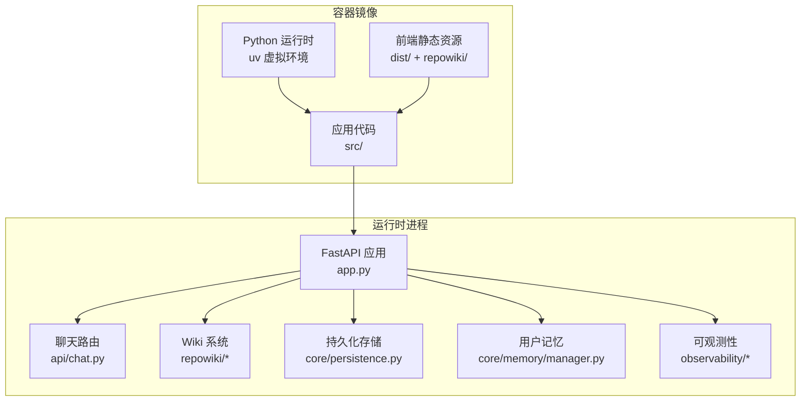
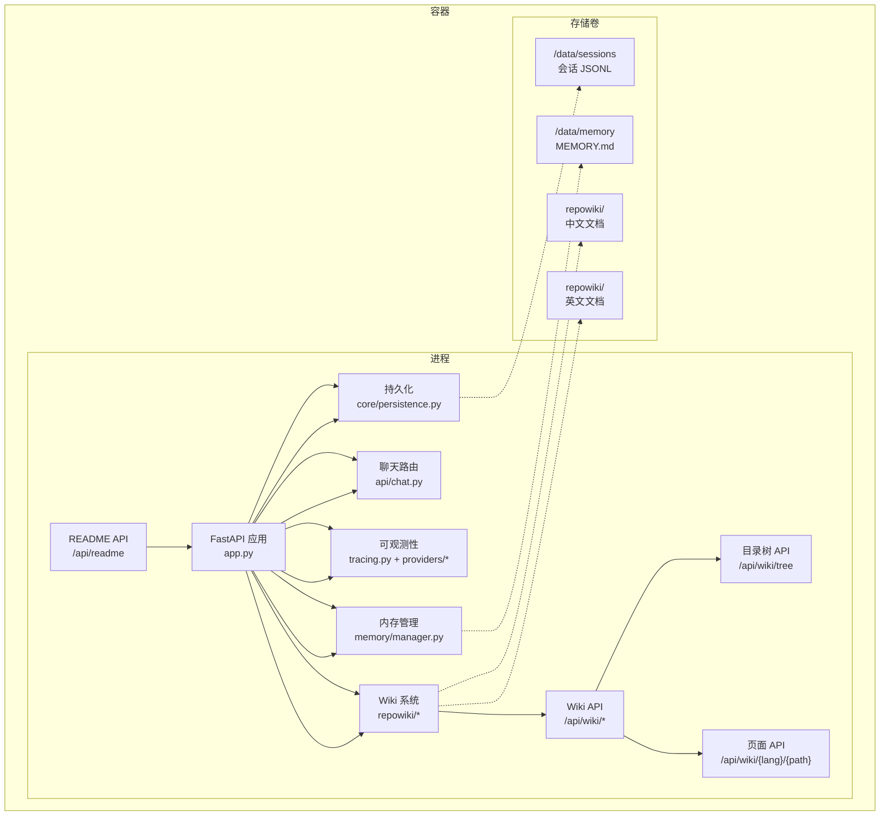
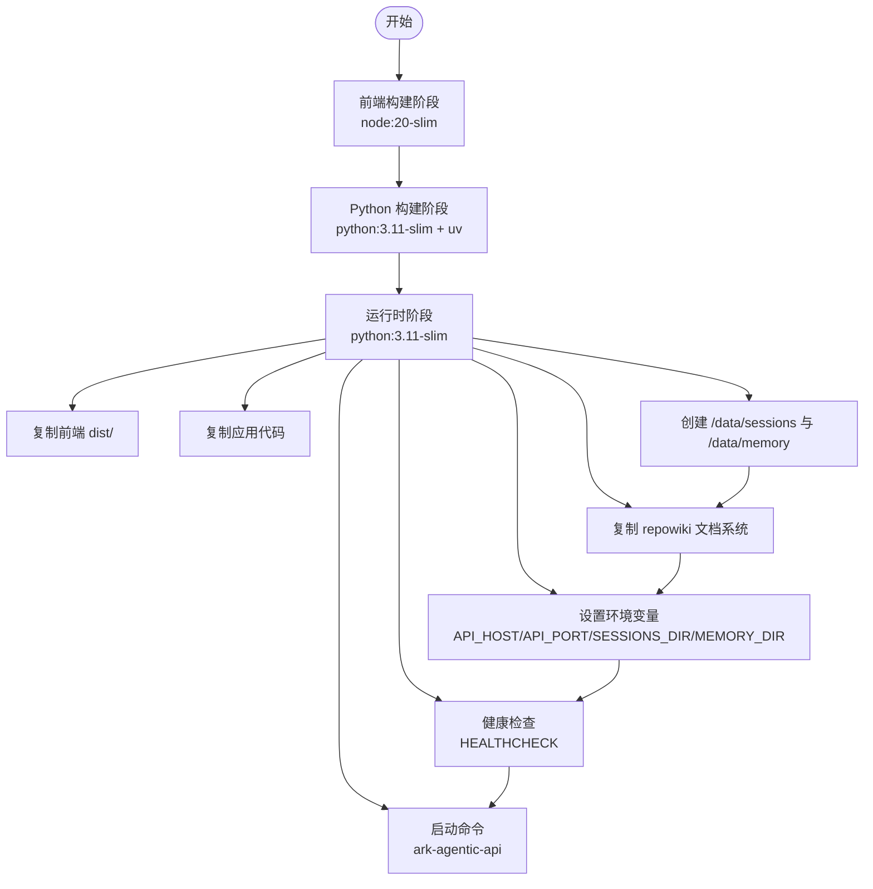
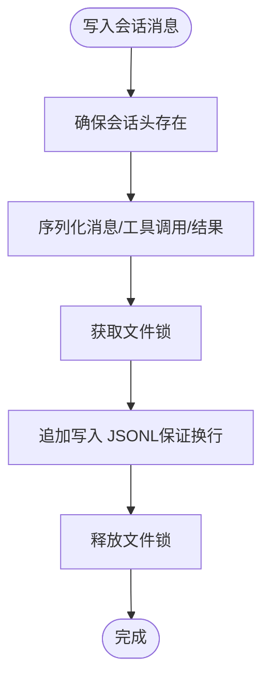
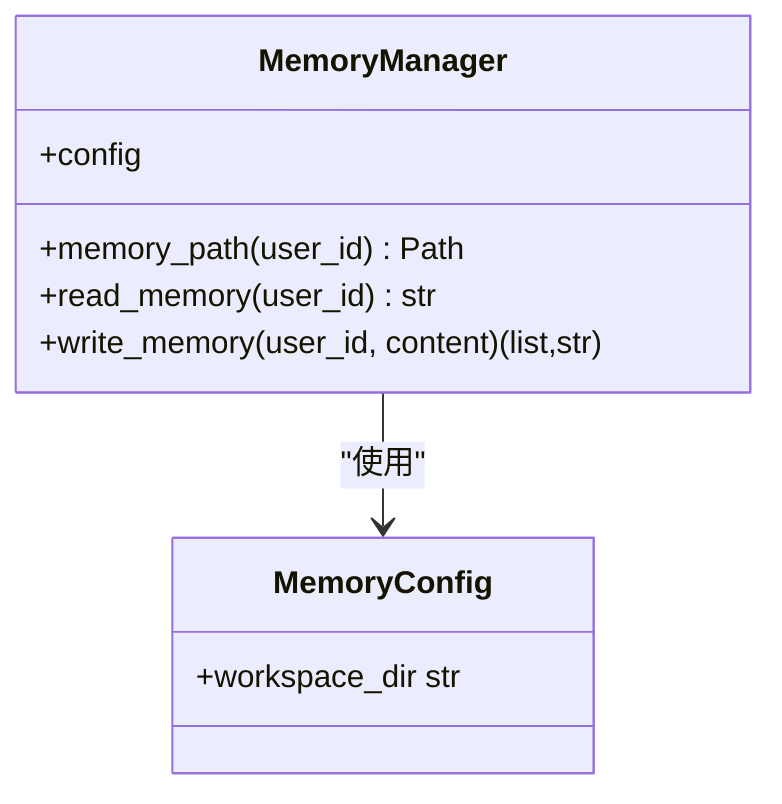
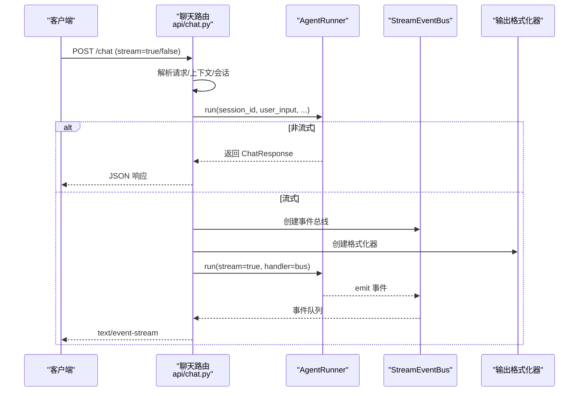
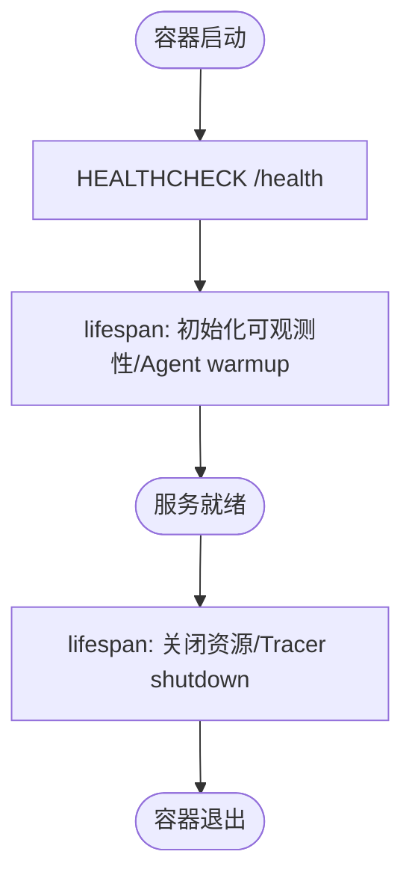
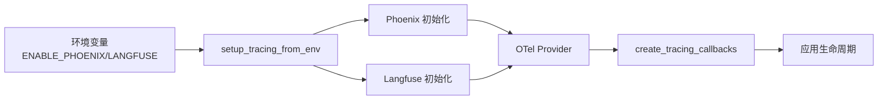
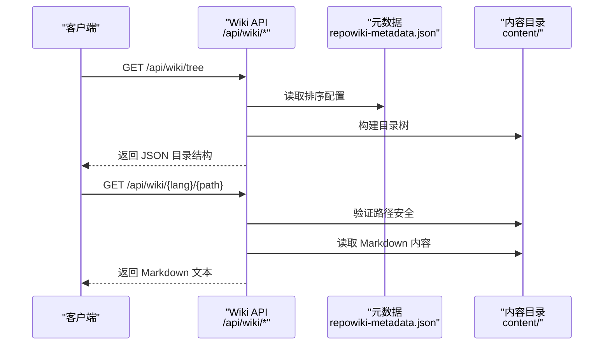
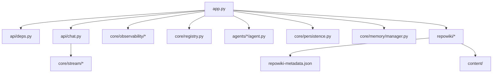

# 部署与运维

<cite>
**本文引用的文件**
- [Dockerfile](file://Dockerfile)
- [README.md](file://README.md)
- [pyproject.toml](file://pyproject.toml)
- [.env-sample](file://.env-sample)
- [src/ark_agentic/app.py](file://src/ark_agentic/app.py)
- [src/ark_agentic/api/chat.py](file://src/ark_agentic/api/chat.py)
- [src/ark_agentic/core/persistence.py](file://src/ark_agentic/core/persistence.py)
- [src/ark_agentic/core/memory/manager.py](file://src/ark_agentic/core/memory/manager.py)
- [src/ark_agentic/core/observability/providers/phoenix.py](file://src/ark_agentic/core/observability/providers/phoenix.py)
- [src/ark_agentic/core/observability/providers/langfuse.py](file://src/ark_agentic/core/observability/providers/langfuse.py)
- [src/ark_agentic/core/observability/tracing.py](file://src/ark_agentic/core/observability/tracing.py)
- [src/ark_agentic/core/utils/env.py](file://src/ark_agentic/core/utils/env.py)
- [scripts/publish.sh](file://scripts/publish.sh)
- [src/ark_agentic/static/home.html](file://src/ark_agentic/static/home.html)
</cite>

## 更新摘要
**变更内容**
- 新增完整的维基系统（repowiki）集成说明
- 更新 Wiki API 端点和文档管理系统
- 增强前端静态资源管理与文档渲染
- 完善多语言文档支持（中英文）

## 目录
1. [简介](#简介)
2. [项目结构](#项目结构)
3. [核心组件](#核心组件)
4. [架构总览](#架构总览)
5. [详细组件分析](#详细组件分析)
6. [依赖关系分析](#依赖关系分析)
7. [性能考虑](#性能考虑)
8. [故障排除指南](#故障排除指南)
9. [结论](#结论)
10. [附录](#附录)

## 简介
本指南面向 Ark-Agentic 的部署与运维团队，围绕容器化部署、多阶段构建、环境配置、持久化存储、健康检查、可观测性、日志管理、安全配置、性能优化、监控告警、故障排除与维护策略进行系统化说明。文档基于仓库中的 Dockerfile、应用入口、API 路由、持久化与内存管理、可观测性实现以及发布脚本等关键文件进行深入分析，确保读者能够安全、稳定、高性能地交付与运营 Ark-Agentic。

**新增特性**：集成完整的维基系统（repowiki），支持中英文双语文档管理，提供在线文档浏览和搜索功能。

## 项目结构
Ark-Agentic 采用 Python 与 FastAPI 构建的服务端应用，前端静态资源通过多阶段 Docker 构建打包进镜像。核心模块包括：
- 应用入口与生命周期：统一 FastAPI 应用、CORS、静态文件、健康检查、可观测性初始化
- API 路由：聊天接口、SSE 流式输出、会话管理、Wiki 文档系统
- 持久化：JSONL 会话转录与文件锁、会话元数据存储
- 内存管理：纯文件 MEMORY.md 用户记忆
- 可观测性：Phoenix/Langfuse 等链路追踪
- 发布与构建：多阶段 Docker 构建与前端构建、打包
- **维基系统**：完整的中英文文档管理系统，支持目录树导航和内容渲染

**图表来源**
- [Dockerfile:35-75](file://Dockerfile#L35-L75)
- [src/ark_agentic/app.py:137-249](file://src/ark_agentic/app.py#L137-L249)
- [src/ark_agentic/api/chat.py:27-177](file://src/ark_agentic/api/chat.py#L27-L177)
- [src/ark_agentic/core/persistence.py:392-787](file://src/ark_agentic/core/persistence.py#L392-L787)
- [src/ark_agentic/core/memory/manager.py:24-92](file://src/ark_agentic/core/memory/manager.py#L24-L92)
- [src/ark_agentic/core/observability/tracing.py:227-482](file://src/ark_agentic/core/observability/tracing.py#L227-L482)

**章节来源**
- [Dockerfile:1-75](file://Dockerfile#L1-L75)
- [README.md:596-701](file://README.md#L596-L701)

## 核心组件
- 多阶段 Docker 构建：前端构建产物复制至运行时镜像，运行时仅包含最小依赖与 uv 虚拟环境，减小镜像体积并提升安全性
- 应用入口与生命周期：加载 .env、初始化日志、注册路由、条件挂载 Studio、健康检查、可观测性初始化与关闭
- API 路由：支持非流式与 SSE 流式响应，支持多协议输出（internal/agui/enterprise/alone）
- **Wiki 系统**：完整的文档管理系统，支持中英文双语、目录树导航、内容渲染和搜索
- 持久化：JSONL 会话转录与文件锁、会话元数据存储，支持并发安全与跨平台锁
- 内存管理：纯文件 MEMORY.md，按用户维度 upsert，无外部数据库依赖
- 可观测性：Phoenix/Langfuse 环境驱动初始化，OTel Provider 无侵入，支持自动/批量与协议配置
- 发布脚本：构建前端、打包 wheel、上传至内部 PyPI

**章节来源**
- [Dockerfile:4-75](file://Dockerfile#L4-L75)
- [src/ark_agentic/app.py:63-135](file://src/ark_agentic/app.py#L63-L135)
- [src/ark_agentic/api/chat.py:27-177](file://src/ark_agentic/api/chat.py#L27-L177)
- [src/ark_agentic/core/persistence.py:392-787](file://src/ark_agentic/core/persistence.py#L392-L787)
- [src/ark_agentic/core/memory/manager.py:24-92](file://src/ark_agentic/core/memory/manager.py#L24-L92)
- [src/ark_agentic/core/observability/providers/phoenix.py:36-77](file://src/ark_agentic/core/observability/providers/phoenix.py#L36-L77)
- [src/ark_agentic/core/observability/providers/langfuse.py:21-63](file://src/ark_agentic/core/observability/providers/langfuse.py#L21-L63)
- [scripts/publish.sh:42-75](file://scripts/publish.sh#L42-L75)

## 架构总览
下图展示容器内应用的运行时架构与关键组件交互：

**图表来源**
- [src/ark_agentic/app.py:137-249](file://src/ark_agentic/app.py#L137-L249)
- [src/ark_agentic/api/chat.py:27-177](file://src/ark_agentic/api/chat.py#L27-L177)
- [src/ark_agentic/core/persistence.py:392-787](file://src/ark_agentic/core/persistence.py#L392-L787)
- [src/ark_agentic/core/memory/manager.py:24-92](file://src/ark_agentic/core/memory/manager.py#L24-L92)
- [Dockerfile:53-57](file://Dockerfile#L53-L57)

## 详细组件分析

### Docker 多阶段构建
- 前端构建阶段：使用 Node 20 slim，安装依赖并构建前端产物，输出 dist/
- Python 构建阶段：安装 uv、创建虚拟环境、安装依赖（含可选组）
- 运行时阶段：仅复制必要运行时依赖与虚拟环境，复制前端 dist 与应用代码，创建 /data/{sessions,memory} 目录
- 健康检查：通过 HTTP GET /health 调用进行探活
- 端口暴露与命令：EXPOSE 8080，CMD 为 ark-agentic-api

**图表来源**
- [Dockerfile:4-75](file://Dockerfile#L4-L75)

**章节来源**
- [Dockerfile:4-75](file://Dockerfile#L4-L75)

### 环境配置与变量
- 应用与网络：LOG_LEVEL、API_HOST、API_PORT、ENABLE_STUDIO、AGENTS_ROOT
- 会话与记忆：SESSIONS_DIR、MEMORY_DIR
- LLM：LLM_PROVIDER、MODEL_NAME、API_KEY、LLM_BASE_URL、DEFAULT_TEMPERATURE
- 可观测性：ENABLE_PHOENIX、PHOENIX_COLLECTOR_ENDPOINT、PHOENIX_PROJECT_NAME、PHOENIX_PROTOCOL、PHOENIX_AUTO_INSTRUMENT、PHOENIX_BATCH
- 记忆/检索：EMBEDDING_MODEL_PATH
- 保险/证券服务：DATA_SERVICE_*、SECURITIES_SERVICE_* 等

**章节来源**
- [.env-sample:1-75](file://.env-sample#L1-L75)
- [README.md:703-756](file://README.md#L703-L756)

### 持久化存储与会话管理
- JSONL 会话转录：会话头与消息条目，追加写入保证尾随换行，文件锁保障并发安全
- 会话元数据存储：per-user sessions.json，带缓存与文件锁
- 文件锁：跨平台实现（Unix 使用 O_EXCL，Windows 使用文件存在性），支持超时与过期清理
- 存储位置：容器内 /data/sessions 与 /data/memory，建议使用 Docker 命名卷避免跨文件系统导致的 WAL 问题

**图表来源**
- [src/ark_agentic/core/persistence.py:444-487](file://src/ark_agentic/core/persistence.py#L444-L487)
- [src/ark_agentic/core/persistence.py:264-387](file://src/ark_agentic/core/persistence.py#L264-L387)

**章节来源**
- [src/ark_agentic/core/persistence.py:392-787](file://src/ark_agentic/core/persistence.py#L392-L787)
- [Dockerfile:53-57](file://Dockerfile#L53-L57)

### 用户记忆系统
- 纯文件 MEMORY.md：按用户维度存储，heading-level upsert，支持删除空 body heading
- 路径管理：按 user_id 定位 MEMORY.md，提供 read/write 接口
- 与会话结合：在会话压缩与系统提示中注入用户记忆

**图表来源**
- [src/ark_agentic/core/memory/manager.py:24-92](file://src/ark_agentic/core/memory/manager.py#L24-L92)

**章节来源**
- [src/ark_agentic/core/memory/manager.py:24-92](file://src/ark_agentic/core/memory/manager.py#L24-L92)

### API 服务与流式输出
- 路由：/chat 支持非流式与 SSE 流式，支持多协议输出
- 输入上下文：支持用户 ID、消息 ID、trace ID、幂等键、历史消息、使用历史等
- 会话管理：自动创建/加载会话，支持跨智能体切换
- 异常处理：捕获异常并上报事件，最终完成事件

**图表来源**
- [src/ark_agentic/api/chat.py:27-177](file://src/ark_agentic/api/chat.py#L27-L177)

**章节来源**
- [src/ark_agentic/api/chat.py:27-177](file://src/ark_agentic/api/chat.py#L27-L177)

### 健康检查与运行时生命周期
- 健康检查：HTTP GET /health，多阶段构建中通过 HEALTHCHECK 指令实现
- 应用生命周期：FastAPI lifespan 中初始化可观测性、warmup 各 Agent、关闭时清理资源

**图表来源**
- [Dockerfile:69-71](file://Dockerfile#L69-L71)
- [src/ark_agentic/app.py:63-135](file://src/ark_agentic/app.py#L63-L135)

**章节来源**
- [Dockerfile:69-71](file://Dockerfile#L69-L71)
- [src/ark_agentic/app.py:63-135](file://src/ark_agentic/app.py#L63-L135)

### 可观测性与日志管理
- Phoenix：通过 ENABLE_PHOENIX、PHOENIX_COLLECTOR_ENDPOINT、PHOENIX_PROJECT_NAME 等环境变量启用，支持自动/批量与协议配置
- Langfuse：通过公共/私钥与主机配置启用，OTLP 导出
- OTel Tracing：提供通用生命周期回调，自动注入属性与状态，无 Provider 时为 NoOp
- 日志：全局日志配置，支持抑制第三方库噪音

**图表来源**
- [src/ark_agentic/core/observability/providers/__init__.py:19-36](file://src/ark_agentic/core/observability/providers/__init__.py#L19-L36)
- [src/ark_agentic/core/observability/providers/phoenix.py:36-77](file://src/ark_agentic/core/observability/providers/phoenix.py#L36-L77)
- [src/ark_agentic/core/observability/providers/langfuse.py:21-63](file://src/ark_agentic/core/observability/providers/langfuse.py#L21-L63)
- [src/ark_agentic/core/observability/tracing.py:227-482](file://src/ark_agentic/core/observability/tracing.py#L227-L482)
- [src/ark_agentic/app.py:93-134](file://src/ark_agentic/app.py#L93-L134)

**章节来源**
- [src/ark_agentic/core/observability/providers/phoenix.py:36-77](file://src/ark_agentic/core/observability/providers/phoenix.py#L36-L77)
- [src/ark_agentic/core/observability/providers/langfuse.py:21-63](file://src/ark_agentic/core/observability/providers/langfuse.py#L21-L63)
- [src/ark_agentic/core/observability/tracing.py:227-482](file://src/ark_agentic/core/observability/tracing.py#L227-L482)
- [src/ark_agentic/app.py:93-134](file://src/ark_agentic/app.py#L93-L134)

### 维基系统与文档管理

**新增功能**：Ark-Agentic 集成了完整的维基系统（repowiki），提供中英文双语文档管理能力。

#### Wiki API 端点
- `/api/wiki/tree`：返回 repowiki 两种语言的目录树，按 repowiki-metadata.json 的 wiki_items 顺序排列
- `/api/wiki/{lang}/{path}`：返回指定 wiki 页面的 Markdown 内容
- `/api/readme`：返回项目根 README.md 纯文本，供 landing 页 Docs Tab 客户端渲染

#### 目录树构建
- 支持中英文双语目录结构
- 通过 repowiki-metadata.json 的 wiki_items 顺序控制显示优先级
- 目录按 catalog_id 分类组织，支持嵌套目录结构

#### 文档渲染
- 支持 Markdown 渲染和 Mermaid 图表
- 提供面包屑导航和目录树切换
- 支持路径安全检查，防止目录遍历攻击

**图表来源**
- [src/ark_agentic/app.py:198-263](file://src/ark_agentic/app.py#L198-L263)

**章节来源**
- [src/ark_agentic/app.py:198-263](file://src/ark_agentic/app.py#L198-L263)
- [src/ark_agentic/static/home.html:1200-1315](file://src/ark_agentic/static/home.html#L1200-L1315)

### 安全配置与依赖管理
- 依赖管理：使用 uv 管理，可选组包含 server、dev、pa-jt 等
- 发布脚本：构建前端、打包 wheel、上传至内部 PyPI，排除测试与示例代码
- 环境变量：集中于 .env-sample，仅包含代码实际使用的变量
- **路径安全**：Wiki 系统实现路径安全检查，防止目录遍历攻击

**章节来源**
- [pyproject.toml:26-43](file://pyproject.toml#L26-L43)
- [scripts/publish.sh:42-75](file://scripts/publish.sh#L42-L75)
- [.env-sample:1-75](file://.env-sample#L1-L75)

## 依赖关系分析
- 应用入口依赖：dotenv 加载环境、FastAPI、CORS、静态文件、可观测性初始化、Agent 注册与 warmup
- API 路由依赖：StreamEventBus、输出格式化器、依赖注入获取 Agent
- 持久化与内存：TranscriptManager、SessionStore、MemoryManager
- 可观测性：Provider 初始化与 OTel 回调
- **Wiki 系统**：repowiki 目录结构、元数据配置、内容渲染

**图表来源**
- [src/ark_agentic/app.py:44-51](file://src/ark_agentic/app.py#L44-L51)
- [src/ark_agentic/api/chat.py:19-21](file://src/ark_agentic/api/chat.py#L19-L21)
- [src/ark_agentic/core/observability/providers/__init__.py:19-36](file://src/ark_agentic/core/observability/providers/__init__.py#L19-L36)

**章节来源**
- [src/ark_agentic/app.py:44-51](file://src/ark_agentic/app.py#L44-L51)
- [src/ark_agentic/api/chat.py:19-21](file://src/ark_agentic/api/chat.py#L19-L21)

## 性能考虑
- 并行工具调用：LLM 返回多个工具调用时，使用异步并行执行
- AG-UI 流式协议：事件驱动，支持细粒度流式推送
- 多协议适配：单一内部实现，输出层适配多种协议格式
- 零 DB 记忆：纯文件 MEMORY.md，启动即用，减少外部依赖
- 会话压缩：自动总结历史消息，保持上下文窗口稳定
- 输出验证：自动检测数值幻觉，提升输出可靠性
- 文件锁与并发：JSONL 写入采用跨平台文件锁，避免竞态与损坏
- 健康检查：HEALTHCHECK 降低编排层误判风险
- **Wiki 性能优化**：目录树缓存、内容渲染优化、路径安全检查

**章节来源**
- [README.md:787-795](file://README.md#L787-L795)
- [src/ark_agentic/core/persistence.py:264-387](file://src/ark_agentic/core/persistence.py#L264-L387)
- [Dockerfile:69-71](file://Dockerfile#L69-L71)

## 故障排除指南
- 健康检查失败
  - 现象：HEALTHCHECK 失败，容器被重启
  - 排查：确认 /health 可达、日志级别、LLM 服务连通性
  - 参考：[Dockerfile:69-71](file://Dockerfile#L69-L71)，[src/ark_agentic/app.py:213-215](file://src/ark_agentic/app.py#L213-L215)
- 会话写入冲突或损坏
  - 现象：JSONL 文件损坏、并发写入冲突
  - 排查：检查文件锁是否正确释放、磁盘空间、跨文件系统访问
  - 参考：[src/ark_agentic/core/persistence.py:264-387](file://src/ark_agentic/core/persistence.py#L264-L387)
- 内存写入异常
  - 现象：MEMORY.md 写入失败或 heading upsert 未生效
  - 排查：确认用户目录存在、heading 格式、工作区路径
  - 参考：[src/ark_agentic/core/memory/manager.py:41-69](file://src/ark_agentic/core/memory/manager.py#L41-L69)
- 可观测性未生效
  - 现象：无链路数据
  - 排查：检查 ENABLE_PHOENIX/LANGFUSE 环境变量、依赖安装、端点可达
  - 参考：[src/ark_agentic/core/observability/providers/phoenix.py:36-77](file://src/ark_agentic/core/observability/providers/phoenix.py#L36-L77)，[src/ark_agentic/core/observability/providers/langfuse.py:21-63](file://src/ark_agentic/core/observability/providers/langfuse.py#L21-L63)
- 端口占用或绑定失败
  - 现象：应用无法启动
  - 排查：确认 API_HOST/API_PORT、容器端口映射、宿主端口占用
  - 参考：[src/ark_agentic/app.py:234-244](file://src/ark_agentic/app.py#L234-L244)，[Dockerfile:61-67](file://Dockerfile#L61-L67)
- **Wiki 文档加载失败**
  - 现象：Wiki 目录树为空、页面加载失败
  - 排查：确认 repowiki 目录结构、元数据文件存在、路径权限
  - 参考：[src/ark_agentic/app.py:198-263](file://src/ark_agentic/app.py#L198-L263)，[src/ark_agentic/static/home.html:1200-1315](file://src/ark_agentic/static/home.html#L1200-L1315)

**章节来源**
- [src/ark_agentic/app.py:213-215](file://src/ark_agentic/app.py#L213-L215)
- [src/ark_agentic/core/persistence.py:264-387](file://src/ark_agentic/core/persistence.py#L264-L387)
- [src/ark_agentic/core/memory/manager.py:41-69](file://src/ark_agentic/core/memory/manager.py#L41-L69)
- [src/ark_agentic/core/observability/providers/phoenix.py:36-77](file://src/ark_agentic/core/observability/providers/phoenix.py#L36-L77)
- [src/ark_agentic/core/observability/providers/langfuse.py:21-63](file://src/ark_agentic/core/observability/providers/langfuse.py#L21-L63)
- [src/ark_agentic/app.py:234-244](file://src/ark_agentic/app.py#L234-L244)
- [Dockerfile:61-67](file://Dockerfile#L61-L67)
- [src/ark_agentic/app.py:198-263](file://src/ark_agentic/app.py#L198-L263)
- [src/ark_agentic/static/home.html:1200-1315](file://src/ark_agentic/static/home.html#L1200-L1315)

## 结论
Ark-Agentic 通过多阶段 Docker 构建实现了精简、安全、可重复的镜像交付；应用入口与生命周期管理确保可观测性与资源正确初始化；JSONL 与 MEMORY.md 的纯文件存储降低了运维复杂度；Phoenix/Langfuse 等可观测性能力便于生产监控与问题定位。**新增的维基系统**提供了完整的中英文文档管理能力，支持在线文档浏览、搜索和渲染，进一步提升了项目的可维护性和用户体验。结合健康检查、并发安全的文件锁与严格的环境变量配置，可在生产环境中实现稳定、可扩展的 Agent 服务交付。

## 附录
- 部署最佳实践
  - 使用 Docker 命名卷管理 /data/sessions 与 /data/memory，避免 bind mount 导致的跨文件系统问题
  - 通过环境变量统一配置 LLM 与可观测性，避免硬编码
  - 在编排平台设置合适的重启策略与健康检查间隔
  - **维基系统部署**：确保 repowiki 目录具有正确的读取权限，配置适当的缓存策略
- 维护策略
  - 定期备份 /data/sessions 与 /data/memory
  - 监控容器 CPU/内存/IO，关注 JSONL 写入延迟
  - 通过 Phoenix/Langfuse 观察 Agent 调用耗时与错误率
  - **文档维护**：定期更新 Wiki 元数据配置，维护目录树结构的准确性
- 容器化优势与注意事项
  - 优势：镜像体积小、启动快、可移植、安全基线统一、内置文档系统
  - 注意事项：持久化卷、文件锁行为差异、HEALTHCHECK 与探针配置、**Wiki 目录结构和权限管理**